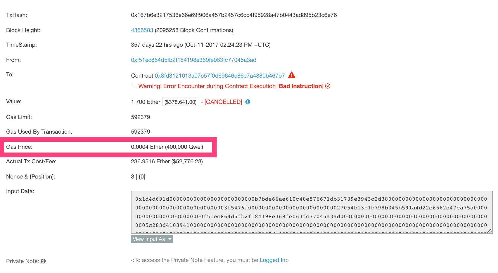

# 从交易的角度看 Ethereum 的实现

---
<!-- START doctoc generated TOC please keep comment here to allow auto update -->
<!-- DON'T EDIT THIS SECTION, INSTEAD RE-RUN doctoc TO UPDATE -->


- [基本概念](#%E5%9F%BA%E6%9C%AC%E6%A6%82%E5%BF%B5)
  - [Web3 协议](#web3-%E5%8D%8F%E8%AE%AE)
  - [SHA-3 哈希加密](#sha-3-%E5%93%88%E5%B8%8C%E5%8A%A0%E5%AF%86)
  - [燃油 (Gas) 和以太币 (Ether)](#%E7%87%83%E6%B2%B9-gas-%E5%92%8C%E4%BB%A5%E5%A4%AA%E5%B8%81-ether)
  - [哈希（common.Hash）和账户地址（common.Address）](#%E5%93%88%E5%B8%8Ccommonhash%E5%92%8C%E8%B4%A6%E6%88%B7%E5%9C%B0%E5%9D%80commonaddress)
  - [账户（state.Account）](#%E8%B4%A6%E6%88%B7stateaccount)
  - [交易（Transaction）](#%E4%BA%A4%E6%98%93transaction)
  - [区块（Block）](#%E5%8C%BA%E5%9D%97block)
  - [收据（Receipt）](#%E6%94%B6%E6%8D%AEreceipt)
  - [日志（Log）](#%E6%97%A5%E5%BF%97log)
    - [几则 Receipt 示例](#%E5%87%A0%E5%88%99-receipt-%E7%A4%BA%E4%BE%8B)
  - [日志的应用 -- 查询合约执行信息](#%E6%97%A5%E5%BF%97%E7%9A%84%E5%BA%94%E7%94%A8----%E6%9F%A5%E8%AF%A2%E5%90%88%E7%BA%A6%E6%89%A7%E8%A1%8C%E4%BF%A1%E6%81%AF)
    - [Indexed Fields](#indexed-fields)
  - [StateDB](#statedb)
- [一个交易被执行的全过程](#%E4%B8%80%E4%B8%AA%E4%BA%A4%E6%98%93%E8%A2%AB%E6%89%A7%E8%A1%8C%E7%9A%84%E5%85%A8%E8%BF%87%E7%A8%8B)
  - [发起交易](#%E5%8F%91%E8%B5%B7%E4%BA%A4%E6%98%93)
    - [数字签名技术](#%E6%95%B0%E5%AD%97%E7%AD%BE%E5%90%8D%E6%8A%80%E6%9C%AF)
      - [Signer 接口](#signer-%E6%8E%A5%E5%8F%A3)
    - [从 Tx 中生成数字签名](#%E4%BB%8E-tx-%E4%B8%AD%E7%94%9F%E6%88%90%E6%95%B0%E5%AD%97%E7%AD%BE%E5%90%8D)
    - [提交到 TxPool](#%E6%8F%90%E4%BA%A4%E5%88%B0-txpool)
  - [执行交易](#%E6%89%A7%E8%A1%8C%E4%BA%A4%E6%98%93)
    - [第一阶段：准备用于 EVM 执行的数据](#%E7%AC%AC%E4%B8%80%E9%98%B6%E6%AE%B5%E5%87%86%E5%A4%87%E7%94%A8%E4%BA%8E-evm-%E6%89%A7%E8%A1%8C%E7%9A%84%E6%95%B0%E6%8D%AE)
    - [第二阶段：EVM 执行中](#%E7%AC%AC%E4%BA%8C%E9%98%B6%E6%AE%B5evm-%E6%89%A7%E8%A1%8C%E4%B8%AD)
    - [第三阶段：创建收据和日志](#%E7%AC%AC%E4%B8%89%E9%98%B6%E6%AE%B5%E5%88%9B%E5%BB%BA%E6%94%B6%E6%8D%AE%E5%92%8C%E6%97%A5%E5%BF%97)
- [小结](#%E5%B0%8F%E7%BB%93)
- [References](#references)

<!-- END doctoc generated TOC please keep comment here to allow auto update -->


## 基本概念

### Web3 协议

Internet 时代我们通过 HTTP(s) 协议连接上网 , 而 Ethereum 中通过 Web3 协议连接 Ethereum 网络，从 OSI 7 层网络协议来看，Web3 与 HTTP(s) 并无二异，都属于应用层（Application Layer）协议。唯一不同的是，Internet 中的HTTP(s) 服务端通信是由厂商开发并维护的，被调用接口的安全与稳定由厂商来担保；而在 Web3 中的服务端可能是一个与你对等的个人在维护，接口的安全与否是由整个 Ethereum 网络来担保，你并不能**只**信任任何一个网络节点。

### SHA-3 哈希加密

Ethereum 代码里哈希（hash) 无处不在，许许多多的类型对象通过给定的哈希算法，可以得到一个哈希值。注意，算法中所使用的哈希函数是不可逆的，即对于 `h = hash(x)`, 仅仅通过哈希运算的结果 h 无法作逆运算得到输入値 x。哈希值在数学上的唯一性使得它可以用作某个对象的全局唯一标识符。

Ethereum 中用到的哈希函数全部采用 SHA-3(Secure Hash Algorithm 3，[wikipedia](https://en.wikipedia.org/wiki/SHA-3))，SHA-3 加密算法属于 Keccak 算法族群中的一个子类。SHA-3 在 2015 年 8 月由美国标准技术协会 (NIST) 正式发布，作为 Secure Hash Algorithm 家族的最新一代标准，相比于 SHA-2 和 SHA-1，采用了完全不同的设计思路，性能和安全性都有非常大的提升。需要注意的是，SHA-2 目前并没有出现被成功攻克的案例，SHA-3 也没有要立即取代 SHA-2 的趋势，NIST 只是考虑到 SHA-1 有过被攻克的案例（被我国的王小云教授提出），未雨绸缪的征选了采用全新结构和思路的 SHA-3 来作为一种最新的 SHA 方案。

### 燃油 (Gas) 和以太币 (Ether)

Etherum 对于转账或者合约调用这些需要上链的交易全都是需要支付手续费的，即 Gas，与 Gas 相关的几个概念：

* `gasPrice`: 每一个 gas 的价格，以 wei 计量，价格越高，越容易被矿工打包，也就意味着交易越快执行；
* `gasUsed`: 实际消耗的 gas 数量，由多方面决定，后文细说；
* `gasLimit`: 可用的 Gas 总量，当放在 Tx 中的时候，决定了这一笔 Tx 可运行的总时间（类似于 CPU time limit）；放在 Block 中的时候，决定出块的快慢；

$$Gas = gasPrice * gasUsed$$


作为一套支付体系来说，系统的稳定性异常重要，正是由于 Gas 机制的引入，可以有效“部分”解决互联网领域 DDoS 问题的出现。

Gas 以 Ether 作为支付媒介，其最小单位是 Wei，除此之外还有 Szabo, Finney 单位，他们的关系如下：

| Unit        | Ether     | Wei       |
| ----------- | --------- | --------- |
| Ether       | 1         | $10^{18}$ |
| Finney      | $10^{-3}$ | $10^{15}$ |
| Szabo(GWei) | $10^{-6}$ | $10^{12}$ |
| Wei         | $10^{18}$ | 1         |

Ethereum 中的所有交易行为，在 EVM 机器级别的活动包括但不限于：

* Ether 转帐，
* 合约的创建，
* 合约指令的执行，
* 合约状态的扩展等等。

所以 Gas 可以想象成是运行 Ethereum 世界计算机的能源。

### 哈希（common.Hash）和账户地址（common.Address）

两个最常用的自定义数据类型 `common.Hash` 用来表示哈希值，`common.Address` 表示地址：

```go
//common/types.go
const (
    HashLength = 32
    AddressLength = 20
)
type Hash [HashLength]byte
type Address [AddressLength]byte
```

- `Hash`: 在 Ethereum 体系中，所有用到的哈希值都使用该 Hash 类型，长度为 32bytes，即 256 bits；
- `Address`: Ethereum 中所有跟帐号 (`Account`) 相关的信息，比如一般的外部帐号 (EOA) 和合约帐号，都会使用该 Address 类型表示，长度 20bytes。

### 账户（state.Account）

与 Bitcoin 的 UTXO 模型不同，Ethereum 中使用账户模型，相比于 UTXO 来说，账户体系更加自然，也更加容易理解，Etherum 中的账户根据是否携带有代码（Code）分别两类：

1. External Owned Account（EOA 账户）：由私钥控制的账户
   - 可发送接收 Ether；
   - 可发送 Tx；
   - 由私钥控制，严格密码学安全；
   - EOA 账户一旦创建无法销毁；

2. Contract Account（合约账户）：由 EOA 或者合约生成的账号，生成者拥有合约的“控制权”

   - 拥有相关联的代码；
   - 无法发送 Tx，只能发送 message call(又称为 internal tx)；
   - 可发送接收 Ether，但前提是合约中有定义，如果合约中没有定义 Ether 转账接口，相当于这个账户中的余额也就作废了；
   - 账户可销毁，销毁后自身上的余额转移到指定账户上；


`Account` 的定义如下：

```go
//core/state/state_object.go
type Account struct {
    Nonce    uint64
    Balance  *big.Int
    Root     common.Hash // merkle root of the storage trie
    CodeHash []byte
}
```

一个账户的基本属性：

- `Nonce`：代表由这个账户主动发起的交易次数，可用于避免「重放攻击」；

- `Balance`: Ether 余额；

- `Root`, `CodeHash`: 对于合约账号有用；


### 交易（Transaction）

Transaction(简称 tx)，是 Ethereum 中标示一次交易的结构体，它的成员变量包括交易 Nonce，转帐金额，合约调用代码、接收方地址等信息。Transaction 的完整声明如下：

```go
//core/types/transaction.go
type Transaction struct {
    data txdata
    hash, size, from atomic.Value // for cache
}
type txdata struct {
    AccountNonce uint64
    Price *big.Int
    GasLimit *big.Int
    Recipient *common.Address
    Amount *big.Int
    Payload []byte
    V, R, S *big.Int // for signature
    Hash *common.Hash // for marshaling
}
```

对于上面结构体定义中几个字段的解释：

- `Price` 也就是上文所讲的 `gasPrice`，此处不再累述；
- `GasLimit` 是该 Tx 执行过程中所允许消耗资源的总上限，我们可以通过这个值防止某个 Tx 执行中出现恶意占用资源的问题，这也是 Ethereum 中安全保护的策略之一。
- 转帐接收方地址 `Recipient` 可能为空，空值代表这是一笔合约创建的交易；
- `Amount` 发送的 Ether 数量，也正是通过 [`eth_sendTransaction`](0xa2305f292457f5c9c2987a584589197228f32b50cd2813b0207fdd3209d33cd2) 发送交易时的 `value` 字段；
- `Payload` 是重要的数据成员，它既可以作为所创建合约的指令数组（其中每一个 `byte` 作为一个单独的虚拟机指令）；也可以作为数据数组，由合约定义的函数指令进行操作。

由上面的定义可见，每个 Tx 都可以声明自己的 (Gas)`Price` 和 `GasLimit`，也意味着每个 Tx 之间都是相互独立的，每笔交易都是可以“谈价格”的。

这一个个的 Transaction 汇聚在一起，就形成了 Block 结构。

### 区块（Block）

区块 (Block) 是用于“包裹”交易信息，这些交易数据由矿工打包封装到 Block 之中。而一个个 Block 又以**单向链表**的形式相互连接起来形成区块链（BlockChain）结构。Block 中带有一个 Header 指针变量，Header 结构体中带有一个区块的元信息，其中的 `ParentHash` 表示该区块的父区块哈希值。由此可见，区块链是一条反向的单向链表，可以从尾指针（当前区块）遍历回到头指针（创世区块），但是从创世区块正向编历到当前区块却没有那么容易，这也就保证了区块链是单向生长的链状结构。

Block 和 Header 的部分成员变量定义如下：

```go
//core/types/block.go
type Block struct {
    header *Header
    transactions Transactions // type Transactions []*Transaction
    ...
}

type Header struct {
    ParentHash common.Hash
    Number *big.Int
    ...
}
```

其中，Header 的 Number 成员类型为 `*big.Int` 类型，

> `big.Int` 是 Golang 提供的数据类型，用来处理比较大的整型数，当然它也可以处理诸如 64bit，32bit 的常用整数。
>
> ```go
> //go-1.x/src/math/big/int.go
> package big
> type Int struct {
>     neg bool // sign, whether negaive
>     abs nat  // absolute value of integer
> }
> ```
>
> `big.Int` 是一个结构体 (struct)，所以每次新建 `big.Int` 时可以用 `x := new(big.Int)`, 返回一个指针。注意对 Int 的算术操作，要使用该对象的成员函数，比如 `Add()`:
>
> ```go
> func (z *Int) Add(x, y *Int) *Int // Add sets z to sum x+y and returns z
> ```

Number 表示该区块在整个区块链 (BlockChain) 中所处的位置，从 0 开始，0 也就称为创世区块（GenesisBlock），每一个区块相对于它的父区块，其 `Number` 差值为 $+1$。创世区块由系统自然生成而不必额外挖掘（在 Ethereum 中创世块是通过 Presale 的机制生成，也就是现在俗称的 ICO；但是对于 Bitcoin 来说，创世区块就是通过计算机真实挖掘而来）。关于 Block 和 BlockChain 的实现细节，之后会有更详细的分析。

### 收据（Receipt）

在日常生活中，你通过支付宝办理一笔转账之后，会收到一张收据，收据上写着由谁在何时向谁转账多少金额之类的信息，那么在 Etherum 中也是类似的，一个 Tx 被 Ethereum 处理之后也会生成一个收据（Receipt）：

```go
//core/types/receipt.go
type Receipt struct {
    // Consensus fields
    PostState         []byte `json:"root"`
    Status            uint64 `json:"status"`
    CumulativeGasUsed uint64 `json:"cumulativeGasUsed"`
    Bloom             Bloom  `json:"logsBloom"`
    Logs              []*Log `json:"logs"`

    // Implementation fields (don't reorder!)
    TxHash          common.Hash    `json:"transactionHash"`
    ContractAddress common.Address `json:"contractAddress"`
    GasUsed         uint64         `json:"gasUsed"`
}
```

其中：

* `PostState`：保存了该 `Receipt` 对象被创建**之后**的 StateDB 的 MPT 树根（关于 MPT 后文会细写，这里你只要知道这是一个瞬时状态即可），代表了所在 Block 中该 Tx 执行之后所有 “帐户” 的当前状态；
* `Status`：表示这个交易执行的成功与否， `0` 代表失败，`1` 代表成功，全量保存交易过程这一点也和互联网交易体系是不谋而合的；
* `CumulativeGasUsed`：累积的 Gas 使用量，在交易执行结束之后，由 EVM 计算得到；
* `GasUsed`：本次交易所使用的 Gas 量，也就是前后两个 Receipt 中 `CumulativeGasUsed` 的差值，个人觉得这个字段有点多余，当然如果是为了验证 Tx 和 Receipt 数据完整性也是可行的；
* `TxHash`：对应于哪笔 Tx；
* `ContractAddress`： 这里特指新创建合约所生成的地址，虽然 Tx 也可以是合约调用，但是这个字段和 Tx 中定义的   `To` 字段是不一样的，`To` 是指交易的接收方地址，而这里是指新生成的地址；
* `Logs`：一个 Tx 的执行结果，存放到 `Receipt` 对象中；Tx 的执行过程“可以”保存到这个字段中，但并不强制；
* `Bloom` 类型是一个 Ethereum 内部实现的一个 256bit 长 Bloom Filter。 Bloom Filter 概念定义可见 [wikipedia](https://en.wikipedia.org/wiki/Bloom_filter)，它可用来快速验证一个新收到的对象是否处于一个已知的大量对象集合之中。这里 Receipt 的 Bloom，被用以验证某个给定的 Log 是否处于 Receipt 已有的 Log 数组中。

### 日志（Log）

对于一般的转账交易来说，只需要保存时间戳、发送方、接收方、转账金额以及成功与否就够了，但是对于合约调用来说，一个 Tx 是异步执行的，只有等到这个 Tx 被矿工打包之后才能确认 Tx 的执行结果，那么同步等待执行结果就不现实了，这个时候通过异步消息通知的机制比有效的措施；另一方面，合约执行过程中可能会更改合约的内部状态，这些信息千差万别，无法标准化，因此并不合适直接保存到 Receipt 结构中。故此，Ethereum 定义了 Event 和 Log 机制，合约被调用之后发出 Event, 由 EVM 捕获到 Event 之后，通过 `LOG` opcode 保存到链上，之后可通过 Log 复现合约被调用的场景，这一机制也可用于替代 Storage 存储合约数据。合约的创建者可依据自己的需求保存**必要的信息**到 Receipt（数据上链是要收费的，不能拍脑袋认为什么都可以保存），当前并没有 EIP 强制要求每个合约调用都需要保存中间数据。

另一方面，对应到多个合约之间的调用，由于这些调用是由合约触发的，而合约是没有私钥的，也就是无法和 EOA 账号一样生成交易签名，所以对于这些 inner Tx 是无法保存到区块链上的，并且 Ethereum yellow paper 中也没有对这些 inner Tx 的完整定义，从另一角度看，Ethereum 链上的交易全部是由 EOA 账号发起的！那么如何追踪这些 inner Tx？于是合约开发者想到了一个方法，通过每个交易中所触发的事件来定位内部调用，一个 inner Tx 对应到一个 Log 结构。因此，这个 `Log` 数组很重要，对应了合约的执行过程，**但是我们又不能完全依赖于这个 `Log` 数组，需要结合合约代码一起使用方可。**

`Log` 结构完整定义如下：

```go
//core/types/log.go
type Log struct {
    // Consensus fields
    Address common.Address
    Topics  []common.Hash
    Data    []byte

    // Derived fields
    BlockNumber uint64
    TxHash      common.Hash
    TxIndex     uint
    BlockHash   common.Hash
    Index       uint

    Removed bool
}
```

每个字段通过注释，都可以知晓一二，对于其中几个重要字段，单独讲解一下：

* `Address`: 合约的直接调用方，也就是这个 Event（Log）的触发者；
* `Topics`: 用于检索日志的时候使用，下一章细讲；
* `Data`： 通常是 ABI encoded 字节内容；
* `TxIndex`： 本条 Log 所对应的 Tx 在 Block 中的索引，从 0 开始；
* `Index`：本条 Log 在 Block 中的索引，从 0 开始（注意，不是在这个 Tx 内部的索引）；
* `Removed`：如果由于链重组（reorg）而使日志恢复，删除的字段为真，因此当监控发现一条 Removed 的日志的时候，需要注意了，这个调用可能是出错的！TODO：找到真实的代码与示例

`Log` 的定义和 `Receipt` 类似地，有几个字段感觉也是比较冗余，`BlockNumber`, `TxHash`, `TxIndex`, `BlockHash` 这几个字段在 `Receipt` 中都已经定义了，这里感觉有点多余了（TODO：为什么要这么做？）。

 #### 几则 Receipt 示例

Geth 中可以通过 `eth_getTransactionReceipt` RPC 接口（RPC 接口在后文讲述）获取到一个 Tx 的 Receipt 输出，下面的示例是在 geth 私链上通过 geth console 获取的。

**合约创建的收据**

```js
eth.getTransactionReceipt('0xcc2f4599b9aedb67d84055cfcabfc6732a2f5eae19bccab94138c70fc0ad8db0')
{
  blockHash: "0x8bf677816978fe68da57baa6204cf32498bda9a7f1a277ab152874ee9559ba2f",
  blockNumber: 401,
  contractAddress: "0x2a7a2fcc9efcc9b76ad8e93b06211aa29ef630b6",
  cumulativeGasUsed: 4100503,
  from: "0x1ef339aace3fc3dd22580fc347ddc75bde962751",
  gasUsed: 4100503,
  logs: [],
  logsBloom: "0x000...00",
  status: "0x1",
  to: null,
  transactionHash: "0xcc2...b0",
  transactionIndex: 0
}
```

- `ContractAddress` 为新创建合约的地址；

- `To` 为空；

- `Logs` 由于没有合约调用，为空；


**合约调用的收据**

其中合约的代码如下：

```js
event Transfer(address indexed _from,
               address indexed _to,
               uint256 _value);

function payableTransfer(address _to, uint256 _value)
public
payable
returns (bool success) {
    require(balances[msg.sender] >= _value);
    balances[msg.sender] -= _value;
    balances[_to] += _value;
    emit Transfer(msg.sender, _to, _value);
    return true;
}
```

这里使用了 Solidity `emit Transfer(msg.sender, _to, _value)` 触发事件，触发的事件在交易执行时被保存在了 `Receipt.Logs ` 字段中。调用 `eth_getTransaction` 和 `eth_getTransactionReceipt` 可得：

```js
>eth.getTransaction('0x446b5c6f1b0800a63c675078c715c6890e9dd96d30a6c52837ab26378f83aef4')
{
  blockHash: "0xcc6ea2d2af5be40695b491b6ccb4bfaeee730b7454f8e7a5ad83ac0ada8ac901",
  blockNumber: 449,
  from: "0x1ef339aace3fc3dd22580fc347ddc75bde962751",
  gas: 135704,
  gasPrice: 5000000000,
  hash: "0x446b5c6f1b0800a63c675078c715c6890e9dd96d30a6c52837ab26378f83aef4",
  input: "0x723...64",
  nonce: 15,
  r: "0x5654857f78013b97a3a0a0be885c6bf74c1b60fc6b9531091e71dfe6de387dc3",
  s: "0x330a202f0315c5a417daadb688a03d903d1642113630bb223c6925560e9e5a20",
  to: "0xadabcd3a769cf95114df02d438d563b379346d14",
  transactionIndex: 0,
  v: "0x41",
  value: 10000000000000000
}

>eth.getTransactionReceipt('0x446b5c6f1b0800a63c675078c715c6890e9dd96d30a6c52837ab26378f83aef4')
{
  blockHash: "0xcc6ea2d2af5be40695b491b6ccb4bfaeee730b7454f8e7a5ad83ac0ada8ac901",
  blockNumber: 449,
  contractAddress: null,
  cumulativeGasUsed: 35704,
  from: "0x1ef339aace3fc3dd22580fc347ddc75bde962751",
  gasUsed: 35704,
  logs: [{
      address: "0xadabcd3a769cf95114df02d438d563b379346d14",
      blockHash: "0xcc6ea2d2af5be40695b491b6ccb4bfaeee730b7454f8e7a5ad83ac0ada8ac901",
      blockNumber: 449,
      data: "0x0000000000000000000000000000000000000000000000000000000000000064",
      logIndex: 0,
      removed: false,
      topics: [
          "0xddf252ad1be2c89b69c2b068fc378daa952ba7f163c4a11628f55a4df523b3ef",
          "0x0000000000000000000000001ef339aace3fc3dd22580fc347ddc75bde962751",
          "0x0000000000000000000000000000000000000000000000000000000000000002"
      ],
      transactionHash: "0x446...f4",
      transactionIndex: 0
  }],
  logsBloom: "0x040...00",
  status: "0x1",
  to: "0xadabcd3a769cf95114df02d438d563b379346d14",
  transactionHash: "0x446...f4",
  transactionIndex: 0
}
```

* Receipt 中的 `To` 对应到 Log 的 `Address` 字段；
* Log 的 `Topic` 字段详见下一章节细述；


**无法依赖于 Logs 数组来反馈真实的 Inner Tx**

下面的示例为在一个合约中调用再次 `emit` 触发事件，那么也就收到两个 `Log`（注意，这种低级的“Bug”在做数据分析的时候要当心）

```js
event Transfer(address indexed _from, address indexed _to, uint256 _value);
function payableTransfer(address _to, uint256 _value) public payable returns (bool success) {
    require(balances[msg.sender] >= _value);
    balances[msg.sender] -= _value;
    balances[_to] += _value;
    emit Transfer(msg.sender, _to, _value);
    emit Transfer(msg.sender, _to, _value);
    return true;
}
```


与上一条 Receipt 的差异在于这里多了一条一模一样的 Log:

```js
eth.getTransactionReceipt('0x060a5ccc522e8f82eb213ab25d73be401620321d318028eccc746832fbc828aa')
{
  ...
  logs: [{
      address: "0x0ee745d8e67c68b9201709ba4558d6244ea192bf",
      blockHash: "0x7b8dfaff68bf5f0b5029772bed0312af3968193ffc325a1e630025669850f3ac",
      blockNumber: 566,
      data: "0x0000000000000000000000000000000000000000000000000000000000000064",
      logIndex: 0,
      removed: false,
      topics: [
          "0xddf252ad1be2c89b69c2b068fc378daa952ba7f163c4a11628f55a4df523b3ef",
          "0x0000000000000000000000001ef339aace3fc3dd22580fc347ddc75bde962751",
          "0x0000000000000000000000000000000000000000000000000000000000000002"
      ],
      transactionHash: "0x060...aa",
      transactionIndex: 0
  }, {
      address: "0x0ee745d8e67c68b9201709ba4558d6244ea192bf",
      blockHash: "0x7b8dfaff68bf5f0b5029772bed0312af3968193ffc325a1e630025669850f3ac",
      blockNumber: 566,
      data: "0x0000000000000000000000000000000000000000000000000000000000000064",
      logIndex: 1,
      removed: false,
      topics: [
          "0xddf252ad1be2c89b69c2b068fc378daa952ba7f163c4a11628f55a4df523b3ef",
          "0x0000000000000000000000001ef339aace3fc3dd22580fc347ddc75bde962751",
          "0x0000000000000000000000000000000000000000000000000000000000000002"
      ],
      transactionHash: "0x060...aa",
      transactionIndex: 0
  }],
  ...
}

```

[EtherScan](https://etherscan.io) 对于 inner Tx 的解析，是在 EVM 层面实现的，并不是直接解析 Log 来获取的，所以并没有上面这个问题，比如上例中相同的 [Tx](https://ropsten.etherscan.io/tx/0x70eb239e7c107a0e8c5a8d1f2c4f4cc88ad9addccaec7c9ecdb0ebc78231a1f4) 并没有出现 inner Tx。

### 日志的应用 -- 查询合约执行信息

> 智能合约通过触发 Event 生成日志，这些日志保存在 Receipt 中，客户端通过查询 Log 信息得知合约的执行情况，下面以实例讲解如何用 Web3 方式分析 Log 。

下面是一个 Tx 中的一个 Receipt 结构，包含了一条 Log 表项，原图来自于 [Deep dive into Ethereum logs – codeburst](https://codeburst.io/deep-dive-into-ethereum-logs-a8d2047c7371)：


注意上面的 `Topics` 和 `Data` 字段，`Topics` 中的第一项指定了特定的事件，但是还不知道是什么事件，也不知道具体的数据，但我们可以通过[合约 0x06012c8cf97bead5deae237070f9587f8e7a266d 对应的ABI 代码](https://etherscan.io/address/0x06012c8cf97bead5deae237070f9587f8e7a266d#code)来解析具体的内容。合约 ABI 代码就是合约的接口定义，是一串 JSON 格式的方法符号表，完整的 ABI 接口查看 [abi.json](https://api.cacher.io/raw/6033a86dad2f9e73bb9f/5be668342396149d8482/abi.json)，这里我们关注下面这个接口：

```json
{
    "anonymous": false,
    "inputs": [
        { "indexed": false,     "name": "from",     "type": "address" },
        { "indexed": false,     "name": "to",       "type": "address" },
        { "indexed": false,     "name": "tokenId",  "type": "uint256" }
    ],
    "name": "Transfer",
    "type": "event"
}
```

这个是 Transfer 事件的定义，对这个事件接口取 SHA3 的値为：

```python
> from web3 import Web3
> Web3.sha3('Transfer(address,address,uint256)').hex()
'ddf252ad1be2c89b69c2b068fc378daa952ba7f163c4a11628f55a4df523b3ef'
```

这个哈希値也正是上面 topics 字段中的第一个値，因此通过这个 Hash 値知道是哪个事件被触发了。接下来解析 data 字段中的含义：

```python
> import requests, json, eth_abi
> abi = json.loads(requests.get('http://tinyurl.com/yanvttr6').content)
> e = [i for i in abi if i.get('name') == 'Transfer'][0]
> types = [i['type'] for i in e['inputs']]
['address', 'address', 'uint256']
> names = [i['name'] for i in e['inputs']]
['from', 'to', 'tokenId']
> receipt = infura.eth.getTransactionReceipt('0x40f3f95fd8c70a76aad5776dc93cfcc8ee2efa0b6e187441af1a0e7b08ef1fd3')
> log = receipt['logs'][0]
> values = eth_abi.decode_abi(types, bytes.fromhex(log['data'][2:]))
('0x0035fc5208ef989c28d47e552e92b0c507d2b318',
 '0x646985c36ad7bf4f3a91283f3ea6eda2af79fac6',
 107696)
> dict(zip(names, values))
{'from': '0x0035fc5208ef989c28d47e552e92b0c507d2b318',
 'to': '0x646985c36ad7bf4f3a91283f3ea6eda2af79fac6',
 'tokenId': 107696}
```

*注：`log['data'][2:]` 把 data 中前两个字符 `0x` 删除*

经过解析之后，我们可以看出这个 Log 想表达的意思是：

> 从 0x0035... 转账 Token 107696 到 0x6469...

#### Indexed Fields

我们来看另一个 Log 信息，这个 Log 是由 [合约 0xb59f67A8BfF5d8Cd03f6AC17265c550Ed8F33907](https://etherscan.io/address/0xb59f67a8bff5d8cd03f6ac17265c550ed8f33907#code) 触发的，原图来自于 [Deep dive into Ethereum logs – codeburst](https://codeburst.io/deep-dive-into-ethereum-logs-a8d2047c7371)：


这个 Log 的 topics 字段中有三个成员，第一个成员表明是哪个方法调用，根据上面的分析我们知道这个是 `Transfer(address,address,uint256)` 的调用，接下来我们查看这个合约的 ABI 中的 Transfer 定义：

```json
{
    "anonymous": false,
    "inputs": [
        { "indexed": true,      "name": "from",     "type": "address" },
        { "indexed": true,      "name": "to",       "type": "address" },
        { "indexed": false,     "name": "value",    "type": "uint256" }
    ],
    "name": "Transfer",
    "type": "event"
}
```

这个 ABI 相对于上面的差异在于：**其中的 from, to 字段的 indexed 属性为 true**。

关于 indexed 字段，查找 [Ethereum Contact ABI#events WIKI 文档](https://github.com/ethereum/wiki/wiki/Ethereum-Contract-ABI#events) 可知

> Given an event name and series of event parameters, we split them into two sub-series: those which are indexed and those which are not. Those which are indexed, which may number up to 3, are used alongside the Keccak hash of the event signature to form the topics of the log entry. Those which are not indexed form the byte array of the event.

 indexed 字段最多有 3 个，他们通过 SHA3 哈希之后放在 `Topics` 中，非 indexed 字段依旧保存在 Log 的 `Data` 字段中。

可以知道每一个 indexed 字段会生成一个新的 topic，这个字段是不包含在 data 字段中的，这么做的好处是：**加快了对相关 topic 查找的效率**，但同时也使得解析变得更加复杂。

`Topics` 和 `Data` 字段的解析过程参考如下：

```python
> types = [i['type'] for i in e['inputs'] if not i['indexed']]
['uint256']
> names = [i['name'] for i in e['inputs'] if not i['indexed']]
['value']
> values = eth_abi.decode_abi(types, log['data'])
(5000000000,)

> indexed_types = [i['type'] for i in e['inputs'] if i['indexed']]
['address', 'address']
> indexed_names = [i['name'] for i in e['inputs'] if i['indexed']]
['from', 'to']
> indexed_values = [eth_abi.decode_single(t, v) for t, v in zip(indexed_types, log['topics'][1:])]
['0x00b46c2526e227482e2ebb8f4c69e4674d262e75',
 '0x54a2d42a40f51259dedd1978f6c118a0f0eff078']

> dict(chain(zip(names, values), zip(indexed_names, indexed_values)))
{'from': '0x00b46c2526e227482e2ebb8f4c69e4674d262e75',
 'to': '0x54a2d42a40f51259dedd1978f6c118a0f0eff078',
 'value': 5000000000}
```

index 字段需要单独解析， 非 index 字段照旧解析。

### StateDB

StateDB 是 Ethereum 中的账户体系，所有账户在 Block 出块之后“固化”形成一棵 MPT 树，MPT 树根保存到 `Block.Root` 中，通过这个 `Block.Root` 可以恢复出在该区块点上时，整个 Ethereum 世界中所有账户的一个快照数据，包括：

- 账户的余额；
- 账户主动发起的交易次数；

对于合约账号，还有下面属性：

- 合约代码；
- 合约代码的 Hash 値；
- 合约中存储的数据的快照；

在具体实现时，为了效率考虑，StateDB 又引入了多层 Cache 机制，具体在后文讲解。

## 一个交易被执行的全过程

Ethereum 作为数字货币平台，首要的任务就是转账交易的需求；另一方面，作为智能合约平台，对于合约创建、合约执行的概念，也抽象为交易的范畴，交易的发起方就是合约的调用者（在 Solidity 合约中，为 `msg.sender` 变量），交易的接收方即是合约本身。因此，Ethereum 中的交易分为两类：

1. 合约创建；
2. 合约调用，其中 EOA 账户的转账也属于这一类别；

Ethereum 中对于这两种 Tx 类型统一处理，均在 EVM 中处理，从一个 Tx 的生命周期的角度来分析下完整的流程：

1. 调用方发起一笔交易
2. Ethereum 平台执行交易
3. 完成交易，保存收据

### 发起交易

客户端可以通过 `eth_sendTransaction` 和 `eth_sendRawTransaction` RPC 接口发布一个交易信息，前者由 RPC Server 完成 Tx 组装和发布的过程，后者是在 Client 端完成 Tx 组装，再由 Server 完成发布的过程，我们先看下 `eth_sendTransaction`  这个接口被调用之后所发生的事情。这一接口被调用之后，大概分为三个步骤完成 Tx 的发布：

 - 使用数字签名生成 Tx 对象；
 - 将 Tx 对象发布到 TxPool 之中；
 - 返回 TxHash 给 Client，完成全过程。

下面分别看待这几个具体的流程。

#### 数字签名技术

数字签名属于密码学的知识，可用于保证消息的公证性，防止篡改，一般情况下数字签名分为两个行为：

- 生成消息签名：由发送者使用私钥对消息内容计算签名；
- 验证消息签名：由接收方或者第三方使用公钥验证消息内容；

其中私钥由发送自己保管，由公钥是可通过验证者通过信任网络获取到，关于数字签名更加详细的知识，大家可以查看 [图解密码学](https://book.douban.com/subject/26265544/) 了解一二（话说，日本人出的「图解系列书籍」都非常棒）。

##### Signer 接口

Ethereum 采用的数字签名是椭圆曲线数字签名算法 （[Elliptic Cure Digital Signature Algorithm](https://en.wikipedia.org/wiki/Elliptic_Curve_Digital_Signature_Algorithm)， 简称 ECDSA），相比于基于大质数分解的 RSA 数字签名算法，可以在提供相同安全级别 (in bits) 的同时，仅需更短的公钥（public key）。

这里需要特别留意的是，前文讲到，数字签名的公钥是通过信任网络获取的，而在 Ethereum 网络中并没有这么一个信任网络存在，而我们也知道公钥其实就是发送者的账户地址，因此，在发送 Tx 的同时，将发送者公钥连同数字签名一起保存到 `Transaction` 结构中就显得恰到好处。这就避免了公钥获取的流程，这种设计在 Ethereum 中大量存在，下文我们在讲解 Block 结构和 LevelDB 存储的时候还会遇到。

基础算法使用  ECDSA 这一点是没有疑问了，但在具体实现上，Etherum 经历了几次数字签名方法的微调，对外 Ethereum 定义了一个通用接口 `Signer`， 用来执行生成签名，获取公钥，对 Tx 对象做哈希等操作：

```go
//core/types/transaction_signing.go
type Signer interface {
    Sender(tx *Transaction) (common.Address, error)
    SignatureValues(tx *Transaction, sig []byte) (r, s, v *big.Int, err error)
    Hash(tx *Transaction) common.Hash
    Equal(Signer) bool
}
```

这四个接口与数字签名的对应关系也不难看出来：

| Signer              | Digital Signature      |
| :------------------ | :--------------------- |
| `Sender()`          | 提取公钥               |
| `Hash()`            | 生成消息哈希値         |
| `SignatureValues()` | 根据哈希値生成消息签名 |
| `Equal()`           | 验证消息签名           |

#### 从 Tx 中生成数字签名

签名是通过钱包完成的，Geth 自带一个名为 keystore 的钱包，上面使用 `eth_sendTransaction` 发布 Tx 之前需要先将 Geth 节点上的钱包 unlock，之后才能生成签名。**切记，在 Ethereum mainnet 上面谨慎使用 unlock 操作，一旦使用完毕，请及时 lock, 由于钱包 unlock 导致的盗币事件非常严重，可以查看慢雾对这一事件的分析：[以太坊黑色情人节](https://mp.weixin.qq.com/s/Kk2lsoQ1679Gda56Ec-zJg)。**


Ethereum 中通过 Tx 生成的 secp256k1 生成数字签名是一个长度为 **65bytes** 的字节数组，在被 `types.SignTx` 调用之后被截成三段保存在 Tx 中：


* 其中前 **32bytes** 赋值给成员变量 **R**；
* 中间的 **32bytes** 赋值给 **S**；
* 最后 **1byte** 为 0 或者 1，加上一个常数之后被赋値给 **V**；

从 secp256k1 bytes 到 RSV 的过程是通过 `Transaction.WithSignature` 完成，内部调用 `Signer.SignatureValues` 实现：

```go
//core/types/transaction_signing.go
func (fs FrontierSigner) SignatureValues(tx *Transaction,
                                         sig []byte) (r, s, v *big.Int, err error) {
    if len(sig) != 65 {
        panic(fmt.Sprintf("wrong size for signature: got %d, want 65", len(sig)))
    }
    r = new(big.Int).SetBytes(sig[:32])
    s = new(big.Int).SetBytes(sig[32:64])
    v = new(big.Int).SetBytes([]byte{sig[64] + 27})
    return r, s, v, nil
}
```

存放到 Tx 中的 **V** 値所使用的常数与签名方法有关：

| Method          | Base | V(After + Base) |
| --------------- | ---- | --------------- |
| EIP155Signer    | 35   | 35, 36          |
| HomesteadSigner | 27   | 27, 28          |

`EIP155Signer` 也正是当前使用的签名方法，其代码实现如下：

```go
func (s EIP155Signer) SignatureValues(tx *Transaction,
                                      sig []byte) (R, S, V *big.Int, err error) {
    R, S, V, err = HomesteadSigner{}.SignatureValues(tx, sig)
    if err != nil {
        return nil, nil, nil, err
    }
    if s.chainId.Sign() != 0 {
        V = big.NewInt(int64(sig[64] + 35))
        V.Add(V, s.chainIdMul)
    }
    return R, S, V, nil
}
```


#### 提交到 TxPool

将 Tx 对象添加到 TxPool 之中，对于客户端来说，交易已经“完成”，但是对于 Ethereum 来说，好戏才刚刚上场。TxPool 中的 Tx 由矿工负责打包执行，矿工打包的流程后文会细讲，这里先行略过。

### 执行交易

注意，Tx 是由矿工来执行的，他们一直监视着 TxPool, 一旦有 Tx 被提交进来，矿工就将其执行，细节见下文分析，这里我们关注 Tx 是如何被执行的：

```go
func (w *worker) commitTransaction(tx *types.Transaction,
                                   coinbase common.Address) ([]*types.Log, error) {
    snap := w.current.state.Snapshot()

    receipt, _, err := core.ApplyTransaction(w.config, w.chain, &coinbase,
                                             w.current.gasPool, w.current.state,
                                             w.current.header, tx,
                                             &w.current.header.GasUsed, vm.Config{})
    if err != nil {
        w.current.state.RevertToSnapshot(snap)
        return nil, err
    }
    w.current.txs = append(w.current.txs, tx)
    w.current.receipts = append(w.current.receipts, receipt)

    return receipt.Logs, nil
}
```

可以看到，矿工通过 `core.ApplyTransaction()` 来执行交易，这一过程大致可以分为三个阶段完成：

- 第一阶段准备交易，包括将 Transaction 类型转化成 Message，准备 EVM 环境；
- 第二阶段是执行交易，主要为 EVM 内部操作，也是核心部分，包括执行转帐，创建或者调用合约，计算 Gas 消耗量；
- 第三阶段是结束交易，创建收据、日志、以及日志查询器。

#### 第一阶段：准备用于 EVM 执行的数据

EVM 执行需要三个数据：

- `Message`：携带了完整 Tx 的交易对象，属于待处理的数据；
- `EVM`：作为此次 Tx 的实际执行环境，用于转帐和合约操作；
- `*GasPool`：当前 Block 中可用的总 Gas 数量，在一个 Block 执行开始时创建，初始値为 `Block.GasLimit()`，通过这个値限制当前 Block 中总体的 Gas 消耗，随着交易的执行，这个变量也慢慢在变小，因此这里传入的是指针变量，进而限制单个 Tx 的 Gas 使用量；

**什么是「完整的」交易对象**

`ApplyTransaction` 的入口参数是 Tx，而从 `Transaction` 结构体定义中，我们并没有看到 Tx 发送者这个字段，而这个字段明显是需要用到的（用于扣款），从上一小篇中我们了解到，Tx 在发送之前使用发送者的私钥生成数字签名，生成的数字签名保存在 **R, S, V** 这三个字段中，因此大概知道通过这几个字段可以拼凑恢复出发送方地址。


从签名恢复出转出方地址的函数叫 `Sender()`， 参数包括 `Signer` 和 `*Transaction`，代码如下：

```go
//core/types/transaction_signing.go
func Sender(signer Signer, Tx *Transaction) (common.Address, error) {
    ...
    addr, err := signer.Sender(tx)
    if err != nil {
        return common.Address{}, err
    }
    tx.from.Store(sigCache{signer: signer, from: addr}) // cache it
    return addr, nil
}
```

`Sender()` 函数体中 `signer.Sender()` 会从本次数字签名的签名字符串 (signature) 中恢复出公钥，并转化为 Tx 的转出方地址。

在上文提到的 `ApplyTransaction()` 实现中，Transaction 对象需要首先被转化成 Message 对象，用到的 `AsMessage()` 函数即调用了此处的 `Sender()`。

```go
// core/types/transaction.go
func (tx *Transaction) AsMessage(s Signer) (Message, error) {
    msg := Message{
        price:    new(big.Int).Set(tx.data.price)
        gasLimit: new(big.Int).Set(tx.data.GasLimit)
        ...
    }
    var err error
    msg.from, err = Sender(s, tx)
    return msg, err
}
```

在 Tx 的发起方地址被解析出来之后，Tx 就被完全转换成了 `Message` 类型，这个数据可以提供给 EVM 执行了。

#### 第二阶段：EVM 执行中

数据已经准备妥当了，接下来就可以执行交易了，由 `StateTransition.TransitionDb()` 函数完成 Tx 的执行，待 `TransitionDb()` 返回之后，创建一个 `Receipt` 对象，最后返回该 `Receipt` 对象以及整个 Tx 执行过程中所消耗的 Gas 数量。

它的基本流程如下图：


我们来细看下 `TransitioinDb()` 的执行过程 (*/core/state_transition.go*)。`StateTransition` 实现了状态转换模型（这里的状态是指账户信息，而不是指状态机，后文会详细分析），也就是用当前全局的 StateDB 来执行交易，而后将交易过程中的账户变更作用于当前的 StateDB, 在此之后可以推导出一个新的 StateDB Root.

`StateTransition` 结构体定义如下：

```go
//core/state_transition.go
type StateTransition struct {
    gp         *GasPool
    msg        Message
    gas        uint64
    gasPrice   *big.Int
    initialGas uint64
    value      *big.Int
    data       []byte
    state      vm.StateDB
    evm        *vm.EVM
}
```

其中，我们关注与 Gas 相关的几个成员变量：

* `gp`： 即上面所讲的 `*GasPool` 对象成员，代表当前区块可用的 Gas 数量;

* `initialGas`：表示初始可用 Gas 数量；

* `gas`：表示即时可用 Gas 数量，初始値为 `initialGas`；

可见 `st.TransitionDb()` 具体步骤：

1. 购买 Gas:
    * 首先从交易转出方账户扣除一笔 Ether，数量等于

       `tx.data.GasLimit * tx.data.Price`，如果这一笔 Gas 超过了当前区块可用的 Gas 数量（即 `gp`），那么直接返回 `GasLimitReached` 错误；

    * 同时 `st.initialGas = st.gas = tx.data.GasLimit`，`st.initialGas` 为这个 Tx 可用的最大 Gas 数量，初始値为 Tx.GasLimit；

    * 然后 `gp -= st.gas`。

2. 计算 Tx 的固有 Gas 消耗，也就是 `intrinsicGas`，它由两个部分组成：

    * 每一个 Tx 预设的消耗量，这个消耗量取决于是合约创建还是合约调用而不同；

      * 合约创建：53000 Gas；

      * 合约调用：21000 Gas；

    * 以及针对 `tx.data.Payload` 的 Gas 消耗，Payload 类型是 `[]byte`，关于它的固有消耗依赖于 `[]byte` 中非 0 字节和 0 字节的数量：

      * 零字节：4 Gas/Byte；

      * 非零字节：68 Gas/Byte；

    最终，当前剩余的 Gas 为 `st.gas -= intrinsicGas`。

3. EVM 执行：如果交易的接收方地址 (`tx.data.Recipient`) 为空，说明是合约创建接口，调用 EVM 的 `Create()` 函数；否则，说明是合约执行接口，调用 `Call()` 函数（这两个接口的内部细节在下面的章节仔细讲解，这儿为了保持内容的连惯性先跳过）。这两个函数在执行过程中，直接扣除相应的 Gas, 并在执行之后，更新 `st.gas`。

4. 偿退和补偿 Gas，基于实际的 Gas 消耗量，即 `st.initialGas - st.gas`，系统提供一定的 Gas 补偿 `refundGas`（补偿数量最多为实际消耗量的一半），`refundGas` 所折算的 Ether 会被立即添加在转出方账户上，因此当前可用的 Gas 数量也就增加了，即 `st.gas += refundGas`，同时 `gp += st.gas`，即剩余的 Gas 加上系统补偿的 Gas，被一起归并进 GasPool，供之后的交易执行使用。

5. 将消耗的 Gas 奖励给所属区块的挖掘者（**注意：这里没有考虑 Ethereum 挖矿体系所给予的固定奖励**）：系统给所属区块的挖掘者账户，增加一笔 Ether，数额等于 `st.gasPrice * (st.initialGas - st.gas)`。此处的 `st.gas` 在步骤 4 中被加上了 `refundGas`, 所以这笔奖励金所对应的 Gas，其数量小于该交易实际消耗量 `requiredGas`。

由上可见，除了步骤 3 中 EVM 函数的执行，其他每个步骤都在围绕着 Gas 消耗量作文章（EVM 虚拟机的运行原理容后再述），由此可见，将 Gas 比喻成 Ethereum 系统中的能源，大家也可以看出来，从互联网的角度看待，Gas 并不是一个完美的设计，但是如何完美利用 Gas 的优势（或者说是劣势）是一门学问，能直接决定 DApp 的成败，感兴趣的同学可以参考[安比实验室对于 FoMo3D 游戏的一则分析](https://zhuanlan.zhihu.com/p/42742004)。

步骤 4 的偿退机制很有意思，这部分的偿退看起来像是为了体恤交易发起方而设立的，但是从另一方面考虑，如果只是为了减缓 Gas 的消耗速度，完全可以降近每一步操作的固有 Gas 使用量来达成，目前来说，并没有解理这一设计的出发点。

矿工虽然可以通过步骤 5 赚取一定的手续费，但是对于 Ethereum 给予的每个 Block 固定收益来说，这点收益还是太少了，比如下面的一个[区块](https://etherscan.io/block/6451761)，总共有 81 笔交易，整个 Block 的 Gas 使用了 99.765%，矿工算是比较“辛苦”了，而矿工获得的收益为 3ether（固定收益）+ 0.1 ether（TxFee 收益），其中手续费只占了 3% 而已：


当然，对于一些傻大粗的人来说，也有可能由于误操作，把手续费设置的很高这种情况出现，比如这个[区块](https://etherscan.io/block/4356583)：


在这个区块中，有这么一笔 [Tx](https://etherscan.io/tx/0x167b6e3217536e66e69f906a457b2457c6cc4f95928a47b0443ad895b23c6e76)，发送者设置的 GasPrice 非常的高（一般在 1-10 GWei，网络堵塞的时候可能飙高到 100 GWei 也是有可能的），但是这里设置的是 4000000 GWei（虽然 Tx 被 cancelled, 但是 Gas 还是要扣的）：




#### 第三阶段：创建收据和日志

EVM 执行之后，返回的结果有几种情况：

* 执行**出错**，这种情况下多是在 EVM 执行之前就已经检测出来，这笔 Tx 是无效的，应当被抛弃掉，也就无法被打包上链。至于错误原因可能是下面几种：

    * 固有 Gas 不足，
    * 转账转出方余额不足，
    * ...

* 执行**失败**，这种情况是由于 EVM 内部执行出错，说明 EVM 已经执行了一部分，那就种情况也是需要生成 Receipt 和 Log，`Receipt.Status` 标记为 Failed. 至于这种情况下的错误原因可能是下面几类：

    * 由于 Gas 不足而报 OutOfGas 的错误，
    * 合约调用栈深度过大（最大为 1024），
    * ...

* 执行**成功**, 生成 Receipt 和 Log。


## 小结

本文从交易的角度切入以太坊的系统实现，希望能够通过交易的数据流程，让大家对于 Ethereum 的功能有一个初步的理解。了解了一笔交易的流程之后，我们知道了 Block/Transaction/Receipt/Log 的数据结构关系如下：


在下一章节中，我们来了解  Block 之上的内容，Block 的结构如何串联起来形成一条单向链表。

另外，Ethereum 的愿景是成为一个基于区块链技术的分布式计算平台，平台上的计算（亦即交易）需要消耗 Gas，而 Gas 以 Ether 作为计量单位，因此 Ether 也就是 Ethereum 平台的代币。矿工属于平台的维护者，受到平台的庇护（奖励 Ether），他们执行交易，并收取交易手续费 Ether。

---
## References

* https://blog.csdn.net/teaspring/article/details/75389151
* https://codeburst.io/deep-dive-into-ethereum-logs-a8d2047c7371
* https://paper.tuisec.win/detail/bfb975e89fabf71
* https://media.consensys.net/technical-introduction-to-events-and-logs-in-ethereum-a074d65dd61e
* https://ethereum.stackexchange.com/questions/760/how-is-the-address-of-an-ethereum-contract-computed
