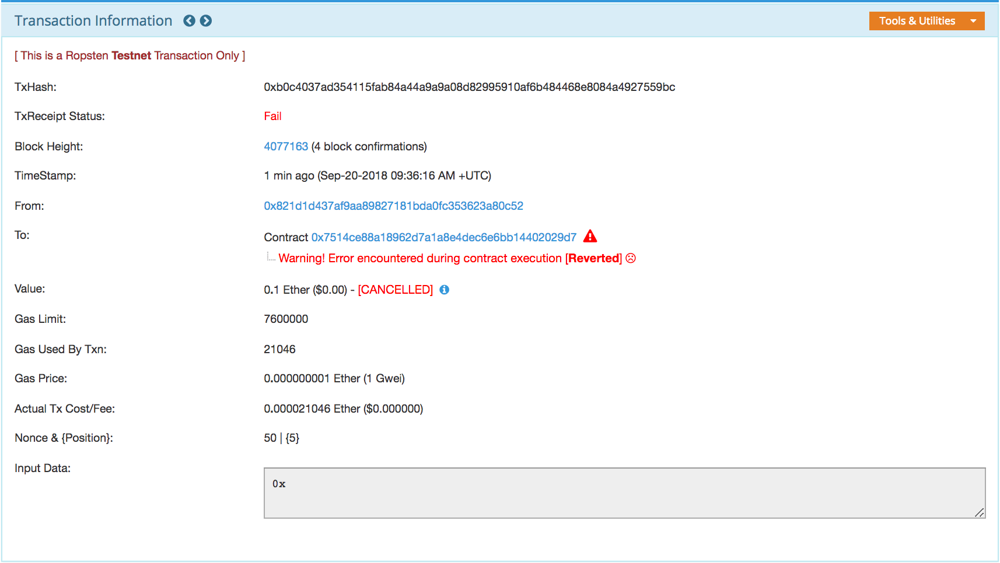
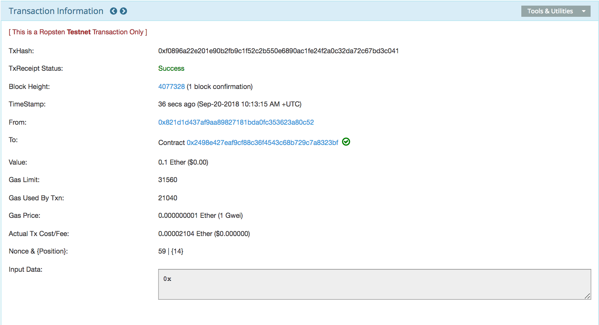
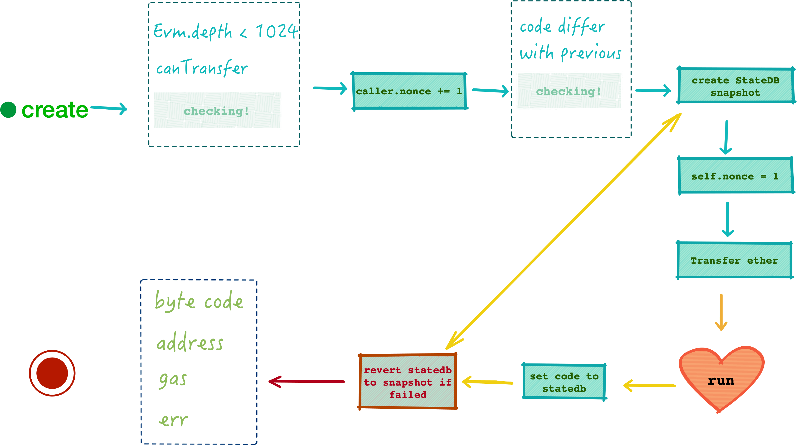
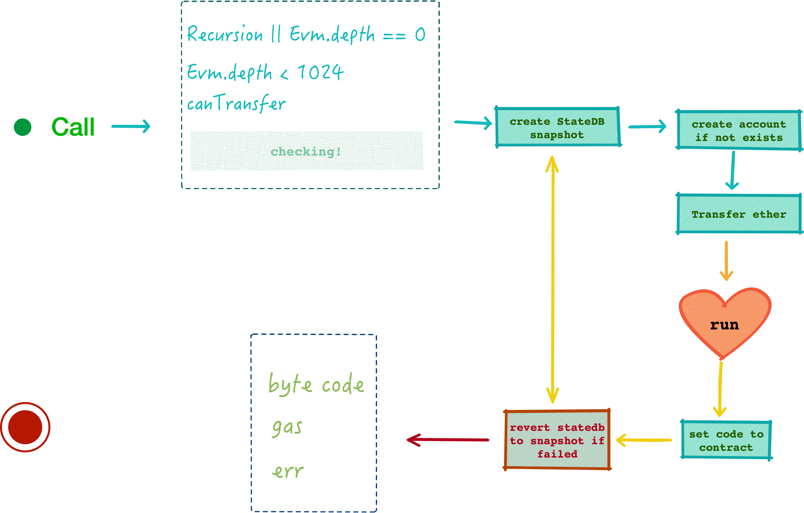
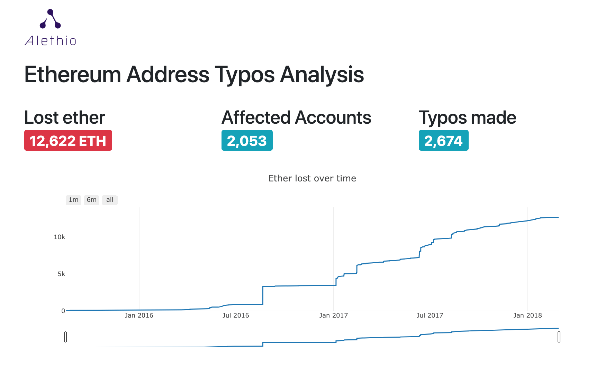
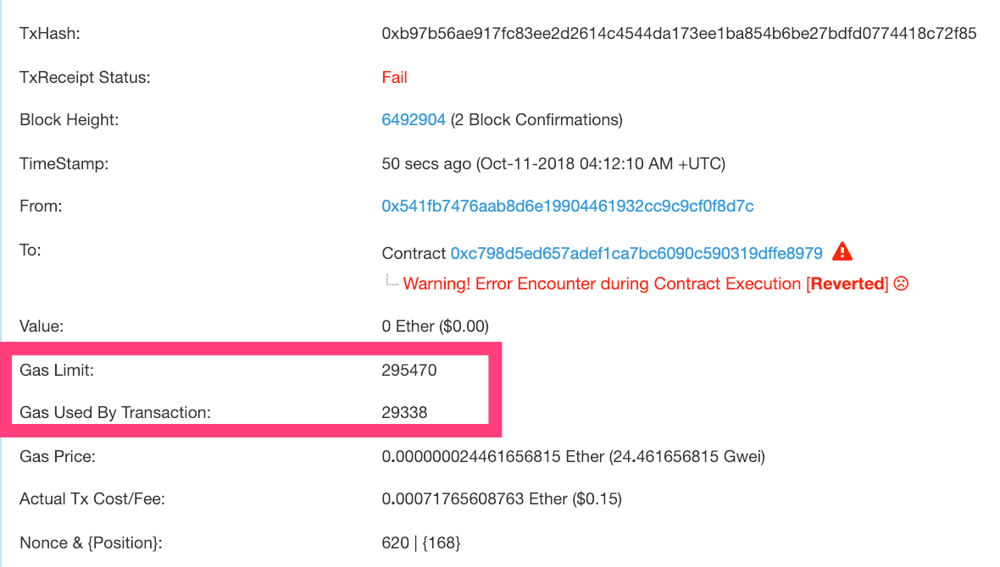
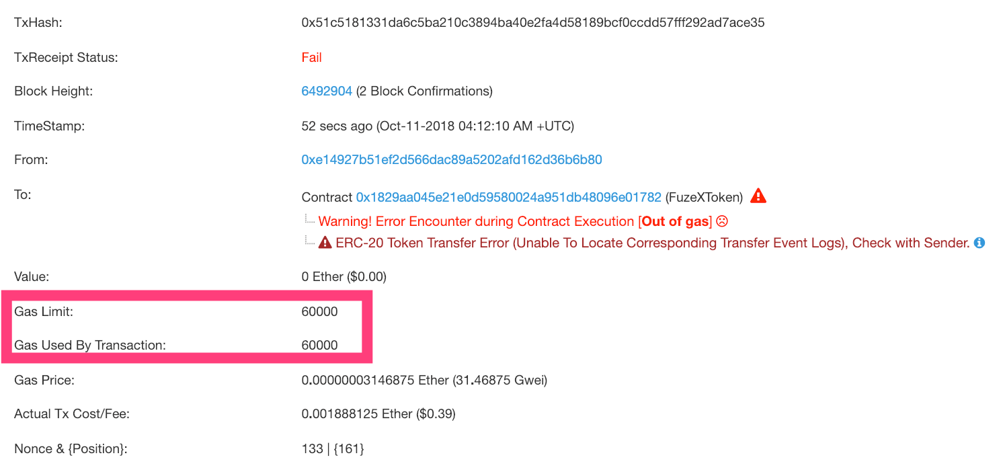

# Ethereum virtual machine simple introduct

---

<!-- START doctoc generated TOC please keep comment here to allow auto update -->
<!-- DON'T EDIT THIS SECTION, INSTEAD RE-RUN doctoc TO UPDATE -->

- [基础数据结构](#%E5%9F%BA%E7%A1%80%E6%95%B0%E6%8D%AE%E7%BB%93%E6%9E%84)
  - [EVM 结构体](#evm-%E7%BB%93%E6%9E%84%E4%BD%93)
- [Ether 转帐](#ether-%E8%BD%AC%E5%B8%90)
  - [合约账号的转账操作](#%E5%90%88%E7%BA%A6%E8%B4%A6%E5%8F%B7%E7%9A%84%E8%BD%AC%E8%B4%A6%E6%93%8D%E4%BD%9C)
    - [“无法往合约账号转账”](#%E6%97%A0%E6%B3%95%E5%BE%80%E5%90%88%E7%BA%A6%E8%B4%A6%E5%8F%B7%E8%BD%AC%E8%B4%A6)
    - [如何强制往合约账号转账](#%E5%A6%82%E4%BD%95%E5%BC%BA%E5%88%B6%E5%BE%80%E5%90%88%E7%BA%A6%E8%B4%A6%E5%8F%B7%E8%BD%AC%E8%B4%A6)
- [合约创建](#%E5%90%88%E7%BA%A6%E5%88%9B%E5%BB%BA)
  - [确定合约地址](#%E7%A1%AE%E5%AE%9A%E5%90%88%E7%BA%A6%E5%9C%B0%E5%9D%80)
  - [合约调用](#%E5%90%88%E7%BA%A6%E8%B0%83%E7%94%A8)
  - [预编译的合约](#%E9%A2%84%E7%BC%96%E8%AF%91%E7%9A%84%E5%90%88%E7%BA%A6)
  - [解释器执行](#%E8%A7%A3%E9%87%8A%E5%99%A8%E6%89%A7%E8%A1%8C)
- [References](#references)

<!-- END doctoc generated TOC please keep comment here to allow auto update -->

**约定：**

Ethereum 中合约的创建与调用可以由 EOA 账户发起，也可以由合约账户发起，前者是直接调用，后者相当是在 EVM 运行时（runtime）通过 OpCode 的方式创建与调用新合约，后者与前者并无二异，但是前者在学习理解的时候比较顺手，下面的文章只讲解第一种方式！

## 基础数据结构

从上文知道，每笔 Tx 带有两部分内容需要执行：

1. 转帐，由转出方地址向接收方地址转移一笔以太币 Ether;
2. 合约，携带的 `[]byte` 类型成员变量 Payload，其每一个 byte 都对应了一个单独的虚拟机指令，用于合约执行。很明显，对于一般的转账操作，Payload 为 nil, 也就意味着不需要执行合约。

从交易的接收方来看，对于 EOA 账号来说，只有转账的场景；而对于合约账号就会有上面两者组合的三种场景：

- 纯转账：合约账号的纯转账与 EOA 账号“**略有不同**”，下文分析；
- 合约调用：对于合约账号来说，这也是最常用的操作，调用合约函数；
- 转账 + 合约调用：对应为 `payable` 函数调用，在这种场景下，转账和合约调用是原子性的，要不两者都成功，或者兼失败。

### EVM 结构体

在了解 EVM 之前，先来看 `Context`（**EVM 上下文**） 结构体，`Context` 提供 EVM 运行时（runtime）的上下文，结构体中携带了转帐函数以及 Tx 和 Block 的一些信息：

```go
//core/vm/evm.go
type Context struct {
    CanTransfer CanTransferFunc
    Transfer    TransferFunc
    GetHash     GetHashFunc

    Origin   common.Address
    GasPrice *big.Int

    Coinbase    common.Address
    GasLimit    uint64
    BlockNumber *big.Int
    Time        *big.Int
    Difficulty  *big.Int
}
```

其中前三个为函数成员，前两个 `XXXTranferFunc` 与转账相关，`GetHashFunc` 是根据 Block Number 获取 Block Hash 的方法，比较简单，就不累述了。另外几个变量的作用如下：

- `Origin`: 取的是 `Message.From()` 地址，即 Tx 的发起方；

- `GasPrice`: Tx 中定义的 Gas 价格；

- `Coinbase`：矿工的 Ethereum Address；

- `GasLimit`, `BlockNumber`, `Time`, `Difficulty`：这四个变量都是取自 Block Header 中的値，**特别注意**，这里的 `GasLimit` 并不是取自 Tx 中的値，试想下这是为什么？

  > 回顾一下，Tx.GasLimit 只用于在交易开始执行之前的检量和扣除，具体为：
  >
  > - 放进 TxPool 的时候检查是否超过当前可用 Gas 总量，即 Block Header.GasLimit;
  > - 交易开始时的 Gas 扣除。
  >
  > 如果说你认为这里的 `GasLimit` 是用于限制这笔 Tx 的 Gas 使用量，那你的理解就错误了，`Context` 中的变量除了 `XXXTransferFunc` 之外都可以理解成是合约在执行时的环境变量，用于 Opcode 调用用。

Context 中与 Opcode 对应关系如下：

| Member        | Opcode     | Solidity@v0.4.24           | Description                             |
| ------------- | ---------- | -------------------------- | --------------------------------------- |
| `Origin`      | ORIGIN     | `tx.origin (address)`      | Get execution origination address       |
| `GasPrice`    | GASPRICE   | `tx.gasprice (uint)`       | Get price of gas in current environment |
| `Coinbase`    | COINBASE   | `block.coinbase (address)` | Get the block's beneficiary address     |
| `GasLimit`    | GASLIMIT   | `block.gaslimit (uint)`    | Get the block's gas limit               |
| `BlockNumber` | NUMBER     | `block.number (uint)`      | Get the block's number                  |
| `Time`        | TIMESTAMP  | `block.timestamp (uint)`   | Get the block's timestamp               |
| `Difficulty`  | DIFFICULTY | `block.difficulty (uint)`  | Get the block's difficulty              |

`EVM` 结构体是 Ethereum EVM 的核心，其定义如下：

```go
//core/vm/evm.go
type EVM struct {
    Context
    StateDB      StateDB
    depth        int
    chainConfig  *params.ChainConfig
    chainRules   params.Rules
    vmConfig     Config
    interpreters []Interpreter
    interpreter  Interpreter
    abort        int32
    callGasTemp  uint64
}
```

**tips**

> `EVM` 结构体中第一个成员为 `Context`, 但是没有定义具体的类型，这是 Golang 的语法糖，将 `Context` 结构中的成员全部导入到 `EVM`结构体中，类似于 OO 编程中的继承语法。

- `depth`： 当前调用栈深度；
- `chainRules`：当前 chain 的规则，主要是一些状态判断，来自 `chainConfig` 中的配置；
- `vmConfig`：EVM 虚拟机的一些配置，主要是一些开头，比如 debug 开关；
- `interpreter`：解释器，用来解释执行 EVM 中合约（Contract）的指令（Code）。

## Ether 转帐

交易的转帐操作由 `Context` 对象中的 `XXXTransferFunc` 类型函数来实现，目前转账的逻辑非常简单：

1. 判断转出方余额是否足够；
2. 转出方账户减掉一笔以太币；
3. 接收方账户添加一笔以太币；

Etherum 中转账的操作作用在 StateDB 上面的一个临时数据，等到 Block 插入到 BlockChain 之后，StateDB 上面的数据才固化下来，可以理解成写入到数据库中，所以这里也不需要加锁保护，不用担心数据一致性问题。

### 合约账号的转账操作

虽然合约账号和 EOA 账号都是 Account, 但是当一个合约账号创建之后，这个账号的性质就会发生变化，无论发送怎样的 Tx 过去，合约账号都会由 EVM 执行合约调用（即使没有调用数据），而如果合约调用失败的话（比如函数没有匹配到就是比较常见的一种调用失败方式）转账也就失败。

#### “无法往合约账号转账”

这也就意味着，你想通过 MetaMask 等工具“直接”给一个合约账号转账是不会成功的！可以看这一个 [Tx](https://ropsten.etherscan.io/tx/0xb0c4037ad354115fab84a44a9a9a08d82995910af6b484468e8084a4927559bc).



> 这是一个 ERC20 的合约，但是发送的是常规的转账数据，并没有调用合约的函数。笔者在测试过程中，一直以为是 Etherum 的 bug, 当时还兴奋了好一会儿，回过神来之后，发现只是一场虚惊。

#### 如何强制往合约账号转账

Solidity 合约中定义了一个 [fallback function](https://solidity.readthedocs.io/en/v0.4.24/contracts.html#fallback-function)，官方解释如下：

> A contract can have exactly one unnamed function. This function cannot have arguments and cannot return anything. It is executed on a call to the contract if none of the other functions match the given function identifier (or if no data was supplied at all).
>
> Furthermore, this function is executed whenever the contract receives plain Ether (without data). Additionally, in order to receive Ether, the fallback function must be marked payable. If no such function exists, the contract cannot receive Ether through regular transactions.

那么上面的问题就很好解决了，只要定义一个空的 `public payable` 的 fallback 函数即可往合约账号中转账:

```javascript
contract XXX {
    function public payable() {}
}
```

我们再次尝试使用 MetaMask 发送相同的一笔 0.1Ether 的 [Tx](https://ropsten.etherscan.io/tx/0xf0896a22e201e90b2fb9c1f52c2b550e6890ac1fe24f2a0c32da72c67bd3c041), 发现成功了:



**号外，号外**

除了定义 fallback 函数之外，还有一种方式，就是作为另一个合约 `selfdestruct` 的接收者，这种情况下会无条件接收 Ether。

fallback 函数虽然好用，但是也是有限制的，限制原文如下：

> In the worst case, the fallback function can only rely on 2300 gas being available (for example when send or transfer is used), leaving not much room to perform other operations except basic logging. The following operations will consume more gas than the 2300 gas stipend:
>
> - Writing to storage
> - Creating a contract
> - Calling an external function which consumes a large amount of gas
> - Sending Ether

当通过 `send`, `transfer` 这类函数调用到合约的 fallback 函数（合约给另一个合约转账的场景，非 EOA 给合约转账场景），此时的 fallback 函数 Gas Limit 不能超过 2300, 也就是说你不能在 fallback 函数中做太多的事情，比如下面调用 `T.callS(sAddress)` 的 message call 将执行失败（REVERTED）：

```js
contract S {
    uint public id;
    construct() public {}
    function () public payable {
        id = 1;
    }
}
contract T {
    function callS(address _s) public payable {
        _s.transfer(100);
    }
}
```

**为什么 EOA 调用 fallback 就没有 gas limit 2300 限制了呢？**

这是由于 EOA 账号发起 Tx 的时候可以指定 gas limit，这笔 gas 费用直接由 EOA 账号扣除即可，但是 `send`, `transfer` 接口你没法指定 gas limit, 那就只能由 EVM 来限制 Gas Limit，从这个角度来看的话，相当于是 `send`, `transfer` 这两个接口的 gas limit 为 2300, 当这两个接口的接收者为合约的时候（匹配到的刚好是 fallback 函数），你不能在接收者内部消耗多于 2300 的 gas，详见 [execution-of-fallback-function-with-more-2300-gas](https://ethereum.stackexchange.com/a/16116/45297) 和 [address-send-vs-address-transfer-best-practice-usage](https://ethereum.stackexchange.com/a/19343/45297).

## 合约创建

上文讲到，合约也是账号的一种，与 EOA 账号不同的是，合约账号拥有 Code 和 Storage，前者保存合约代码，后者保存合约中的全局变量，先来看下 Contract 的定义：

```go
// core/vm/contract.go
type ContractRef interface {
    Address() common.Address
}
type Contract struct {
    CallerAddress common.Address
    caller        ContractRef
    self          ContractRef
    jumpdests     map[common.Hash]bitvec
    analysis      bitvec
    Code          []byte
    CodeHash      common.Hash
    CodeAddr      *common.Address
    Input         []byte
    Gas           uint64
    value         *big.Int
}
```

其中，

- `caller` 合约调用方地址，EOA 账号或者合约账号，`CallerAddress` 也就是 `caller` 的地址；
- `self` 合约自身的地址，`self` 和 `caller` 的类型都用接口 `ContractRef` 来表示；
- `jumpdests`
- `analysis`
- `Code` 是指令数组，其中每一个 `byte` 都对应于一个预定义的虚拟机指令；
- `CodeHash` 是 `Code` 的 RLP 哈希值；
- `CodeAddr`
- `Input` 是指令所操作的数据集合；
- `Gas`
- `value`

Contract 之间通过合约地址相互调用，这一特性为业务扩展提供了若干可能性，笔者想到的一个使用场景是，由于智能合约是不可升级的，对于已经部署的合约也就无法再行调整，那么我们是否可以参考 Web 领域的反向代理模式呢？简而言之，对外提供服务的是一个类似 Nginx 的接口合约，这一合约中只负责认证鉴权和转发请求，接口合约的后端为真正的实现合约，用户只能连接到这个接口合约上，一旦后端的实现合约出现了问题，直接升级后端合约即可，从技术上来说这么做没有问题，但是我不确定为何没有人这么推荐（或者我不知晓）。

### 确定合约地址

创建一个 Contract 对象时，合约的 `self` 地址就已经**确定**下来了，这是比较神奇的一件事情，类似于先有鸡还是先有蛋的问题，那么这个地址是如何确定下来的呢？追综合约创建过程，了解到合约地址与合约创建者有关系：

```go
//core/vm/evm.go
func (evm *EVM) Create(caller ContractRef, code []byte, gas uint64, value *big.Int) (ret []byte, contractAddr common.Address, leftOverGas uint64, err error) {
    contractAddr = crypto.CreateAddress(caller.Address(), evm.StateDB.GetNonce(caller.Address()))
    return evm.create(caller, code, gas, value, contractAddr)
}
```

合约地址是根据合约创建者的 `Address` 和 `Nonce` 经过 RLP 编码之后得到 Hash, 取 Hash 后 20 个字节，即 `keccak256(address ++ nonce)[12:]`，可以参考 [how-is-the-address-of-an-ethereum-contract-computed](https://ethereum.stackexchange.com/questions/760/how-is-the-address-of-an-ethereum-contract-computed) 验证这个过程。

> 由于通过这种方式生成的合约地址是可以提前计算出来的，这可能会带来一些安全风险，比如 [FoMo3D Airdrop 攻击事件分析](https://blog.peckshield.com/2018/07/24/fomo3d/) 中提到攻击者可以通过预先计算好合约地址来赢取 Airdrop 奖励。Vitalik 在 [EIP 1014](https://github.com/ethereum/EIPs/blob/master/EIPS/eip-1014.md) 提出了根据创建者地址、随机数以及合约代码来生成合约地址的 `Create2` 接口（我不确定是出于安全考虑还是其它的），即 `keccak256(0xff ++ address ++ salt ++ keccak256(init_code)))[12:]`，在写这这份文档（区块高度 6483360，2018/10/10）的时候，Ethereum mainnet 并没有切换到这个接口，预计在 Constantinople 硬分叉完成之后就会切换到这个接口上。

现在我们来看看 `EVM.create()` 的流程：



上图已经清晰地显示了 `create()` 的流程，其主要逻辑都是在 `run()` 中执行，这个流程在后面单独讲解。

其实，它们来源都是 Transaction 对象 Tx 的成员变量 Payload！

调用 EVM.Create() 或 Call() 的入口在 `StateTransition.TransitionDb()` 中，

- 当 `tx.Recipent` 为空时，`tx.data.Payload` 被当作所**创建** Contract 的 code；
- 当 `tx.Recipient` 不空时，`tx.data.Payload` 被当作所**调用** Contract 的 input。

### 合约调用

EVM 目前有几个函数可以执行 Contract，根据作用和调用方式，可以分成两类:

- `Call()`: 通过 EOA 账号发送的 Tx 完成，也适用于合约 InnerTx；
- `CallCode()`, `DelegateCall()`, `StaticCall()`：三者由于分别对应于不同的虚拟机指令操作，属于 Tx 的 InnerTx，这几个接口属于简化版本的 `Call()`，没有转账操作，那么这种情况下如何调用另一个合约的 `payable` 接口？

这儿我们只看 `Call()` 的调用过程，其它三个接口类似，就不分析了：



`Call()` 函数的逻辑和 `create()` 基本一致，关键逻辑都是在 `run()` 中执行的， 但是有一点很大的不同：

**`Call()` 执行中缺少 Nonce 调整的步骤。**

而我们知道 Nonce 是用于避免「重放攻击」，Nonce 也是账户的一个基本属性，会直接影响到 State Root 値，下面我们对 Nonce 的调整做一下详细的解释，内容来自于 [Subtleties#nonces · ethereum/wiki Wiki](https://github.com/ethereum/wiki/wiki/Subtleties#nonces)：

- EOA 账号发起的 Tx, 其 nonce 在执行之前 $++$;
- EOA 账号 nonce 初始値为 0，合约账号初始値为 1；
- 合约账号发起 message call，其 nonce 不变；
- 合约账号发起 contract create, 其 nonce $++$；

因此，可以看到，对于合约的创建和调用，EOA 账号与合约账号的行为是不一致的：**在合约 A 中创建合约 B，会增加合约 A 的 nonce，这个行为也是必须的，不然合约 B 的地址就没办法确定下来了；但如果是调用合约 B，那是不会增加 A 的 nonce**；但是 EOA 中创建或者调用合约，都会增加自身的 nonce；

另外注意：`Call()` 的接收者（合约地址）可以是一个不存在的地址，如果调用方不小心往里面转账了，那么 EVM 会自动把这个地址创建出来，**但是很抱歉并没有私钥**！所以转入的这笔 Ether 也就无法提取出来，自然消失了。由于这个问题造成的 Ether 丢失有多少，看下面的图表就知道了（原图参考 [Aleth 的网站](https://analyses.aleth.io/2018/address-typos/)）：



一共有 12622 个 Eth，折合成 2848515 USD，总金额与当下火热的 [bitcoin challenge](https://bitcoinchallenge.codes/) 有的一拼！

### 预编译的合约

EVM 中执行合约 (指令) 的函数是 run()，其实现代码如下：

```go
// core/vm/evm.go
func run(evm *EVM, contract *Contract, input []byte, readOnly bool) ([]byte, error) {
    if contract.CodeAddr != nil {
        precompiles := PrecompiledContractsHomestead
        if evm.ChainConfig().IsByzantium(evm.BlockNumber) {
            precompiles = PrecompiledContractsByzantium
        }
        if p := precompiles[*contract.CodeAddr]; p != nil {
            return RunPrecompiledContract(p, input, contract)
        }
    }
    for _, interpreter := range evm.interpreters {
        if interpreter.CanRun(contract.Code) {
            if evm.interpreter != interpreter {
                // Ensure that the interpreter pointer is set back
                // to its current value upon return.
                defer func(i Interpreter) {
                    evm.interpreter = i
                }(evm.interpreter)
                evm.interpreter = interpreter
            }
            return interpreter.Run(contract, input, readOnly)
        }
    }
    return nil, ErrNoCompatibleInterpreter
}
```

- 如果待执行的合约地址属于预编译合约，那么直接运行预编译合约内容；
- 其它情况，遍历执行 `evm.interpreters` 中的每个 interpreter。

这里的 "预编译"，可理解为 EVM 内置合约，通常是一些比较常用的合约，其逻辑全部固定且已知，其代码已经加载到 EVM 中了，所以执行中不再需要去 StateDB 获取 Code，仅需输入 input 即可执行。

在代码实现中，预编译合约中需要实现 `RequiredGas()` 和 `Run()` 两个方法，这两全方法均仅需一个 `[]byte` 类型的参数 input：

```go
// core/vm/contracts.go
type PrecompiledContract interface {
    RequiredGas(input []byte) uint64
    Run(input []byte) ([]byte, error)
}
func RunPrecompiledContract(p PrecompiledContract, input []byte, contract *Contract) (ret []byte, err error) {
    gas := p.RequiredGas(input)
    if contract.UseGas(gas) {
        return p.Run(input)
    }
    return nil, ErrOutOfGas
}
```

在 **Byzantium** 版本的 Ethereuem 代码中已经加入了多个预编译合约，主要包括数学计算函数，例如：

- 椭圆曲线密钥恢复，
- SHA-3(256bits) 哈希算法，
- RIPEMD-160 加密算法，
- 数据拷贝，
- 大数指数运算，
- 曲线点相加法，
- 曲线倍数运数，
- Barreto-Naehrig 曲线配对

### 解释器执行

我们先来了解下`EVMInterpreter` 结构体：

```go
//core/vm/interpreter.go
type EVMInterpreter struct {
    evm      *EVM
    cfg      Config
    gasTable params.GasTable
    intPool  *intPool

    readOnly   bool   // Whether to throw on stateful modifications
    returnData []byte // Last CALL's return data for subsequent reuse
}
```

`EVMInterpreter` 结构体中其它几个成员都比较熟悉了，关键在于 `Config` 类型的成员变量，这一结构的定义如下：

```go
//core/vm/interpreter.go
type Config struct {
    Debug                   bool
    Tracer                  Tracer
    NoRecursion             bool
    EnablePreimageRecording bool
    JumpTable               [256]operation

    EWASMInterpreter string
    EVMInterpreter   string
}
```

Yellowpaper 中定义一个 opcode 大小为 `1byte`, 所以指令集最多为 256 个，在 EVM 结构中用 `operation` 对象对应一个已定义的虚拟机指令，因此其中的 `JumpTable` 数组包含了 256 个 `operation` 正是这么来的，看到这，我们知道 EVM 的核心在于 `operation` 这个结构体，这一结构体包含每个指令的基本属性，其写义如下：

```go
//core/vm/jump_table.go
type operation struct {
    execute       executionFunc
    gasCost       gasFunc
    validateStack stackValidationFunc
    memorySize    memorySizeFunc

    halts, jumps, writes, valid, reverts, returns bool
}
```

其中每个成员的功能从命名就已经看得很清晰了，除了提供基本的执行判断之外，还提供了 6 个状态判断成员，表征这个指令的高级属性：

- `halts`：指示是否中止后续执行；
- `jumps`: 指示是否增加 [PC 计数器](https://en.wikipedia.org/wiki/Program_counter)；
- `writes`: 确定这个指令可以更改 state，否的话代表只读;
- `valid`: 指示这个指令是一个有效的已知指令，虽然说最多有 256 个指令，但当前实现只有不到 100 个指令，恶意攻击可能发送一些未定义指定；
- `reverts`: 确定这个指令是否回滚 state；
- `returns`: 确认这个指令返回数据；

Contract 对象的成员变量 Code 类型为 `[]byte`，就是这些 `operation` 的集合。

`EVMInterpreter` 实现了 `Interpreter`接口，`EVMInterpreter.Run()` 方法通过逐个 `byte` 遍历入参 `Contract` 的 `Code` 成员，将其解释为一个已知的 `operation`，然后依次调用该 `operation` 对象的四个函数，完成之后返回 `[]byte`。值得注意的是，遍历过程中遇到 `errExecutionReverted` 错误的话，应当把剩下的 gas 返还，对应这一类错误的 Solidity 调用有：

- `revert`；

- `require` 失败；

查看下面这个 [Reverted Tx](https://etherscan.io/tx/0xb97b56ae917fc83ee2d2614c4544da173ee1ba854b6be27bdfd0774418c72f85)，其剩余 Gas 会被保留下来：



其它任何错误都应当被看作是 `revert-and-consume-all-ga` 错误，剩余的 Gas 不予退还，对应的 Solidity 调用为：

- `assert` 失败；
- 其它任何的错误；

剩余的 Gas 会被消耗光，详见 [Failed Tx](https://etherscan.io/tx/0x51c5181331da6c5ba210c3894ba40e2fa4d58189bcf0ccdd57fff292ad7ace35)：



其代码实现如下：

```go
//core/vm/interpreter.go
func (in *EVMInterpreter) Run(contract *Contract, input []byte, readOnly bool) (ret []byte, err error) {
    ...
    // get in.intPool

    in.evm.depth++
    defer func() { in.evm.depth-- }()

    if readOnly && !in.readOnly {
        in.readOnly = true
        defer func() { in.readOnly = false }()
    }

    in.returnData = nil

    if len(contract.Code) == 0 { return nil, nil }

    var (
        op    OpCode        // current opcode
        mem   = NewMemory() // bound memory
        stack = newstack()  // local stack
        pc    = uint64(0)   // program counter
        cost uint64
        ...
    )
    contract.Input = input
    defer func() { in.intPool.put(stack.data...) }()

    if in.cfg.Debug { ... }

    for atomic.LoadInt32(&in.evm.abort) == 0 {
        // ... Capture pre-execution values for tracing if debugging

        op = contract.GetOp(pc)
        operation := in.cfg.JumpTable[op]

        // ... check valid, Stack, Readonly, Memory，return for any failing

        cost, err = operation.gasCost(in.gasTable, in.evm, contract, stack, mem, memorySize)
        if err != nil || !contract.UseGas(cost) { return nil, ErrOutOfGas }
        if memorySize > 0 { mem.Resize(memorySize) }
        ...
        res, err := operation.execute(&pc, in, contract, mem, stack)
        ...
        if operation.returns { in.returnData = res }

        switch {
        case err != nil:        return nil, err
        case operation.reverts: return res, errExecutionReverted
        case operation.halts:   return res, nil
        case !operation.jumps:  pc++
        }
    }
    return nil, nil
}
```

流程讲解：

1. 调用栈 $++$, 由于 EVM 调用栈最大深度为 1024， 在入口先自增，为的是避免无限递归调用；
2. 如果是 `readOnly` 模式，那么无论这个 opcode 是否为 read only, 在这一次调用中设置为 `readOnly`；
3. 重置 `operator` 的 `returnData` 字段；
4. 如果这个合约的 Code 为 空，那么直接返回，什么也不执行（也就是成功了），这个场景在合约 `selfdestruct` 之后出现；
5. 初始化一个 Stack 和 Memory 用于 EVM 运行;
6. 开始遍历操作，除非收到 STOP, RETURN, SELFDESTRUCT 指令中止外，其它情况一直运行：
   1. 获取 opcode；
   2. 校验是否是合法的 opcode;
   3. 校验 opcode 的 Stack，Memory，Readonly；
   4. 计算 Gas 消耗量；
   5. 调用 opcode 的 `execute` 执行；
   6. 设置 `returnData`;

关于已知的 opcode 可以参考 Yellow Paper 中最后一节的介绍，大致可以分成这几类：

| Byte Range | Function                              | Description                      |
| ---------- | ------------------------------------- | -------------------------------- |
| 0x0        | STOP, ADD, MUL...                     | 0x0 为 STOP 指令，其它为算术运算 |
| 0x10       | LT, GT ...                            | 大小比较                         |
| 0x20       | SHA3                                  | 当前只有这一个指令               |
| 0x30       | ADDRESS, BALANCE...                   | State 相关的指令                 |
| 0x40       | BLOCKHASH, COINBASE...                | Block 相关的指令                 |
| 0x50       | MLOAD, MSTORE...                      | Storage 相关的指令               |
| 0x60       | PUSH,DUP, SWAP...                     | Stack 操作相关的指令             |
| 0xa0       | LOG0..4                               | Log 相关的指令                   |
| 0xf0       | CREATE, CALL, REVERT, SELFDESTRUCT... | Contract 操作相关的指令          |

需要特别注意的是 $LOG_n$ (n <= 4) 指令操作，$n$ 对应于 indexed 参数的个数 ，还记得 Log 在何时被用到么？

每个 Tx 执行完成后，会创建一个 Receipt 对象用来记录这个交易的执行结果。Receipt 对象中携带一个 Log 数组，用来记录 Tx 操作过程中的所有变动细节，而这些 Log，正是通过合适的 $LOGn$ 指令 - 即合约指令数组中的单个 `byte`，在其对应的 `operation` 里被创建出来的。

## References

- https://github.com/trailofbits/evm-opcodes
- https://media.consensys.net/over-12-000-ether-are-lost-forever-due-to-typos-f6ccc35432f8
