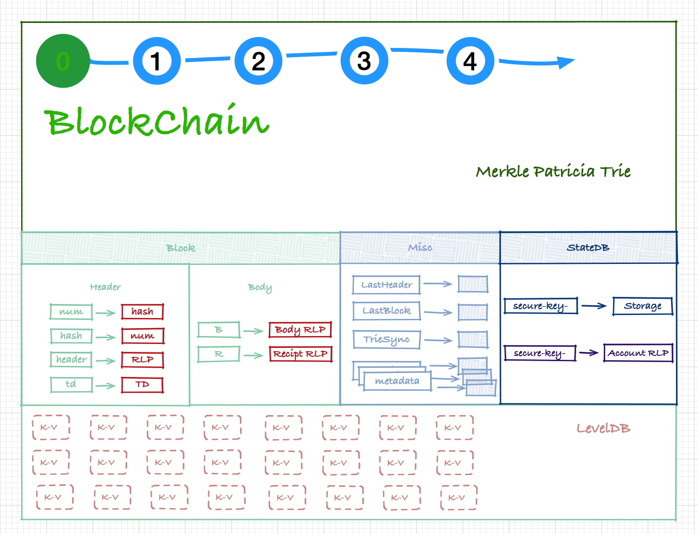
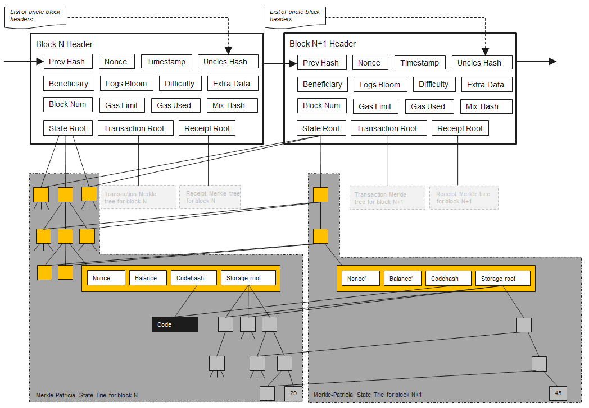

# BlockChain 内部数据结构

---
<!-- START doctoc generated TOC please keep comment here to allow auto update -->
<!-- DON'T EDIT THIS SECTION, INSTEAD RE-RUN doctoc TO UPDATE -->


- [LevelDB](#leveldb)
  - [Schema 结构](#schema-%E7%BB%93%E6%9E%84)
- [LevelDB 之上 && BlockChain 之下](#leveldb-%E4%B9%8B%E4%B8%8A--blockchain-%E4%B9%8B%E4%B8%8B)
  - [Block 结构](#block-%E7%BB%93%E6%9E%84)
  - [Header 结构](#header-%E7%BB%93%E6%9E%84)
    - [将数组转化成 MPT 结构](#%E5%B0%86%E6%95%B0%E7%BB%84%E8%BD%AC%E5%8C%96%E6%88%90-mpt-%E7%BB%93%E6%9E%84)
    - [MPT 生成时间](#mpt-%E7%94%9F%E6%88%90%E6%97%B6%E9%97%B4)
  - [Body 结构](#body-%E7%BB%93%E6%9E%84)
  - [Block Hash](#block-hash)
  - [Bloom Filter](#bloom-filter)
- [BlockChain](#blockchain)
  - [BlockChain VS HeaderChain](#blockchain-vs-headerchain)
  - [`BlockChain` 的初始化](#blockchain-%E7%9A%84%E5%88%9D%E5%A7%8B%E5%8C%96)
  - [BlockChain 的查找](#blockchain-%E7%9A%84%E6%9F%A5%E6%89%BE)
  - [BlockChain 的插入](#blockchain-%E7%9A%84%E6%8F%92%E5%85%A5)
  - [BlockChain 的删除](#blockchain-%E7%9A%84%E5%88%A0%E9%99%A4)
- [创世区块 Gensis Block 和区块链配置 Chain Config](#%E5%88%9B%E4%B8%96%E5%8C%BA%E5%9D%97-gensis-block-%E5%92%8C%E5%8C%BA%E5%9D%97%E9%93%BE%E9%85%8D%E7%BD%AE-chain-config)
  - [ChainConfig](#chainconfig)
  - [Genesis Block](#genesis-block)
- [交易池 TxPool](#%E4%BA%A4%E6%98%93%E6%B1%A0-txpool)
  - [Tx 加入 TxPool](#tx-%E5%8A%A0%E5%85%A5-txpool)
  - [同账号下的交易列表 txList](#%E5%90%8C%E8%B4%A6%E5%8F%B7%E4%B8%8B%E7%9A%84%E4%BA%A4%E6%98%93%E5%88%97%E8%A1%A8-txlist)
- [Ethereum world state -- StateDB](#ethereum-world-state----statedb)
  - [stateObject -- Ethereum Account](#stateobject----ethereum-account)
  - [stateObject VS StateDB](#stateobject-vs-statedb)
  - [StateDB journal -- 账户状态的版本管理](#statedb-journal----%E8%B4%A6%E6%88%B7%E7%8A%B6%E6%80%81%E7%9A%84%E7%89%88%E6%9C%AC%E7%AE%A1%E7%90%86)
  - [StateDB prune 机制](#statedb-prune-%E6%9C%BA%E5%88%B6)
  - [StateDB 作为临时存储 LOG 日志](#statedb-%E4%BD%9C%E4%B8%BA%E4%B8%B4%E6%97%B6%E5%AD%98%E5%82%A8-log-%E6%97%A5%E5%BF%97)
- [小结](#%E5%B0%8F%E7%BB%93)
- [References](#references)

<!-- END doctoc generated TOC please keep comment here to allow auto update -->


在 Ethereum 的世界里，数据的最终存储形式是 [k,v] 键值对，目前使用的 [k,v] 型底层数据库是 LevelDB；在底层数据库之上，根据数据呈现形式的不同，可以分为：

  * 首先是 Block 结构，所有与交易、合约相关的数据，其呈现的集合形式是 Block；

  * 如果以 Block 为单位链接起来，则构成更大粒度的 BlockChain；

  * 若以 Block 作切割，那么 Transaction, State, Receipt, Contract 就是更小的粒度；


下图描绘了上述各数据单元的层次关系：



另一方面，上述数据单元如 Block，stateObject，StateDB 等，均大量使用 Merkle-PatriciaTrie(MPT) 数据结构以组织和管理 [k,v] 型数据。利用 MPT 高效的分段哈希验证机制和灵活的节点 (Node) 插入 / 载入设计，调用方均可快速且高效的实现对数据的插入、删除、更新、压缩和加密。

下面从底向顶的方式讲解各个层面的内容，希望能够从底层开始给大家一个比较清晰的结构。

## LevelDB

LevelDB 的知识比较独立，关于 LevelDB 原理性的内容后面单独讲解，在这一系列的文章中不体现出来。

LevelDB 作为一个典型的 K-V 数据库，为了应对多种不同类型数据的存储，业务层（Block）需要对 Key 做 encode  使用，也就是经常说的 Schema，下面看下 LevelDB 中存储的数据 Schame 结构。

### Schema 结构

Header 和 Block 的主要成员变量，最终还是要存储在底层数据库中。我们来看看 Ethereum 中具体的存储方式 (*core/rawdb/schema.go*)。

| key                                                          | value                      |
| ------------------------------------------------------------ | -------------------------- |
| `'h' + num + hash`                                           | header's RLP raw data      |
| `'h' + num + hash + 't'`                                     | td                         |
| `'h' + num + 'n'`                                            | hash                       |
| `'H' + hash`                                                 | num                        |
| `'b' + num + hash`                                           | body's RLP raw data        |
| `'r' + num + hash`                                           | receipts RLP               |
| `'l' + hash`                                                 | tx/receipt lookup metadata |
| `'B' + bit(uint16 big endian) + section(uint64 big endian) + hash` | bloom bits                 |
| `'secure-key-' + hash`                                       | preimage                   |

其中几个字段解读如下：

- hash 是该 Block 对象的 RLP 哈希值，在代码中也被称为 `canonical hash`；
- num 是 Number 的 `uint64 big endian` 整型数。

可以发现，hash 和 num 是 key 中出现最多的成分；同时 hash 和 num 还分别作为 value 被单独存储，而每当此时则另一方必组成 key。对应到 Web 领域，num 可记性比较高，相当于域名，hash 相当于 IP 地址，这样子的设计好处也很明显，到 LevelDB 查询数据也多了一种可能性。

这些信息都在强烈的暗示，**num(Number) 和 hash 是 Block 最为重要的两个属性：**

- num 用来确定 Block 在整个区块链中所处的位置；
- hash 用来辨识唯一的 Block/Header 对象。

另外，大家可能对于 `secure-key-` 这个 schema 比较好奇，这是用来存储类似[彩虹表](https://zh.wikipedia.org/zh-hans/%E5%BD%A9%E8%99%B9%E8%A1%A8)的数据，这个内容请细看下一篇文章的分析。

## LevelDB 之上 && BlockChain 之下

这一块的内容在整个 Etherum 体系中都是比较重要的，希望能够好好理解一下。

### Block 结构


Block 是 Ethereum 的核心数据结构之一，所有账户的相关活动，以交易 (Transaction) 的格式表现出来，每个 Block 有一个交易数据列表；每个交易的执行结果，由一个 Receipt 对象与其包含的一组 Log 对象记录；

所有交易执行完后生成的 Receipt 列表，经过压缩和签名之后存储在 Block 中。Block 之间通过前向指针 `ParentHash` 一个一个串联起来成为一个单向链表，这个就是 BlockChain 结构体。

从上图可以知道，Block 结构由 Header 和 Body 两个部分组成，其 `Block` 结构体的定义如下：

```go
//core/types/block.go
type Block struct {
    header       *Header
    uncles       []*Header
    transactions Transactions

    // caches
    hash atomic.Value
    size atomic.Value

    // Td is used by package core to store the total difficulty
    // of the chain up to and including the block.
    td *big.Int

    // These fields are used by package eth to track
    // inter-peer block relay.
    ReceivedAt   time.Time
    ReceivedFrom interface{}
}
```

`Block` 是这么重要的结构，但其成员变量以私有为主，具体成员见上面的定义，注意的是，这里有一个 `td` 成员，这个成员在 *core* 模块中被用来存储从创世区块开始到当前区块为止所有区块上的 difficulty 之和（包括当前区块）。

### Header 结构

```go
//core/types/block.go
type Header struct {
    ParentHash  common.Hash
    UncleHash   common.Hash
    Coinbase    common.Address
    Root        common.Hash
    TxHash      common.Hash
    ReceiptHash common.Hash
    Bloom       Bloom
    Difficulty  *big.Int
    Number      *big.Int
    GasLimit    uint64
    GasUsed     uint64
    Time        *big.Int
    Extra       []byte
    MixDigest   common.Hash
    Nonce       BlockNonce
}
```

Header 是 Block 的核心，注意到它的成员变量全都是 public 的，这使得它可以很方便的向调用者提供关于 Block 属性的操作，Header 的成员变量全都很重要，值得细细理解:

* `ParentHash`：指向父区块 (parentBlock) 的指针。除了创世区块 (Genesis Block) 外，每个区块**有且只有一个**父区块。
* `UncleHash`：Block 结构体的成员 `uncles` 的 RLP 哈希值。`uncles` 是一个 `Header` 指针数组，它的存在，用于解决冲突问题，uncle 是指拥有相同的 Tx，不同 `Header` 的区块 。Uncle 是 Block 中非常特殊的一个成员，从业务功能上说，它并不是 Block 结构体必须的，它的出现当然会占用整个 Block 计算哈希值时更长的时间，目的是为了抵消整个 Ethereum 网络中那些计算能力特别强大的节点会对区块的产生有过大的影响力，防止这些节点破坏 “去中心化” 这个根本宗旨。官方描述可见 [ethereum-wiki uncle-incentivization](https://github.com/ethereum/wiki/wiki/Design-Rationale#uncle-incentivization)
* `Coinbase`：挖掘出这个区块的矿工地址，在每次执行交易时系统会给与一定补偿的 Ether 发送给这个地址。
* `Root`：**StateDB** 中的 **state trie** 的根节点的 RLP 哈希值。Ethereum 中，每个账户以 `stateObject` 对象表示，账户以 Address 为唯一标识，其信息在相关交易 (Transaction) 的执行中被修改。注意，Block 之间 `stateObject` 是会有重叠的部分，这一値在 Block 封印的时候计算出来，下一个 Block 中交易的执行以上一个  Block 中的 stateRoot 为根基。交易执行过程中所有的账户对象逐个被插入到一个 Merkle-PatricaTrie(MPT) 结构里，形成 **state trie**，可以通过简单地向网络询问 trie 的特定分支来立即确定任何帐户的确切余额和状态，而不用像 Bitcion UTXO 模型一步步推导出来，这一特性对于 light client 来说非常有用。
* `TxHash`: Block 中 **tx trie** 的根节点的 RLP 哈希值。与 `Root` 成员的原理类似，Block 的成员变量 `transactions` 中所有的 tx 对象，都被逐个插入一个 MPT 结构，形成 **tx trie**。
* `ReceiptHash`：Block 中的 **receipt trie** 的根节点的 RLP 哈希值。Block 的所有 Transaction 执行完后会生成一个 Receipt 数组，这个数组中的所有 Receipt 被逐个插入一个 MPT 结构中，形成 **receipt trie**。
* `Bloom`：Bloom Filter，用来快速判断一个 Log 对象是否存在于一组已知的 Log 集合中（至于什么是 Log 对象，且看后面的分析）。
* `Difficulty`：区块的挖掘难度。Block 的 Difficulty 由共识算法基于 parentBlock 的 Time 和 Difficulty 计算得出，它会应用在区块的‘挖掘’阶段，从概念上可知，`Difficulty` 就等于当前区块与其父区块的 `td` 之差。
* `Number`：区块的序号。Block 的 Number 等于其 parentBlock 的 `Number`  加 1。
* `Time`：区块 “应该” 被创建的时间。由共识算法确定，一般来说，要么等于 `parentBlock.Time + 10s`，要么等于当前系统时间。
* `GasLimit`：区块内所有 Gas 消耗的理论上限。该数值在区块创建时设置，与父区块有关。具体来说，根据父区块的 GasUsed 同 GasLimit * 2/3 的大小关系来计算得出。
* `GasUsed`：区块内所有 Transaction 执行时所实际消耗的 Gas 总和。
* `Nonce`：一个 64bit 的哈希数，它被应用在区块的 "挖掘" 阶段，并且在使用中会被修改。

Merkle-PatriciaTrie(MPT) 是 Ethereum 用来存储区块数据的核心数据结构， MPT 最简单的理解是一个倒置的树形结构，每个节点可能有若干个子节点，关于 MPT 在 Ethereum 中的实现细节在下文有专门介绍。

`Root`，`TxHash` 和 `ReceiptHash`，分别取自三个 MPT 类型对象：**stateTrie**, **txTrie**, 和 **receiptTrie** 的根节点哈希值。用一个 32byte 的哈希值，来代表一个有若干节点的树形结构（或若干元素的数组），这是为了数据校验。比如在 Block 的同步过程中，通过比对收到的 `TxHash`，可以确认 `Block` 成员 transactions 是否同步完整。

三者当中，`TxHash` 和 `ReceiptHash` 的生成稍微特殊一点，因为这两的数据来源是数组，而不像 `Root` 中的 `stateObject` 原本就是以 K-V 结构存在。

#### 将数组转化成 MPT 结构

考虑到 MPT 专门存储 [k,v] 类型数据，代码里利用了点小技巧：将数组中每个元素的索引作为 k，该元素的 RLP 编码值作为 v，组成一个 [k,v] 键值对作为一个节点，这样所有数组元素作为节点逐个插入一个初始化为空的 MPT，形成 MPT 结构。

#### MPT 生成时间

在 `stateTrie`，`txTrie`，`receiptTrie` 这三个 MPT 结构的产生时间上，分别是：

* `txTrie` 理论上只需要 Block 打包的 tx 数组 `Block.transactions` 即可，不过依然被限制在所有交易执行完成后生成；

* `receiptTrie` Receipt 是在交易执行之后生成的，因此这个 MPT 在 Block 内的所有交易执行完成才能生成；

* 接下来是 `stateTrie`，它被称为 Ethereum world state，存储了 Ethereum 中所有账户的信息，比如余额，发起交易次数，合约代码等等，所以随着交易的执行，`stateTrie` 一直在变化，这就使得 `stateTrie` 值也在变化中。于是 `StateDB` 定义了一个函数 `IntermediateRoot()`，用来生成那一时刻的 `Root` 值:

    ```go
    // core/state/statedb.go
    func (s *StateDB) IntermediateRoot(deleteEmptyObjects bool) common.Hash
    ```

    这个函数的返回值，代表了所有账户信息的一个**即时状态**。

关于 `Header.Root` 的生成时间，无可厚非，必定是在 Block 插入到 BlockChain 的时候生成。所以 `Root` 值就是在该区块内所有交易完成后，根据当前所有账户信息的即时状态生成一个新的根哈希值：


### Body 结构

```go
//core/types/block.go
type Body struct {
    Transactions []*Transaction
    Uncles       []*Header
}
```

让人产生好奇的是，`Block` 结构中并没有 `Body` 结构的成员，细看代码，发现是 `Body()` 方法，通过引用 Block 的  `transactions` 和 `uncles` 成员，返回 `*Body` 结构成员：

```go
//core/types/block.go
func (b *Block) Body() *Body { return &Body{b.transactions, b.uncles} }
```

从这个角度看，Block 中除了 Header 和其它几个属性成员，剩余部分就是 Body 成员。那为什么需要有这个区分呢，直接一个 Block 包含 Header 和 Body 或者不要 Body 字段不是更加清晰吗？

类似于 HTTP Header 和 Body 的设计形式，Block 中的 Body 可以理解为 Block 里的数组成员集合，它相对于 Header 需要更多的存储空间，所以在数据传输和验证时，往往与 Header 是分开进行的，这点和 HTTP 协议不同。

### Block Hash

同 Ethereum 世界里的其他对象类似，Block 对象的唯一标识符，就是它的哈希值。需要注意的是:

**Block.Hash = Block.Header.RLPHash**

```go
// core/types/block.go
func (b *Block) Hash() common.Hash {
    if hash := b.hash.Load(); hash != nil {
        return hash.(common.Hash)
    }
    v := b.header.Hash()
    b.hash.Store(v)
    return v
}
func (h *Header) Hash() common.Hash {
    return rlpHash(h)
}
```

**Tips**：Block 对象创建之后，Block 中的内容将不再变化，而 Hash 计算是个耗时耗力的过程，因此有必要将 Block 的 Hash 值缓存下来，那么 Block 的成员 `hash` 会缓存上一次 Header 计算出的哈希值，以避免不必要的计算。

Block 的哈希值等于其 Header 的 RLP 哈希值，也就是没有把 Tx, Receipt 这些数据计算到哈希値中，这从一方面优化了哈希计算的效率问题，也从根本上明确了 Block 和 Header 表示的是同一个区块对象。考虑到这两种结构体所占存储空间的差异，这种设计可以带来很多便利，比如在数据传输时，完全可以先传输 Header 对象，验证通过后再传输 Block 对象，收到两个对象后还可以利用二者的成员哈希值做相互验证。

### Bloom Filter

**背景知识**

> 布隆过滤器是用于集合的概率表示的紧凑数据结构，以便支持成员资格查询（查找某个元素是否在这个集合中）。
>
> 空 Bloom 过滤器是 m 位全部设置为 0 的位数组，同时还必须定义 k 个不同的哈希函数，每个哈希函数将一些集合元素映射或散列到 m 个阵列位置之一，从而生成均匀的随机分布。通常，k 是常数，远小于 m，其与要添加的元素的数量成比例；k 的精确选择和 m 的比例常数由过滤器的预期误报率决定。
>
> 1. 添加元素：请将其提供给每个 k 哈希函数以获取 k 个数组位置，将所有这些位置的位设置为 1。
> 2. 查询元素（测试它是否在集合中）：请将其提供给每个 k 哈希函数以获取 k 个数组位置。如果这些位置的任何位为 0，则该元素肯定不在该集合中 - 如果是，则插入时所有位都将设置为 1。如果全都是 1，则元素在集合中，**或者在插入其他元素期间偶然将位设置为 1**，从而导致误报。在简单的 Bloom 过滤器中，无法区分这两种情况，但更高级的技术可以解决这个问题。
>
>  **优点**
>
> * 节省空间：位数组的使用，再加上多重哈希函数的使用
>
> **缺点**
>
> - 无法存储相关联的对象
> - 无法删除元素
> - 有一定概率的假阳性判断（只能用来判断元素“不在”集合中，判伪不判正）

前文提到，Header 的 `Bloom` 成员是一个大小为 `256bytes` 的字节数组，这个区域存储了当前区块中所有 Receipt Log 所组成的布隆过滤器，也就是布隆过滤器大小是 2048 个 bit。而我们的一个 Tx 的 Receipt 字段也存在一个大小相等的布隆过滤器，这个布隆过滤器中记录了所有的 log 记录的信息，详见下面的代码：

```go
//core/types/blom9.go
const BloomByteLength = 256
type Bloom [BloomByteLength]byte

//core/types/block.go
type Header struct {
    Bloom Bloom
    ...
}

//core/types/receipt.go
type Receipt struct {
    Bloom Bloom
    Logs  []*Log
    ...
}
```

展开出来的结构关系详见下图，原图位于 [StackOverflow](https://ethereum.stackexchange.com/a/6413/45297)：


为了理解上图，我们不得不对 Yellowpaper 中 log 记录的形式化定义有所了解：

O 代表我们的日志记录，$O_{a}$ 代表 log 触发者（logger）的地址，$O_{t0}$, $O_{t1}$ 代表 log 的 Topics，$O_{d}$ 代表数据。
$$
O \equiv (O_{a}, (O_{t0}, O_{t1}, ...), O_{d})
$$
$O_{a}$  为 20 个字节，$O_{t}$ 为 32 个字节，$O_{d}$ 字节长度不固定
$$
O_{a} \in B_{20} \qquad \bigwedge \qquad \forall_{t \in O_{t}}: t \in B_{32} \qquad \bigwedge  \qquad O_{d} \in B
$$
Yellowpaper 中定义的布隆过滤器函数 M，用来把一个 log 对象转换成 256 字节的 hash：
$$
M(O) \equiv \bigvee _{t \in { O_{a} } \bigcup O_{t}}(M_{3:2048(t)})
$$
其中 $M_{3:2048}$ 是一个特殊的布隆过滤器函数，用来设置 2048 个 bit 位中的3个位为1,  具体的方法请参考下面：
$$
\begin{align}
M_{3:2048}(x: x \in B)  \quad &\equiv \quad y: y \in B_{256}  \qquad where: \\
y \quad &= \quad (0, 0,..., 0)  \quad except: \\
\forall_{i\in\{0, 2,4\}} \quad &:  \quad \Beta_{m(x,i)}(y) = 1 \\
m(x, i) \quad &\equiv \quad KEC(x)[i, i+1] mod   2048
\end{align}
$$
其中，$\Beta$ 为给定字节数组的 bit 位索引，$KEC(x)[i,i+1]$ 求 SHA3 输出的 第$[i,i+1]$ 字节上的値（也就是从 $i*8$ 开始共 16 bit 的値）。

对于任意的输入值，首先求他的 SHA3 输出，然后通过取 SHA3 输出的第 $01, 23, 45$ 三对2字节上的值对 2048 取余，得到三个值，这三个值就是输出的 2048 个位组中需要置位的下标。根据布隆过滤器的特性，**对于任何一个输入，如果它对应的三个下标的值都为 0，那么它肯定不在这个区块中；而反之则不成立，即如果对应的三位都为 1，也不能说明一定在这个区块中。**

Etherum 中的代码实现如下：

```go
//core/types/bloom9.go
func LogsBloom(logs []*Log) *big.Int {
    bin := new(big.Int)
    for _, log := range logs {
        bin.Or(bin, bloom9(log.Address.Bytes()))
        for _, b := range log.Topics {
            bin.Or(bin, bloom9(b[:]))
        }
    }
    return bin
}
func bloom9(b []byte) *big.Int {
    b = crypto.Keccak256(b)
    r := new(big.Int)

    for i := 0; i < 6; i += 2 {
        t := big.NewInt(1)
        b := (uint(b[i+1]) + (uint(b[i]) << 8)) & 2047
        r.Or(r, t.Lsh(t, b))
    }

    return r
}
```

注意，yellowpaper 中写着取余，而上面代码实现中用了 bit and, 如果是对 2 的幂次方取余，其结果等同于对幂次方 -1 的値 bitand:
$$
x \quad mod \quad 2^{n} \equiv x \; \& \; (2^{n}-1)
$$
Receipt 中的布隆过滤器就是当前 tx 中所有的日志的布隆过滤器输出的并集，同时 Header 中的布隆过滤器就是当前 Block 中的 Receipt 的布隆过滤器的并集。

## BlockChain

在 Geth 早期版本中，Ethereum 中用 `ChainManager` 结构来管理上面由 Block 结构组成的链状数据，后面更改的 `BlockChain` ，从某种意义上来说，区块链也是一种数据库，一种只支持追加写入，并发读取的数据库。在 Ethereum 中，`core.types.BlockChain` 结构体被用来管理整个区块单向链表，管理了这个链表的初始化、插入、读取等操作。

`BlockChain` 的结构体成员非常多，我们先来关注几个重要的成员：

```go
type BlockChain struct {
    chainConfig   *params.ChainConfig
    db                 ethdb.Database
    hc                 *HeaderChain
    genesisBlock  *types.Block

    currentBlock       atomic.Value
    currentFastBlock atomic.Value

    bodyCache, bodyRLPCache, receiptsCache, blockCache *lru.Cache

    engine      consensus.Engine
    processor Processor
    validator   Validator
    vmConfig  vm.Config
}
```

可以看到，`BlockChain` 结构中持有了一个 `ethdb.Database` 类型的 db, 用于操作底层的 LevelDB, 另外有两个重要成员，通过这两个成员可以标定两个区块链是否是相同的：

1. `genesisBlock`： 创世区块，创世区块确定之后不可更改，一个链通过一个包含了创世区块的数据结构开始，一个相同的链必须包含相同的创世区块，但反之刚不成立（考虑 ETH 和 ETC hard fork 的情况），关于创世区块，后方会详细讲解；
2. `currentBlock`：当前区块，标定一个区块链的区块高度，是一个随时间变化的値。

除此之外，可以看到 `BlockChain`  有一大堆的 LRU cache，分别用于缓存 body, receipt, block 等维度的数据，可见，业务层主要通过 `BlochChain` 结构来操作管理链状数据，从这里的高速缓存也能够看出来。另外，要提一点，我们知道 cache 是个万金油，在 Web 领域 cache 的使用非常普遍，而 Ethereum 对于每一层的数据都提供了或多或少的 cache，比如说：

* BlockChain 维度的 block, body cache；
* Block 维度避免重复计算 Hash 和 Size 的 cache；
* Trie 保存到 LevelDB 之前缓存在内存中的 trie nodes；
* Trie 中保存 preimage 的缓存；
* ...

**Engine**

Engine 是共识算法定义的行为接口，共识算法是整个数字货币体系中最重要的概念之一，它在理论上的完整性，有力的支撑了 “去中心化” 这个伟大设想的实现。落实在代码层面，`consensus.Engine` 就是 Ethereum 系统里共识算法的一个主要行为接口，它基于符合某种共识算法规范的算法库，提供包括 `VerifyHeaders()`，`VerifyUncles()` 等一系列涉及到数据合法性的关键函数。不仅仅 `BlockChain` 和 `HeaderChain` 结构体，在 Ethereum 系统里，所有跟验证区块对象相关的操作都会调用 Engine 行为接口来完成。

目前存在两种共识算法规范，一种是基于运算能力（proof-of-work），叫 [Ethash](https://en.wikipedia.org/wiki/Ethash)；另一种基于投票机制（proof-of-authority），叫 [Clique](https://github.com/ethereum/EIPs/issues/225)，具体的共识算法内容在之后的文章中会有更多展开。

### BlockChain VS HeaderChain

同 Block/Header 的关系类似，`BlockChain` 还有一个成员变量类型是 `HeaderChain`, 用来管理所有由 `Header` 组成的单向链表。`HeaderChain` 结构不会单独出现，只会被 `BlockChain` 或者 `LightChain` 裹挟持有的时候会出现（`LightChain` 结构类似于 BlockChain，但默认只处理 Headers，不过依然可以另行下载 Tx 和 Receipt）。

**注：**
`LightChain` 提供了一种轻客户端的实现，Etherum 想着能在资源受限的设备上使用，与 `BlockChain` 相比，`LightChain` 只提供 `Header` 的处理，对于 Block body 则从其它节点上下载的方式，因此对于 light client 这里不讲解了。从这个意义上来说， `BlockChain` 与 `LightChain` 其实是一对相似的结构。

`HeaderChain` 结构体定义如下：

```go
type HeaderChain1 struct {
    config             *params.ChainConfig
    chainDb          ethdb.Database
    genesisHeader *types.Header

    currentHeader atomic.Value

    headerCache, tdCache, numberCache *lru.Cache

    engine consensus.Engine
}
```

在数据结构的设计上，`BlockChain` 同 `HeaderChain` 有诸多类似之处：

- 有相同的 `ChainConfig` 对象；
- `BlockChain` 有成员 `genesisBlock` 和 `currentBlock`，分别对应创世块和当前块，而 `HeaderChain` 则有 `genesisHeader` 和 `currentHeader`；
- `BlockChain` 有 `bodyCache`，`blockCache` 等成员用以缓存高频调用对象，而 `HeaderChain` 则有 `headerCache`, `tdCache`, `numberCache` 等缓存对象。
- 两者提供相似的 `GetBlockXXX()`, `GetHeaderXXX()` 接口用于查找 Block/Header 对象；
- 两者分别提供 `WriteBlockXXX()` 与 `WriteHeader()` 接口用于写入 Block/Header 对象；

除此之外，`BlockChain` 相对于 `HeaderChain` 主要增加了 `Processor()` 和 `Validator()` 两个接口行为变量，两者用于处理 Block 级别的事宜：
* `Processor()` 实现了 `core.Processor` 接口，用以执行一个 Block 中所有的 Tx 对象，`BlockChain` 中使用的是 `core.StateProcessor` 结构；
* `Validator()` 实现了 `core.Validator` 接口，验证 Block 中的数据成员的有效性，`BlockChain` 中使用的是 `core.BlockValidator` 结构。


### `BlockChain` 的初始化

`BlockChain` 是在节点初始化 Ethereum 协议的时候创建的（关于 Ethereum 协议创建流程详见后文），那么对应于 light client，`LightChain` 是在 LightEthereum 协议初始化中创建的，这里我们只看下 `BlockChain` 创建的流程：

```go
//core/blockchain.go
func NewBlockChain(db ethdb.Database, cacheConfig *CacheConfig, chainConfig *params.ChainConfig, engine consensus.Engine, vmConfig vm.Config) (*BlockChain, error) {
    ...
    bodyCache, _ := lru.New(bodyCacheLimit)
    // also set lru for bodyRLPCache, blockCache, futureBlocks, badBlocks
    ...

    bc := &BlockChain{
        // ... assign member
    }
    bc.SetValidator(NewBlockValidator(chainConfig, bc, engine))
    bc.SetProcessor(NewStateProcessor(chainConfig, bc, engine))

    bc.hc, err = NewHeaderChain(db, chainConfig, engine, bc.getProcInterrupt)
    if err != nil { return nil, err }

    bc.genesisBlock = bc.GetBlockByNumber(0)
    if bc.genesisBlock == nil { return nil, ErrNoGenesis }

    if err := bc.loadLastState(); err != nil { return nil, err }

    for hash := range BadHashes {
        if header := bc.GetHeaderByHash(hash); header != nil {
            headerByNumber := bc.GetHeaderByNumber(header.Number.Uint64())
            if headerByNumber != nil && headerByNumber.Hash() == header.Hash() {
                ...
                // rewind chain
                bc.SetHead(header.Number.Uint64() - 1)
            }
        }
    }
    go bc.update()
    return bc, nil
}
```

1. 首先初始化一些后续需要用到的 LRU Cache，包括 bodyCache, bodyRLPCache, blockCache, futureBlocks, badBlocks；

2. 创建一个 `BlockChain` 实例，并根据入参赋值；

3. 设置 `BlockChain` 的 Validator 和 Processor；

4. 创建一个 `HeaderChain`；

5. 确保 `BlockChain` 中创世区块已经存在了;

6. 确保 `BlockChain` 中最新的区块及其 State 数据是正确和完整的；

   当前已知的并已经确认的最近的区块对应的 StateDB 信息，后续的 StateDB 都是当前的 StateDB 来做变更，因此这里也可以理解为“初始化的” `stateTrie`.

7. 确保区块中不存在 bad block，所谓的 bad block 一般就是出现软件问题之后，hard fork 的分叉点。一般情况下，这里的软件问题是由于某一个 Etherum client 的问题导致的，比如 Geth 的问题，或者 Parity 的问题，而不是所有客户端都受到了影响，那么把在这一客户端出现问题的块扔掉就可以了，同时选择用其它未受影响客户端上的区块，正是由于这一机制的要求，所以你会看到每一个公链都会有多个客户端共同维护的情况，不然的话就要真正的硬分叉！（比如  TheDao 事件）

   删除 bad block 的方法比较简单直接，就将 bad block 及之后所有的 block 删除（通过将 currentBlock 前移一步的方式），然后本地的 BlockChain 再从远端节点同步“正确的”区块回来。

   当前已知的 bad block 有：

   ```go
   //core/block.go
   "05bef30ef572270f654746da22639a7a0c97dd97a7050b9e252391996aaeb689": true
   "7d05d08cbc596a2e5e4f13b80a743e53e09221b5323c3a61946b20873e58583f": true
   ```

   其中，`05bef...` 是由于 geth 客户端删除账号导致的问题，可以查看 [Security alert [consensus issue]](https://blog.ethereum.org/2015/08/20/security-alert-consensus-issue/) 了解详情；至于 `7d05d...` 还没有找到官方说明，但是从 git commit 中可以看出来是由于 Parity 客户端的合约错误导致的分叉。从 [Announcing Parity 1.4 | Parity Technologies](https://www.parity.io/announcing-parity-1-4/) 能看出大概的内容，但是不知道这个事故的缘由，大概是由于几个致命问题导致的（比如说重放攻击），这也就是 [EIP-607](https://github.com/ethereum/EIPs/blob/master/EIPS/eip-607.md) 的内容。

8. 启动一个定时器，每隔 5s 查看是否有新的区块被挖掘出来。

   ```go
   //core/blockchain.go
   func (bc *BlockChain) update() {
       futureTimer := time.NewTicker(5 * time.Second)
       defer futureTimer.Stop()
       for {
           select {
           case <-futureTimer.C:
               bc.procFutureBlocks()
           case <-bc.quit:
               return
           }
       }
   }
   ```

### BlockChain 的查找

查找分为两种情况：一个是查找最新的 Block/Header；另一个是查找指定的 Block/Header。

查找最新的 Block 比较简单，直接返回 `currentBlock`/`currentHeader`。除此之外，LevelDB 中里还分别存有当前最新的 Block/Header 的 hash：

| key            | value |
| -------------- | ----- |
| `"LastHeader"` | hash  |
| `"LastBlock"`  | hash  |
| `"LastFast"`   | hash  |

这里 “LastFast” 所存储的是在 FastSync 同步模式下最新 Block 的 hash。FastSync 相比于 FullSync，可以仅同步 Block 中的 Tx 和 Receipt，而不用执行所有的 Tx 再生成 Receipt, 故此得名 Fast。


**那么如何获取指定高度的 Block？**

1. 用 `'h' + num + 'n' ` 作 key，就可以从数据库中获取指定目标的 hash;
2. 再通过 `'h' + num + hash` 可以获得 Block 的 Header 结构;
3. 再通过 `'b' + num + hash` 可以获得 Block 的 Body 结构。

这部分的代码比较简单，从缓存或者 LevelDB 中查找即可，下面列举一下 BlockChain 中提供的几个查找接口：

```go
//core/blockchain.go
func (bc *BlockChain) GetBlock(hash common.Hash, number uint64) *types.Block { ... }
func (bc *BlockChain) GetBlockByHash(hash common.Hash) *types.Block { ... }
func (bc *BlockChain) GetBlockByNumber(number uint64) *types.Block { ... }
func (bc *BlockChain) GetReceiptsByHash(hash common.Hash) types.Receipts { ... }
...
```

### BlockChain 的插入

区块链跟普通单向链表有一点非常明显的不同：

区块链中的链表节点一旦确定下来，就不可更改了，即 `Header` 中的前向指针 `ParentHash` 是不能修改的。

所以在插入的实现中，当决定持久化一个新的 `Header` 进底层数据库时，从这个 `Header` 开始回溯到当前区块，必须是完整连接起来的，只有这样，才能确保从创世块（num 为 0）起始，直到当前新写入的区块，整个链式结构没有中断或分叉。

插入区块链尝试把给定的多个 Block 插入到 Chain 之上，或者是创建一个分叉。

```go
//core/blockchain.go
func (bc *BlockChain) InsertChain(chain types.Blocks) (int, error) {
    n, events, logs, err := bc.insertChain(chain)
    bc.PostChainEvents(events, logs)
    return n, err
}
```

主要的逻辑代码在 `insertChain` 中：

```go
func (bc *BlockChain) insertChain(chain types.Blocks) (int, []interface{}, []*types.Log, error) {
    ...
    // Do a sanity check ensure:
    // child.ParentHash == parent.Hash && child.Number == parent.Number + 1

    abort, results := bc.engine.VerifyHeaders(bc, headers, seals)
    defer close(abort)

    for i, block := range chain {
        ...
        err := <-results
        if err == nil {
            err = bc.Validator().ValidateBody(block)
        }
        ...
        state, err := state.New(parent.Root(), bc.stateCache)
        if err != nil { return i, events, coalescedLogs, err }

        // Process block using the parent state as reference point.
        receipts, logs, usedGas, err := bc.processor.Process(block, state, bc.vmConfig)
        ...
        // Validate the state using the default validator
        err = bc.Validator().ValidateState(block, parent, state, receipts, usedGas)
        ...
        // Write the block to the chain and get the status.
        status, err := bc.WriteBlockWithState(block, receipts, state)
        ...
    }
    // Append a single chain head event if we've progressed the chain
    if lastCanon != nil && bc.CurrentBlock().Hash() == lastCanon.Hash() {
        events = append(events, ChainHeadEvent{lastCanon})
    }
    return 0, events, coalescedLogs, nil
}
```

这部分的代码比较简单，处理流程如下：

1. 检查 Block 彼此之间是否连续：

   `child.ParentHash == parent.Hash && child.Number == parent.Number + 1`；

2. 检查每个 Block 的 Header 是否合法；

3. 对于每个合法的 Header 检查 Body 是否也是合法的；

4. 对于合法的 Header 和 Body, 执行 Block 的 Process 过程，Process 的结果将生成 Receipt 信息；

5. 通过 `ValidateState()` 检查 StateDB 与 Block 产生出来的 Receipt 信息以及 Gas 使用量是否合法；

6. 如果上面的一切执行结果都是合法的，那就将 block, receipts, state 写入到底层数据库中。

### BlockChain 的删除

首先考虑一个问题，我们说区块链是不可更改的，那为什么会有删除操作？

不难理解，当出现分叉的时候，而我们又在错误的叔块上行走，等到发现走错了的时候，回到分叉点的位置，重走正确的道路，回去的过程就需要将错误的分叉上的 Block 删除。因此，在 BlockChain 的操作中，删除一般是伴随着插入出现的，当需要插入新区块时，才可能有旧的区块需要被删除，这种情形在代码里被称为 reorg 机制，如果不及时走回之前的分叉点，后续再想和主网同步的成本将非常高，这也是挖矿者不愿意看到的情形，因此有必要在第次插入的时候都检查一下是否需要 reorg。删除与插入的情形类似，要是需要从 num 最大的区块开始，逐步回溯。

[Chain Reorganization - Bitcoin Wiki](https://en.bitcoin.it/wiki/Chain_Reorganization)
> The term "blockchain reorganization" is used to refer to the situation where a client discovers a new difficultywise-longest well-formed blockchain which excludes one or more blocks that the client previously thought were part of the difficultywise-longest well-formed blockchain. These excluded blocks become orphans.
>
> Chain reorganization is a client-local phenomenon; the entire bitcoin network doesn't"reorganize" simultaneously.

Ethereum 会在 Block 被写入底层数据库检测是否需要 reorg, 通过 `Block.td` 字段来检测是否需要 reorg, 具体检测逻辑如下：

```go
//core/blockchain.go#WriteBlockWithState()
ptd := bc.GetTd(block.ParentHash(), block.NumberU64()-1)

currentBlock := bc.CurrentBlock()
localTd := bc.GetTd(currentBlock.Hash(), currentBlock.NumberU64())
externTd := new(big.Int).Add(block.Difficulty(), ptd)

reorg := externTd.Cmp(localTd) > 0
currentBlock = bc.CurrentBlock()
if !reorg && externTd.Cmp(localTd) == 0 {
    // Split same-difficulty blocks by number, then preferentially select
    // the block generated by the local miner as the canonical block.
    if block.NumberU64() < currentBlock.NumberU64() {
        reorg = true
    } else if block.NumberU64() == currentBlock.NumberU64() {
        var currentPreserve, blockPreserve bool
        if bc.shouldPreserve != nil {
            currentPreserve = bc.shouldPreserve(currentBlock)
            blockPreserve = bc.shouldPreserve(block)
        }
        reorg = !currentPreserve && (blockPreserve || mrand.Float64() < 0.5)
    }
}
if reorg {
    // Reorganise the chain if the parent is not the head block
    if block.ParentHash() != currentBlock.Hash() {
        if err := bc.reorg(currentBlock, block); err != nil {
            return NonStatTy, err
        }
    }
    // Write the positional metadata for transaction/receipt lookups and preimages
    rawdb.WriteTxLookupEntries(batch, block)
    rawdb.WritePreimages(batch, block.NumberU64(), state.Preimages())

    status = CanonStatTy
} else {
    status = SideStatTy
}
if err := batch.Write(); err != nil {
    return NonStatTy, err
}

// Set new head.
if status == CanonStatTy {
    bc.insert(block)
}
```
流程图如下：


1. 待插入区块总难度 > 当前已知区块总难度  -> maybeReorg；
    这也是正常的逻辑，从这儿也可以看出来，reorg 是对于每个区块必走的一条路，至于是否真的有 reorg 操作那是另一回事。

2. 待插入区块总难度 == 当前已知区块总难度，还无法直接决定，需要分情况讨论：

    1. 待插入区块 Number < 当前已知区块 Number -> maybeReorg
    2. 待插入区块 Number == 当前已知区块 Number && 当前区块不是本地挖出的
        1. 待插入区块是本地挖出的 -> maybeReorg;
        2. 一半的概率 maybeReorg;

maybeReorg && 待插入区块的父区块 Hash != 当前区块 Hash -> reorg  (真正执行 chain reorganization)

也只有执行了 reorg 之后才能更新区块头，其它情况说明是侧链，不用更新区块头。

`bc.reorg()` 接受两个区块作为参数，一个是旧的区块（当前已知的区块头 `bc.currentBlock`），一个是新的区块（待插入区块），这个方法会把他们插入重构，以生一条规范的区块链，reorg 之后“旧”的区块上的交易会全部消失，同时把它们作为事件发布出去。正是由于 reorg 的存在，所以我们说 BlockChain 是一个最终一致性（eventually consistency）的系统，也就是为什么你需要等待 x 个区块之后才能确认自己的账户的原因。

reorg 的具体逻辑为：

```go
//core/blockchain.go
func (bc *BlockChain) reorg(oldBlock, newBlock *types.Block) error {
    ...
    if oldBlock.NumberU64() > newBlock.NumberU64() {
        // reduce old chain
        for ; oldBlock != nil && oldBlock.NumberU64() != newBlock.NumberU64(); oldBlock = bc.GetBlock(oldBlock.ParentHash(), oldBlock.NumberU64()-1) {
            oldChain = append(oldChain, oldBlock)
            deletedTxs = append(deletedTxs, oldBlock.Transactions()...)
            collectLogs(oldBlock.Hash())
        }
    } else {
        // reduce new chain and append new chain blocks for later inserting
        for ; newBlock != nil && newBlock.NumberU64() != oldBlock.NumberU64(); newBlock = bc.GetBlock(newBlock.ParentHash(), newBlock.NumberU64()-1) {
            newChain = append(newChain, newBlock)
        }
    }

    for {
        if oldBlock.Hash() == newBlock.Hash() {
            commonBlock = oldBlock
            break
        }

        oldChain = append(oldChain, oldBlock)
        newChain = append(newChain, newBlock)
        deletedTxs = append(deletedTxs, oldBlock.Transactions()...)
        collectLogs(oldBlock.Hash())

        oldBlock = bc.GetBlock(oldBlock.ParentHash(), oldBlock.NumberU64()-1)
        newBlock = bc.GetBlock(newBlock.ParentHash(), newBlock.NumberU64()-1)
        if oldBlock == nil { return fmt.Errorf("Invalid old chain") }
        if newBlock == nil { return fmt.Errorf("Invalid new chain") }
    }

    var addedTxs types.Transactions
    for i := len(newChain) - 1; i >= 0; i-- {
        // insert the block in the canonical way, re-writing history
        bc.insert(newChain[i])
        // write lookup entries for hash based transaction/receipt searches
        rawdb.WriteTxLookupEntries(bc.db, newChain[i])
        addedTxs = append(addedTxs, newChain[i].Transactions()...)
    }
    // calculate the difference between deleted and added transactions
    diff := types.TxDifference(deletedTxs, addedTxs)
    // When transactions get deleted from the database that means the
    // receipts that were created in the fork must also be deleted
    for _, tx := range diff {
        rawdb.DeleteTxLookupEntry(bc.db, tx.Hash())
    }
    if len(deletedLogs) > 0 {
        go bc.rmLogsFeed.Send(RemovedLogsEvent{deletedLogs})
    }
    if len(oldChain) > 0 {
        go func() {
            for _, block := range oldChain {
                bc.chainSideFeed.Send(ChainSideEvent{Block: block})
            }
        }()
    }
}
```
**TODO： reorg 流程图补充**


## 创世区块 Gensis Block 和区块链配置 Chain Config

前文说了，一个 BlockChain 链状结构就是从同一个创世区块开始，通过一些规则相应形成单向链表的结构，那么创世区块又是如何产生的？

先看 Genesis 的结构体定义：

```go
//core/genesis.go
type Genesis struct {
    Config     *params.ChainConfig
    Nonce      uint64
    Timestamp  uint64
    ExtraData  []byte
    GasLimit   uint64
    Difficulty *big.Int
    Mixhash    common.Hash
    Coinbase   common.Address
    Alloc      GenesisAlloc
    ...
}

// GenesisAlloc specifies the initial state that is part of the genesis block.
type GenesisAlloc map[common.Address]GenesisAccount
```

### ChainConfig

首先要明确的一点是，不同的网络有不同的创世区块（当然也可以是相同的，只不过你认为的相同可能并不同），比如 Ethereum 中 mainnet 和 testnet 的创世区块是不同的，这些不同体现在 `Genesis.Config` 成员中。

首先，我们观察到，`Genesis` 结构中有一个重要成员 `Config`，代表这一条 BlockChain 中的基本配置，先看其结构体定义：

```go
//params/config.go
type ChainConfig struct {
    ChainID                    *big.Int
    HomesteadBlock       *big.Int
    DAOForkBlock          *big.Int
    DAOForkSupport       bool
    EIP150Block             *big.Int
    EIP150Hash              common.Hash
    EIP155Block             *big.Int
    EIP158Block             *big.Int
    ByzantiumBlock        *big.Int
    ConstantinopleBlock *big.Int
    EWASMBlock           *big.Int

    Ethash *EthashConfig
    Clique *CliqueConfig
}
```
首先，是一个 `ChainID` 成员，标的当前使用的是哪一个 BlockChain，当前已知的所有网络有：

| ChainID | Network  | Notes                               | Consensus | Clients |
| ------- | -------- | ----------------------------------- | ------- | ------- |
| `0`     | Olympic  | Ethereum public pre-release testnet | PoW | Geth, Parity |
| `1`     | Frontier | Homestead, Metropolis, the Ethereum public main network | PoW |  |
| `61`    | Classic  | the (un)forked public Ethereum Classic main network | PoW |  |
| `2`     | Expanse  | an alternative Ethereum implementation |  |  |
| `2`     | Morden   | the public Ethereum testnet, now Ethereum Classic testnet |  |  |
| `3`     | Ropsten  | the public cross-client Ethereum testnet | PoW | Geth, Parity |
| `4`     | Rinkeby  | the public Geth Ethereum testnet | PoA | Geth |
| `42`    | Kovan    | the public Parity Ethereum testnet | PoA | Parity |
| `77`    | Sokol    | the public POA testnet | PoA | Parity |

这个结构体中剩下的其它成员，是一大量的 `XXXBlock` 命名方式，与这些成员相对应的是 `IsXXX(num *big.Int) bool` 成员函数，可见这里的配置都是一些状态判断器，用于标定一个 BlockChain 的功能特性。

### Genesis Block
另外，从结构体定义中也可以看出来，创世区块也是一个 Block, 不过相对于一般的 Block 而言，这里少了交易数据，也就是少了 `TxHash`, `ReceiptHash` 等几个数据成员。但是对于 Block 中重要的 `StateRoot` 又是怎样的呢，当创世区块创建完成之后，初始的 stateObject 是怎么分布的？有哪些账号拥有多少 Ether，如何规定每个账号的初始大小？这个问题留在下面解答。

对于 mainnet 及几个主要的 testnet 的创世区块创建是在代码中写死的，而其它的 private chain 可通过 geth 命令行生成，对于生产环境的 GensisBlock 如下：

```go
//core/genesis.go
func DefaultGenesisBlock() *Genesis {
    return &Genesis{
        Config:     params.MainnetChainConfig,
        Nonce:      66,
        ExtraData:  hexutil.MustDecode("0x11bbe8db4e347b4e8c937c1c8370e4b5ed33adb3db69cbdb7a38e1e50b1b82fa"),
        GasLimit:   5000,
        Difficulty: big.NewInt(17179869184),
        Alloc:      decodePrealloc(mainnetAllocData),
    }
}
```

而创世区块的创建过程也是比较简单的：

```go
//core/genesis.go
func SetupGenesisBlock(db ethdb.Database, genesis *Genesis) (*params.ChainConfig, common.Hash, error) {
    ...
    stored := rawdb.ReadCanonicalHash(db, 0)
    if stored == (common.Hash{}) {
        if genesis == nil {
            genesis = DefaultGenesisBlock()
        }
        block, err := genesis.Commit(db)
        return genesis.Config, block.Hash(), err
    }

    // Check whether the genesis block is already written.
    if genesis != nil {
        hash := genesis.ToBlock(nil).Hash()
        if hash != stored {
            return genesis.Config, hash, &GenesisMismatchError{stored, hash}
        }
    }

    // Get the existing chain configuration.
    newcfg := genesis.configOrDefault(stored)
    storedcfg := rawdb.ReadChainConfig(db, stored)
    if storedcfg == nil {
        log.Warn("Found genesis block without chain config")
        rawdb.WriteChainConfig(db, stored, newcfg)
        return newcfg, stored, nil
    }

    if genesis == nil && stored != params.MainnetGenesisHash {
        return storedcfg, stored, nil
    }

    height := rawdb.ReadHeaderNumber(db, rawdb.ReadHeadHeaderHash(db))
    if height == nil {
        return newcfg, stored, fmt.Errorf("missing block number...")
    }

    compatErr := storedcfg.CheckCompatible(newcfg, *height)
    if compatErr != nil && *height != 0 && compatErr.RewindTo != 0 {
        return newcfg, stored, compatErr
    }
    rawdb.WriteChainConfig(db, stored, newcfg)
    return newcfg, stored, nil
}
```

`SetupGenesisBlock()` 可用于创建或者“更新”创世区块，先来分析下函数中的第二个参数 `genesis`，这个参数的取值有两种情况：

* is `nil`: geth 启动时候的情况，从代码或者 DB 中读取出 genesis，这也是一般的情形；
* not `nil`: 这个情形在 geth init 的时候会使用，将指定的 genesis json 文件导入到 LevelDB 中；

其中创建过程比较简单，主要关注以下两步：

1. 首先从 LevelDB 中读取已保存的区块 Number 为 0 的区块（即创世区块），如果读取不到，那么将指定的 `*Genesis` 或者默认创世区块及其区块链配置写入 LevelDB, 同时返回 `params.ChainConfig` 和 Block Hash；
2. 如果读取到的创世区块和给定入参的创世区块（不为空）的 Hash 値不一致，说明 LevelDB 上的存储的数据和新指定的不是同一条区块链，那就直接返回参数中指定的创世区块配置和一个 `GenesisMismatchError` 错误；

到此为止，用于创建创世区块的过程就结束了，创世区块一旦创建之后就不可更改。而区块链配置（ChainConfig）是表示一条 BlockChain 的生长状态，所以这里的“更改”，其实就是升级 Ethereum, 而升级的内容须在代码中指定，即将相应网络下的配置信息写入到 DB 中，配置信息的变量策略如下：

```go
func (g *Genesis) configOrDefault(ghash common.Hash) *params.ChainConfig {
    switch {
    case g != nil:
        return g.Config
    case ghash == params.MainnetGenesisHash:
        return params.MainnetChainConfig
    case ghash == params.TestnetGenesisHash:
        return params.TestnetChainConfig
    default:
        return params.AllEthashProtocolChanges
    }
}
```
从代码中看出来，如果是节点初始化流程（`geth init`），直接取参数中指定的内容；而在启动的流程下，区块链配置只能从代码中读取！

1. DB 中存在创世区块，但是缺失区块链配置的话，将代码中指定的 `ChainConfig` 写入到 DB 中；
2. 对于非 mainnet 网络来说，如果 DB 中已经存在了区块链配置, 参数中没有给定 `gensis`，那么无法更改创世区块链配置，直接返回 DB 中存储的配置即可。对于 testnet 来说，如果要调整区块链配置，比如要上线 Constantinople 分叉，那只能通过 `geth init` 的方式来更改，这样子的好处是在测试网上线过程中调整 genesis json 文件就可以了，不需要更改代码；
3. 如果创世区块已经写入 Chain 了，而且新的配置与 BlockChain 上已有的配置是匹配的，那就将上面取到的代码中写死的调整写入到 DB 中，作为新的配置；

**附：创世区块生成过程**

使用 Geth 详细创建创世区块的过程可以参考 [how to create your own private ethereum blockchain](https://medium.com/mercuryprotocol/how-to-create-your-own-private-ethereum-blockchain-dad6af82fc9f)。

上面我们提了一个问题：创世区块创建之后，有哪些账号拥有多少 Ether？这个问题的答案就在于 `genesis.ToBlock()`，在创世区块写入到 BlockChain 的时候定下来的：

```go
func (g *Genesis) ToBlock(db ethdb.Database) *types.Block {
    ...
    statedb, _ := state.New(common.Hash{}, state.NewDatabase(db))
    for addr, account := range g.Alloc {
        statedb.AddBalance(addr, account.Balance)
        statedb.SetCode(addr, account.Code)
        statedb.SetNonce(addr, account.Nonce)
        for key, value := range account.Storage {
            statedb.SetState(addr, key, value)
        }
    }
    root := statedb.IntermediateRoot(false)
    head := &types.Header{
        Root:       root,
        ...
    }
    ...
    statedb.Commit(false)
    statedb.Database().TrieDB().Commit(root, true)

    return types.NewBlock(head, nil, nil, nil)
}
```

 在 `genesis.mainnetAllocData` 中定义了一些账号的初始 Ether 大小，这些账号是通过 [Ethereum 预售](https://blog.ethereum.org/2014/07/22/launching-the-ether-sale/) 的所有用户，这些账户具体的 Ether 余额値可以查看 [mainnetAllocData 解析之后的値](https://gist.github.com/jsvisa/e659f95e2ac3ea477afbe9dfd8e2ad37)。

## 交易池 TxPool

前面谈交易的章节中，我们提到T x 通过网络或者本地提交到 TxPool  中，之后再通过矿工打包进 Block 离开 TxPool。这个章节中我们着重讲解下 TxPool 这个数据结构，因此在 Ethereum 中，主要通过一个 TxPool 交易池结构作为交易和打包的中间件，起到解耦合的作用，TxPool 中分为两块内容：

* Tx 加入、离开 TxPool;
* TxPool 管理 Tx；

### Tx 加入 TxPool

Tx 可以通过本地或者网络提交到 TxPool 之中，例如通过 `eth_sendTransaction`, `eth_sendRawTransaction` 为 local Tx，通过 `TxPool.AddLocal()` 提交到 TxPool； 而从 P2P 网络上接收到的 Tx，例如 `eth.TxMsg` 消息为 remote Tx，通过 `TxPool.AddRemote()` 接口提交到同一个 TxPool 中。local 和 remote Tx 的差别在于，当 TxPool 定时 eviction 之时，remote Tx 会被驱逐出去，而 local Tx 则不受影响。

Tx 在加入到 pool 之前需要经过验证，验证需要满足下列条件：

1. pool 中还不存在这一笔 Tx;
2. txSize < 32kb，避免大文本攻击;
3. Tx 中携带的 value $\ge$ 0，避免负值，整数溢出攻击；
4. pool 中当前可用 Gas $\ge$ Tx.Gas；
5. 从 Tx 中可以恢复出签名方地址，
    1. 签名方当前 Nonce $\le$ Tx.Nonce，避免重放攻击；
    2. 签名方余额 $\ge$ Tx.Cost（$V + GP * GL$）；
    3. Tx.Gas $\ge$ Tx 中固定 Gas 消耗（`StateProcessor.IntrinsicGas()`）；
6. remote Tx 的 GasPrice 需要 $\ge$ Tx.GasPrice.

验证通过之后，就可以加入 pool 之中了，在这儿我们先看下 `TxPool` 结构体中的几个成员变量：

```go
//core/tx_pool.go
type TxPool struct {
    locals  *accountSet
    journal *txJournal

    pending map[common.Address]*txList
    queue    map[common.Address]*txList
    beats     map[common.Address]time.Time
    all          *txLookup
    priced    *txPricedList
    ...
}
```
一个账号可以发送多笔 Tx，每笔 Tx 的 nonce 是唯一且递增的，TxPool 中使用 `txList` 结构来存储一个账号所发送的所有 Tx, 以 nonce 从小到大排序，关于 `txList` 下一章节细述。`TxPool` 这几个成员变量中用来存储 Tx 信息的为 map 或者类 map 结构的几个成员，其含义如下：

* `locals`: 保存本地账号，避免 local Tx被 evication;
* `journal`: 保存 local Tx, 定时备份到磁盘上；
* `pending`: 当前所有可处理的（processable）txList，对于已经在 `pending` map 中的 Tx, 认为是可以直接处理的，其它的均为不可处理;
* `queue`: 当前排队待处理的 txList，比如 nonce 太高的情况，可通过提权（`TxPool.promoteExecutables()`）机制转换到 `pending` 队列中;
* `beats`: 每一个账户最近 heartbeat 的时间戳;
* `all`: 所有可被查询的 Tx；
* `priced`: 以价格从小到大排序的 Tx 列表；

值得注意的是，同一账号相同 nonce 的 Tx 只会保留一个 GasPrice 最大的那个，通过这个功能可以在一定时间内取消或者更改 Tx 内容的功能。有限的资源情况下按照 GasPrice 的优先级进行替换；本地的交易会使用 journal 的功能存放在磁盘上，在节点重启之后会重新导入，而远端的交易届时重新同步。

TxPool 默认限制：

- PriceLimit(1)：最低的 GasPrice 限制；
- PriceBump(10)：替换相同 nonce 的交易的价格的百分比；
- AccountSlots(16)：每个账号的 `pending` 的槽位的最小值；
- GlobalSlots(4096)：全局 `pending` 队列的最大值；
- AccountQueue(64)：每个账户的 `queueing` 的槽位的最小值;
- GlobalQueue(1024)：全局 `queueing` 的最大值；
- Lifetime(3h)：在 `queue` 队列的最长等待时间；

**TODO: txpool 中 tx 在各个 map 之中的变化图，以及 promoteExecutables 流程**

### 同账号下的交易列表 txList

txList 主要用来存储按 nonce 或者 price 从小到大排序的 Tx 列表，内部为最小堆实现的一个 map 结构。

> 最小堆算法：如果 h 是一个数组，只要数组中的元素满足下面的要求（任意的树根不能比它的两个分枝大），那么就认为 h 是一个最小堆
>
> ```
> !h.Less(j, i) for 0 <= i < h.Len() and 2*i+1 <= j <= 2*i+2 and j < h.Len()
> ```
>
> 把数组看成是一颗完全二叉树（complete binary tree），第一个元素是树根，第二和第三个元素是树根的两个分枝，这样依次推下去：那么如果树根是 i 那么它的两个树枝就是 $2*i+1$ 和 $2*i + 2$。

TxList 包中大量使用了最小堆算法（head），用来排序 Tx 列表，我们先看数据结构：

```go
//core/tx_list.go
type nonceHeap []uint64
type txSortedMap struct {
    items map[uint64]*types.Transaction
    index *nonceHeap
    cache types.Transactions
}
```

其中：

* `items`：以 nonce 为 key, `*types.Transaction` 为 value 的 HashMap 结构
* `index`：以 nonce 为 value 的数组，实现了 `heap.Interface` 接口，为最小堆结构，

你可能会认为上面这个结构有点多余，`items` 字段已经保存了 nonce 和 transaction 的全部数据了，为什么还要引入一个 `index` 结构？

其实答案很简单：map 结构可以提供快速的 key get 功能，但是对于 range 请求（大小判断：$\le$ 某个值）就无能为力了，而业务上需要有这样的功能，例如找到或者删除 $\le$ 某个 nonce 值的所有 Tx，如果只有一个 map 结构，只能通过 map 扫描 做 if 判断，其时间复杂度为 $O(N)$，$N$ 为 map 的大小；而对于一个最小堆，要判断 $\le$ 其时间复杂度为 $O(n)$，$n$ 为待查找数据数量。


## Ethereum world state -- StateDB

到目前为止，Ethereum 系统中 Block 数据结构部分已经介绍了不少，我们接下来探索更加深远的 Ethereum World State，也就是 Ethereum 中的账户体系（StateDB），在 Ethereum 系统设计中，StateDB 类似于 Web 框架中的 [CRM 组件](https://en.wikipedia.org/wiki/Customer_relationship_management)，连接底层数据库和业务模型，作为业务和数据库的解耦合，它面向业务模型，可以根据业务需求灵活的设计各种存储模式和单元。同时，stateObject 担任数据库表项的功能，对应为一个账号，而 StateDB 管理这些所有的 stateObject 对象集合（“账户” 信息）。

包 *core/state* 提供的数据结构如下：


与 Ethereum 中其它数据结构设计类似，整体还是一个三明治多层结构：

* 最底下一层为 `state.DataBase` 接口，提供了 trie tree 和 database 的抽象，*core/state/database.go* 中提供了一个 `cachingDB` 结构，提供了 state trie tree 的内存缓存，以及 contract size 的 LRU 缓存功能，在重复打开一个 trie tree 的时候有利于提高效率。

    注意到，Database 创建函数 `state.NewDatabase` 的入参为 `ethdb.Database`，这一入参是给 `trie.NewDatabase` 使用，这一个入参也就是 chainDB 的那个实例，因此 StateDB 和 chainDB 一起被持久化到同一个 DataBase（LevelDB）实例中。

* 上一层为 Trie 结构，这个也就是俗称的 **StateTrie**，用于存储每一个账号的属性，这个 MPT 结构中存储的都是 `stateObject` 对象，每个 `stateObject` 对象以其地址（20 bytes）作为插入 Trie 节点的 Key。StateDB 中使用的 Trie 在 `trie.Trie` 基础之上封装了缓存的能力，特别引入了 LRU Cache 用于缓存合约账号的 code size，Ethereum 中每一个账号（Account）及其状态信息就是中间的 `stateObject` 结构，代表当前正在被修改的一个 Account，关于 `stateObject` 结构见下方细讲。

    stateObject 会被 consesus 和 EVM 使用到，但是在这些代码内部无法处理 database 级别的错误，在数据库读取期间发生的任何错误都会存储在 `stateObject.dbErr`  成员中，最终将提交给由 `StateDB.dbErr` 成员中，所以业务层在操作使用 StateDB 的时候，需要判断 `StateDB.Error()` 是否为空。

* 更上一层为 StateDB 内部的缓存层，提供了 all 和 dirty stateObject，log，preimage 等的缓存成员，起到聚合变更的作用，EVM 和 Miner 在执行 Tx 的过程中变更的 StateDB 内容先缓存在这几个成员中，等到 Block 被提交的时候再一并持久化到底层存储中，这也是 Web 开发领域经典的缓存使用场景。

    `stateObjects` 这一 map 缓存最近使用过的所有的 stateObject, 同时 `stateObjectsDirty` 这一 map 保存这一 Block 以来所有变更过的账号（通过 journal 机制，见下面解释），每当一个 stateObject 有变动时，变更之后的 stateObject 被存储在 stateObjects 这个 map 中，接下来当 `IntermediateRoot()` 调用时，所有标为 dirty 的 stateObject 会被一起写入到 trie，生成 Trie Hash。**但是这个时候数据还只是在内存中，没有提交到底层数据库层**；接下来在 `CommitTo()` 被调用时再提交到底层数据库中。

* 最上层的 `StateDB` 作为整个包的对外接口结构，提供了一系列操作 StateDB 的接口：

        ```go
        //core/state/statedb.go
        func (s *StateDB) AddBalance(addr common.Address, amount *big.Int) { }
        func (s *StateDB) SubBalance(addr common.Address, amount *big.Int) { }
        func (s *StateDB) SetNonce(addr common.Address, nonce uint64) { }
        func (s *StateDB) SetCode(addr common.Address, code []byte) { }
        func (s *StateDB) SetState(addr common.Address, key, value common.Hash) { }
        ...
        ```

### stateObject -- Ethereum Account

stateObject 是 Ethereum 里用来管理一个账户所有属性变更的结构体，它以一个 Address 类型变量为索引。其结构体关系如下：


每个 stateObject 对象管理着 Ethereum 世界里的一个 “账户”。stateObject 有一个成员 `Account` 类型的 `data` 成员，里面保存有:

* `Balance`：账户余额（单位为 Wei）；
* `Nonce`：Tx 发起次数；
* `Root`: 合约账号的 StorageTrie Root；
* `CodeHash`: 合约账号的 Code 的 SHA3 Hash 值；

值得注意的是，stateObject 内部也有一个 Trie 类型的成员 `trie`，这一个 trie 被称为 Storage trie，用于保存合约代码中的 [storage 变量](https://solidity.readthedocs.io/en/latest/introduction-to-smart-contracts.html#storage-memory-and-the-stack)，与之相对应的还有类型为 `state.Storage` 的 originStorage 和 dirtyStorage 成员，`state.Storage` 是一个 K-V 结构：

```go
//core/state/state_object.go
type Storage map[common.Hash]common.Hash
```

但是 K 和 V 都是 Hash 值，K 代表该值在合约 Storage 中的位置信息的 SHA3 哈希，这里考虑一个问题，为什么要用 Hash 之后的值作为 key，而不是原初的值？

**trie.SecureTrie**

> 由于 Trie 结构中 Key 可以任意取值，如果恶意攻击者通过大量的大 Key 攻击（一个非常长的 key, 比如说 1024KB 的长度），那么 Trie  结构就会变得很脆弱，因此需要对 Key 长进行限制，Ethereum 中采用了一种叫做 `SecureTrie` 的结构来存储这种 key 长度可变的数据，将 key hash 之后的值作为 trie 中的 key 存储，但同时这个机制也带来了其它问题，trie 中保存的是 hash 之后的值，无法还原回到之前的初始值，故此，在 `trie.Database` 结构体中加入了一个 `preimages` 成员，用来保存 hash -> raw 数据，用于还原 key 初始值。
>
> 同时，StateDB 中也有一个同名的 `preimages` 成员，用于在 EVM 调用 SHA3 指令时保存原始数据。


### stateObject VS StateDB


从 stateObject 和 StateDB 结构体中定义中，我们看出来这两者的结构是极其相似的：

1. 都是内存缓存加 Trie 存储的结构；
2. 内存缓存中有两种类型的数据，其一为 dirty 数据；
3. 通过 update 生成 Trie Root, 再通过 commit 写入 Trie DB；


### StateDB journal -- 账户状态的版本管理

StateDB 使用 revision, journal 结构来管理所有的历史变更，先来看下 journal 机制，`journal` 结构体的定义如下：

```go
//core/state/journal.go
type journal struct {
    entries []journalEntry
    dirties map[common.Address]int
}
```

其中：

* `entries`：保存所有的变更细节，类型为 `journalEntry` 数组；
* `dirties`：保存当前账号的变更次数；

`journalEntry` 是一接口类型，对于 StateDB 中的任何变更操作都需要实现这一接口，比如说账户创建，Balance 增减，Nonce 增加，Storage 变化等，因此在执行过程出任何错误都可以回滚。

```go
//core/state/journal.go
type journalEntry interface {
    revert(*StateDB)
    dirtied() *common.Address
}
```
其中：

* `revert(*StateDB)`：回退由当前的变更项引起的改变；
* `dirties() *common.Address`：返回这一变更项所影响到的地址；

举一个 Balance 变更的示例：

```go
//core/state/journal.go
func (ch balanceChange) revert(s *StateDB) {
    s.getStateObject(*ch.account).setBalance(ch.prev)
}

func (ch balanceChange) dirtied() *common.Address {
    return ch.account
}
```

`revision` 结构体也比较简单：

```go
//core/state/statedb.go
type revision struct {
    id               int
    journalIndex int
}
```
其中：

* `id`：版本号；
* `journalIndex`: 这一 revision 所对应的 `journal.entries` 数据 index；


journal 的实现逻辑比较简单，大致分为三步执行：

1. `StateDB.journal.entries` 数组会随着账号变更不断的增长，记录所有发生过的变更事件；当某个时刻需要产生一个账户状态版本时，调用 `StateDB.Snapshop()` 生成一个新 revision 对象，记录下当前 `journal.entries` 长度，和一个自增 1 的版本号;
2. 在交易执行或者 message call 过程中，每一个变更都需要记录细节信息，比如对于 `AddBalance` 操作，记录变更之前的 Balance 值；
3. 如果交易执行或者 message call 出错的话，调用 `StateDB.RevertToSnapshop()` 将 journal 中自当前位置到 snapshot 所在 index 以来的所有 entry 执行 `revert(*StateDB)` 操作。


### StateDB prune 机制

从上文知晓，State Root 在每个区块生成之后创建出来，State Trie 的数据保存在 StateDB 缓存中，等到 `CmmitTo()` 的时候才持久化到 DB 中，虽然说整体的 StateDB Trie 是随着 Block 不断变化，一个 Block 中受影响的 stateObject 可能并不多（100 笔 Tx 受影响也就 200 的样子，不考虑 message call 情况），但是这些 stateObject 作用到 Trie 结构上所产生的变化将是巨大的（详见 Trie 结构讲解）。Geth 刚上线的时候，是跟随每个 Block 都保存一遍 State Trie，根据 Ethereum blog 的数据显示在 2015.6.6 的时候 BlockChain 数据大小在 1.3GB，而同时期的 State Trie 数据量占用了 10~40GB，参见[1][1]，这个数据量会非常大，对于磁盘也不友好。

因此，一个比较优雅的做法就是间隔 N 个 Block 保存一次 State Trie, 这也是当前 geth 的默认方式，如果你需要保存每一个 Block 对应的 State Trie, geth 启动的时候添加以下参数：

```bash
$ geth --gcmode archive
```

State Trie 保存的逻辑在 `core.WriteBlockWithState()` 中：

```go
//core/blockchain.go

func (bc *BlockChain) WriteBlockWithState(block *types.Block, receipts []*types.Receipt, state *state.StateDB) (status WriteStatus, err error) {
    ...
    triedb := bc.stateCache.TrieDB()
    if bc.cacheConfig.Disabled {
        if err := triedb.Commit(root, false); err != nil {
            return NonStatTy, err
        }
    } else {
        ...
        if current := block.NumberU64(); current > triesInMemory {
            if bc.gcproc > bc.cacheConfig.TrieTimeLimit {
                triedb.Commit(header.Root, true)
            }
        }
    }
    ...
}
```

### StateDB 作为临时存储 LOG 日志

前文讲到，LOG 通过 EVM 的 $LOG_{n}$ 指令触发，在 Tx 被执行之后，如果触发了（emit）Event , 这些 Event（也就是 LOG）会跟随 Receipt 一起返回。初看起来，这里将 StateDB 当作一个临时存储来使用，EVM 运行中将 LOG 临时保存到 `StateDB.logs` 这一个大 map 中，在 Tx 执行结束，Receipt 返回之前，再从 StateDB 中将这些 LOG 取出来，塞到 `Receipt.Logs` 结构中，之后在 StateDB 在重置的时候将 LOG 清除。


## 小结

Ethereum 中的 BlockChain 结构可以用下图来表示，系统且完善地表述了各个层面的数据结构：



任何一个系统中，数据部分的占用空间，运行效率当然会影响到整体性能。

* 如何简洁完整的呈现数据，并涵盖业务模型下的大大小小各种需求；
* 如何高效的管理数据，使得插入、删除、查找数据更加快速；
* 如何在业务模块和底层数据库之间安排面向业务的、接口友好的本地存储模块，使得空间占用更紧凑，提交和回退数据更加安全等等，都是值得全面思考的。

从本文中，可以看到整个 Ethereum 系统的架构设计、代码实现上，对于以上各个话题都进行了诸多考量，值得同业者学习参考。

* Block 结构体主要分为 Header 和 Body, 其中：
   * Header 相对轻量，涵盖了 Block 的所有属性，包括特征标示，前向指针，和内部数据集的验证哈希值等；
   * Body 相对重量，持有内部数据集。

  每个 Block 的 Header，Body 部分，以及一些特征属性，都以 [k,v] 形式单独存储在底层数据库中。

* BlockChain 管理 Block 组成的一个单向链表，HeaderChain 管理 Header 组成的单向链表，并且 BlockChain 持有 HeaderChain。在做插入 / 删除 / 查找时，要注意回溯，以及数据库中相应的增删。

* Merkle-PatriciaTrie(MPT) 数据结构用来组织管理 [k,v] 型数据，它设计了灵活多变的节点体系和编码格式，既融合了多种原型结构的优点，又兼顾了业务需求和运行效率。

* StateDB 作为本地存储模块，它面向业务模型，又连接底层数据库，内部利用两极缓存机制来存储和更新所有代表 “账户” 的 stateObject 对象。

* stateObject 除了管理着账户余额等信息之外，也用了类似的两级缓存机制来存储和更新所有的 State 数据。

---
## References

* [1]: https://blog.ethereum.org/2015/06/26/state-tree-pruning/

* https://blog.csdn.net/teaspring/article/details/75390210

* https://www.badykov.com/ethereum/2017/10/29/ethereum-bloom-filter/

* https://ethereum.stackexchange.com/questions/268/ethereum-block-architecture

* https://hackernoon.com/getting-deep-into-ethereum-how-data-is-stored-in-ethereum-e3f669d96033
* https://blog.ethereum.org/2015/08/08/chain-reorganisation-depth-expectations
