# Ethereum Merkle-PatriciaTrie

---
<!-- START doctoc generated TOC please keep comment here to allow auto update -->
<!-- DON'T EDIT THIS SECTION, INSTEAD RE-RUN doctoc TO UPDATE -->


  - [PatriciaTrie 与 MerkleTree 的差异性总结](#patriciatrie-%E4%B8%8E-merkletree-%E7%9A%84%E5%B7%AE%E5%BC%82%E6%80%A7%E6%80%BB%E7%BB%93)
- [Merkle-PatriciaTrie(MPT) 的实现](#merkle-patriciatriempt-%E7%9A%84%E5%AE%9E%E7%8E%B0)
  - [分枝节点](#%E5%88%86%E6%9E%9D%E8%8A%82%E7%82%B9)
    - [fullNode](#fullnode)
    - [shortNode](#shortnode)
  - [叶子节点](#%E5%8F%B6%E5%AD%90%E8%8A%82%E7%82%B9)
    - [valueNode](#valuenode)
    - [hashNode — 特殊的一个](#hashnode--%E7%89%B9%E6%AE%8A%E7%9A%84%E4%B8%80%E4%B8%AA)
      - [hashNode VS valueNode](#hashnode-vs-valuenode)
      - [hashNode  如何生成](#hashnode--%E5%A6%82%E4%BD%95%E7%94%9F%E6%88%90)
  - [Trie 持久化保存](#trie-%E6%8C%81%E4%B9%85%E5%8C%96%E4%BF%9D%E5%AD%98)
    - [Trie 层面的持久化](#trie-%E5%B1%82%E9%9D%A2%E7%9A%84%E6%8C%81%E4%B9%85%E5%8C%96)
    - [DB 层面的持久化](#db-%E5%B1%82%E9%9D%A2%E7%9A%84%E6%8C%81%E4%B9%85%E5%8C%96)
- [MPT 与 Trie 结构的关联关系](#mpt-%E4%B8%8E-trie-%E7%BB%93%E6%9E%84%E7%9A%84%E5%85%B3%E8%81%94%E5%85%B3%E7%B3%BB)
- [Trie 中对 key 的编码](#trie-%E4%B8%AD%E5%AF%B9-key-%E7%9A%84%E7%BC%96%E7%A0%81)
  - [RLP 编码](#rlp-%E7%BC%96%E7%A0%81)
  - [keybytesToHex](#keybytestohex)
  - [hexToCompact](#hextocompact)
- [Trie 中节点的插入](#trie-%E4%B8%AD%E8%8A%82%E7%82%B9%E7%9A%84%E6%8F%92%E5%85%A5)
- [小结](#%E5%B0%8F%E7%BB%93)
- [References](#references)

<!-- END doctoc generated TOC please keep comment here to allow auto update -->


**约定**

* 为了与源码命名一致，下文以 Trie 代表 Ethereum 中的 MPT 结构，至于原生的 Trie 结构，均以 **[Trie](https://en.wikipedia.org/wiki/Trie)** 命名
* DB 泛指后端存储，可能是 LevelDB, 也可能是 Memroy

Ethereum 中使用 **Merkle-PatriciaTrie(MPT)** 结构保存 State、transaction、receipt 信息，可以这么认为，MPT 结构是 MerkleTree 和 PatriciaTrie 叠加的结果，源自于 **[Trie](https://en.wikipedia.org/wiki/Trie)** 结构，又分别继承了 **[PatriciaTrie](https://en.wikipedia.org/wiki/Radix_tree)** 和 **[MerkleTree](https://en.wikipedia.org/wiki/Merkle_tree)** 的优点，并基于区块数据的特性，设计了全新的节点体系和插入 / 载入机制。

**[Trie](https://en.wikipedia.org/wiki/Trie)**，又称为字典树或者前缀树（prefix tree），属于查找树的一种。它与平衡二叉树的主要不同点包括：

- 每个节点数据所携带的 key 不会存储在 Trie 的节点中，而是通过该节点在整个树形结构里的位置来体现；
- 同一个父节点的子节点，共享该父节点的 key 作为它们各自 key 的前缀，因此根节点 key 为空；
- 待存储的数据只存储在叶子节点中，非叶子节点帮助形成叶子节点 key 的前缀。

下图来自 [wiki-Trie](https://en.wikipedia.org/wiki/Trie)，展示了一个简单的 Trie 结构。

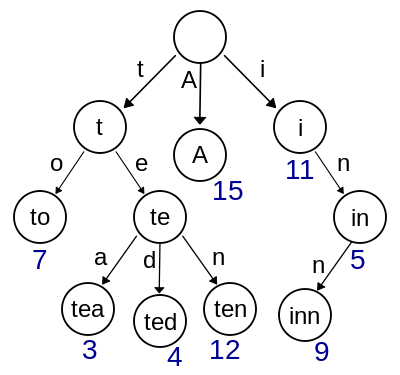

**PatriciaTrie**，又被称为 [RadixTree](https://en.wikipedia.org/wiki/Radix_tree) 或紧凑前缀树（compact prefix tree），是一种空间使用率经过优化的 **Trie**。与 **Trie** 不同的是，如果在 **Trie** 中存在一个父节点只有一个子节点的情形，那么这个子节点将与父节点合并。这样可以缩短 **Trie** 中不必要的深度，大大加快搜索节点速度。

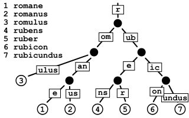

**MerkleTree**，又名哈希树 ([hash tree](https://en.wikipedia.org/wiki/Merkle_tree ))，是密码学的一个概念，与之相对的是 [hash list](https://en.wikipedia.org/wiki/Hash_list)，注意理论上 **MerkleTree** 不一定是 **Trie**。在哈希树中，叶子节点的 key 是它所关联数据块的哈希值，而非叶子节点的 key 是它的所有子节点的 key 拼接而成字符串的哈希值。哈希树的优势在于，它能够对大量的数据内容迅速作出高效且安全的验证。

假设一个 hash tree 中有 n 个叶子节点，如果想要验证其中一个叶子节点是否正确 - 即该节点数据属于源数据集合并且数据本身完整，所需哈希计算的时间复杂度是是 $O(log(n))$，相比之下 [hash list](https://en.wikipedia.org/wiki/Hash_list) 大约需要时间复杂度 $O(n)$ 的哈希计算，hash tree 的表现无疑是优秀的。

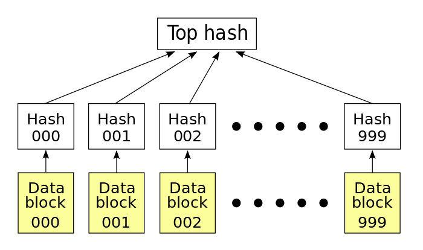

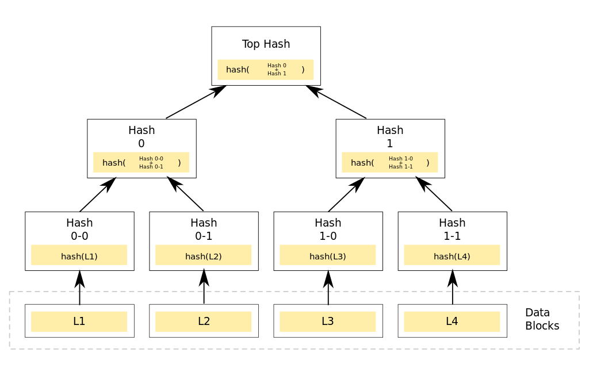

上图来自 [wiki- MerkleTree](https://en.wikipedia.org/wiki/Merkle_tree)，展示了一个简单的二叉哈希树。四个有效数据块 L1-L4，分别被关联到一个叶子节点上。Hash0-0 和 Hash0-1 分别等于数据块 L1 和 L2 的哈希值，而 Hash0 则等于 Hash0-0 和 Hash0-1 二者拼接成的新字符串的哈希值，依次类推，根节点的 top hash 等于 Hash0 和 Hash1 二者拼接成的新字符串的哈希值。

哈希树最主要的应用场景是 P2P 网络中的数据传输验证，因为 P2P 网络中可能存在未知数目的不可信数据源，所以确保下载到的数据正确可信并且无损坏无改动，就显得非常重要。哈希树可用来解决这个问题：

1. 每个待下载文件按照某种方式分割成若干小块后，组成类似上图的哈希树；
2. 首先从一个**绝对可信**的数据源获取该文件对应哈希树的根节点哈希值（top hash），有了这个可靠的 top hash 后，就可以开始从整个 P2P 网络下载文件；
3. 不同的数据部分可以从不同的源下载，由于哈希树中任意的分支树都可以单独验证哈希值，所以一旦发现任何数据部分无法通过验证，都可以切换到其他数据源单独下载那部分数据，提高了网络带宽的利用率和集群数据冗余度。
4. 最终，完整下载文件所对应哈希树的 top hash 值，一定要与我们的可靠 top hash 相等。

### PatriciaTrie 与 MerkleTree 的差异性总结

从上面看出来，虽然这两个都是 tree 结构，但是这两者的使用方式和形态都是完全不同的，PatriciaTrie 常规用途是搜索查找，而 MerkleTree 用于数据一致性确认。

## Merkle-PatriciaTrie(MPT) 的实现

MPT 是 Ethereum 自定义的 Trie 型数据结构。在代码中，`trie.Trie` 结构体用来管理一个 MPT 结构，其中每个节点都是接口 `node` 的实现类。Trie 结构体提供包括对节点的插入、删除、更新、持久化到底层数据库，以及返回整个 MPT 的哈希值。

Trie 结构体成员变量分解如下：

- `root` 作为整个 MPT 的当前根节点，其值随着 PUT/DELETE 的操作而变化；
- `db` 后端存储实例；
- `cacheGen` 是 cache 次数的计数器，每次 Trie 的变动提交后（调用 `Trie.Commit`），`cacheGen` 自增 1。

*trie/node.go* 中定义的 `node` 接口族担当整个 MPT 中的各种节点，node 接口分为四种实现: **fullNode**，**shortNode**，**valueNode**，**hashNode**，其中只有 **fullNode** 和 **shortNode** 可以携带子节点，根据是否携带子节点可以分为叶子节点和分枝节点。

### 分枝节点

> 携带子节点的节点

#### fullNode

```go
//trie/node.go
type fullNode struct {
    Children [17]node
    flags    nodeFlag
}
```

**fullNode** 是一个可以**携带多个**子节点的父节点：

- 它有一个容量为 17 的 node 数组成员变量 `Children`：
  - 数组中前 16 个槽位分别对应 16 进制（hex）下的 $[0-9a-f]$，这样对于每个子节点，根据其 key 值 16 进制形式下的第一位的值落座到 `Children` 数组的对应位置上；
  - `Children` 数组的第 17 位，用于保存该 **fullNode** 自身的数据；
- **fullNode** 没有 key 变量，因为 key 就藏在 *prefix path* 中；
- **fullNode** 明显继承了原生 **Trie** 的特点，而每个父节点最多拥有 16 个分支也包含了基于总体效率的考量；

#### shortNode

```go
//trie/node.go
type shortNode {
    Key   []byte
    Val   node
    flags nodeFlag
}
```

**shortNode** 是一个**仅有一个**子节点的父（枝）节点。

- 它的成员变量 `Val` 指向下一个子节点，**因此 shortNode 本节点并不保存数据**；
- 而成员 `Key` 是一个任意长度的字节数组 `[]byte`，代表下属子节点的公共前缀；
- 由此可见，**shortNode** 的设计体现了 **PatriciaTrie** 的特点，通过合并单传子节点来缩短搜索树的深度，提高查询效率，优化内存空间。

### 叶子节点

> 不能携带子节点的节点

#### valueNode

```go
//trie/node.go
type valueNode []byte
```

**valueNode** 充当 MPT 的叶子节点，它其实是字节数组 `[]byte` 的一个别名。在 Ethereum 实际使用中，**valueNode** 用来存储所携带带数据的 RLP 编码値。

> 这三种类型覆盖了一个**PatriciaTrie** 的所有需求。任何一个 [k,v] 类型数据被插入一个 MPT 时，会以 k 字符串为路径沿着 root 向下延伸，在此次插入结束时首先成为一个 **valueNode**，k 以自顶点 root 起到该节点为止的 key path 的形式存在。但之后随着其他节点的不断插入和删除，根据 MPT 结构的要求，原有节点可能会变化成其他节点类型，同时 MPT 中也会不断裂变或者合并生成新的父节点。比如：

- 假设一个 **shortNode** S 已经有一个子节点 A，现在要新插入一个子节点 B，那么会有几种可能：
  1. $diff(KeyB, KeyA) = KeyA$ 新节点 B 与 A 的公共前缀就是为节点 A，这种情况下，B 节点沿着 A 的路径继续向下，节点 S 不变，而 S 的子节点会被更新；
  2. $KeyS < diff(KeyB, KeyA) < KeyA$ 新节点 B 与 A 的公共前缀在节点 S 和节点 A 之间，这种情况下，S 的 Key 分裂成两段，前一段分配给 S 作为新的 Key，同时裂变出一个新的 **fullNode** 作为 S 的子节点，以同时容纳 B，以及需要更新的 A。
- 如果一个 **fullNode** 原本只有两个子节点，现在要删除其中一个子节点，那么这个 **fullNode** 就会退化为 **shortNode**，同时保留的子节点如果也是 **shortNode**的话，还可以把这两个子节点再合并成一个子节点。
- 如果一个 **shortNode** 的子节点是叶子节点同时又被删除了，那么这个 **shortNode** 就会退化成一个 **valueNode**，成为一个叶子节点。

诸如此类的情形还有很多，提前设想过这些案例，才能正确实现 MPT 的插入 / 删除 / 查找等操作。当然，所有查找树（search tree）结构的操作，避免不了使用递归算法。

#### hashNode — 特殊的一个

从上面我们看出来，对于 **PatriciaTrie** 结构来说，其实数据结构已经完备了。那么 **hashNode** 是为了 **MerkleTree** 结构而来，正如 **MerkleTree** 中叶子节点为数据的真实値，父节点为其下属子节点的 Hash 値，Ethereum 中将这一特性和 **Trie** 结构结合起来了，这时，我们发现前面定义的 **shortNode** 和 **fullNode** 中有一个 `nodeFlag` 字段：

```go
//trie/node.go
type hashNode []byte
type nodeFlag struct {
    hash  hashNode
    gen   uint16
    dirty bool
}
```

细看这一字段，其中正好有一个 **hashNode** 类型的 `hash`  字段，因此不难看出来，**hashNode** 不会单独存在，而是以 `nodeFlag` 结构体成员的形式，被 **fullNode** 和 **shortNode** 间接持有，如果不以这种形式存在的话，真的很难相像如何把两个不同数据结构无缝组合成一个结构，看来 Ethereum 的开发者对于数据结构的理解还是很深的。

##### hashNode VS valueNode

**hashNode** 跟 **valueNode** 一样，也是字节数组 `[]byte` 的一个别名，但是使用上有莫大的不同，首先从

* **hashNode** 只用于存放 32byte 的哈希值，通过 **fullNode/shortNode** 的 RLP 哈希值而生成；
* **valueNode** 用于存放真实的 RLP 字节，为节点属性的一部分。

##### hashNode  如何生成

一旦 **fullNode** 或 **shortNode** 的成员变量（包括子结构）发生任何变化，它们的 **hashNode** 就一定需要更新。所以在 `trie.Trie` 结构体的 `insert()`，`delete()` 等函数实现中，可以看到除了新创建的 **fullNode**、**shortNode**，那些子结构有所改变的 **fullNode**、**shortNode** 的 `nodeFlag` 成员也会被重置，通过 `t.newFlag()`生成不带 hash 的 **hashNode**：

```go
//trie/trie.go
func (t *Trie) newFlag() nodeFlag {
    return nodeFlag{dirty: true, gen: t.cachegen}
}
```

同时，成员 `dirty` 被置为`true`，表明了所代表的父节点有改动需要提交。

**hashNode** 在下次 `trie.Hash()` 调用时才会计算出来，在哈希计算之后将 `dirty` 重置为 `false` ，如果如果需要重新计算 hash，看到 `dirty` 为 `false` 也就不需要重复计算了。整个 MPT 自底向上的遍历过程中，所有清空的 **hashNode** 会被重新赋值，这样 `trie.Hash()` 结束后，我们可以得到一个根节点 root 的 **hashNode**，它就是此时此刻这个 MPT 结构的哈希值。

每个 **hashNode** 被赋值的过程，就是它所代表的 **fullNode** 或 **shortNode** 被折叠（collapse）的过程。基于效率和数据安全考虑，`trie.Trie` 仅提供整个 MPT 结构的折叠 `Hash()` 操作函数，默认从顶点 root 开始遍历：

```go
//trie/trie.go
func (t *Trie) Hash() common.Hash {
    hash, cached, _ := t.hashRoot(nil, nil)
    t.root = hash
    return common.BytesToHash(hash.(hashNode))
}
func (t *Trie) hashRoot(db *Database, onleaf LeafCallback) (node, node, error) {
    if (t.root == nil) { return hashNode(emptyRoot.Bytes()), nil, nil }
    h := newHasher(t.cachegen, t.cachelimit, onleaf)
    defer returnHasherToPool(h)
    return h.hash(t.root, db, true)
}
```

**hash 计算**

`hashRoot()` 函数内部调用 `hasher.hash()` 结构体进行折叠（collapse）计算操作：


   ```go
//trie/hasher.go
func (h *hasher) hash(n node, db *Database,
                      force bool) (node, node, error) {
    if hash, dirty := n.cache(); hash != nil {
        ...
        if !dirty { return hash, n, nil }
    }
    collapsed, cached, err := h.hashChildren(n, db)
    if err != nil { return hashNode{}, n, err }

    hashed, err := h.store(collapsed, db, force)
    if err != nil { return hashNode{}, n, err }

    cachedHash, _ := hashed.(hashNode)
    switch cn := cached.(type) {
        case *shortNode:
        cn.flags.hash = cachedHash
        if db != nil { cn.flags.dirty = false }

        case *fullNode:
        cn.flags.hash = cachedHash
        if db != nil { cn.flags.dirty = false }
    }
    return hashed, cached, nil
}
   ```

1. 如果计算的 node 已经有 cache 了，并且 dirty 为 `false`，那么直接从缓存中直接返回，避免重复计算；
2. 如果这个 node 带有子节点，那么首先将子节点折叠成 **hashNode**，当这个 node 的子节点全都变成 **hashNode** 之后，再对这个 node 作 RLP Encode 计算之后得到 SHA3 哈希值，亦即这个节点的 **hashNode**。
3. 将折叠生成的节点（类型没有变，原先是 shortNode 还是 shortNode）保存到 DB 之中（保存的逻辑在下面介绍）；
4. Hash 计算已经完成了，将 **shortNode/fullNode** 中的 dirty 置为 `false`.

### Trie 持久化保存

Trie 持久化分两部分内容，

* 一个是 Trie 层面的“持久化”
* 另一个是 DB 层面的持久化。

#### Trie 层面的持久化

上面讲解 **hashNode** 的时候提到过，hashNode 在生成之后“可能”会被保存到 DB 之中，因此 Trie 层面持久化就是在那个时候完成的。

 `Trie.hashRoot()` 有一个数据库接口类型的参数，在折叠 MPT 过程中，如果 `db` 不为空，就把每次计算 `hashNode` 时的 Hash 值和它对应的节点 RLP 编码值一起存进『数据库』里，这也正是 `Commit()` 的逻辑。回看一下 `Trie.Hash()`，它在调用 `hashRoot()` 时，传入的 `db` 是空值 。只有显式调用 `Commit()` 才可以提交数据。

**注意：**
虽然这里把 hashNode 以及 RLP 编码値保存到『数据库』中了，但实际上只是保存到了数据库实例的内存中而已，并没有真正持久化到 LevelDB 层面。

```go
//trie/trie.go
func (t *Trie) Commit(onleaf LeafCallback) (root common.Hash, err error) {
    if t.db == nil {
        panic("commit called on trie with nil database")
    }
    hash, cached, err := t.hashRoot(t.db, onleaf)
    if err != nil {
        return common.Hash{}, err
    }
    t.root = cached
    t.cachegen++
    return common.BytesToHash(hash.(hashNode)), nil
}
```

**hashNode 存储**

通过 `store()` 保存节点到 DB 之中，**shortNode/fullNode** 在作 RLP Encode 与 Hash 计算之后生成 **hashNode**，同时将生成的 Hash 值与原始 node 一起保存到后端存储中：

```go
func (h *hasher) store(n node, db *Database, force bool) (node, error) {
    if _, isHash := n.(hashNode); n == nil || isHash { return n, nil }

    h.tmp.Reset()
    if err := rlp.Encode(&h.tmp, n); err != nil {
        panic("encode error: " + err.Error())
    }
    ...
    hash, _ := n.cache()
    if hash == nil { hash = h.makeHashNode(h.tmp) }
    ...
    if db != nil { db.insert(hash, t.tmp, n) }
    ...
}

func (h *hasher) makeHashNode(data []byte) hashNode {
    n := make(hashNode, h.sha.Size())
    h.sha.Reset()
    h.sha.Write(data)
    h.sha.Read(n)
    return n
}
```

由此可见，DB 中只会存在**一**种形态的 node 类型：

- **hashNode**;

其它节点只存在于内存中，当 Trie 被从 DB 中恢复的时候，这些节点才会从  **hashNode** 中恢复出来。

注意，这里说的保存 **hashNode** ，并不是指 **hashNode** 自身（即 `bytes[]`）这个节点会被保存，而是指在保存的时候是以 **hash**Node 为 key，short**Node**/full**Node** 为 value 的结构被写入到 DB 之中，这才是 **hashNode** 的正确理解！同理，在从 DB 中恢复 Trie 树的时候，也只能通过 **hashNode** 来恢复。

*注：shortNode/fullNode 中的 `flags` 字然在保存之前会被删除。*


因此，在 MPT 的查找，插入，删除中，如果遍历过程中遇到一个 hashNode，不要慌：

1. 首先从数据库里以这个哈希值为 k，读取出相匹配的 v；
2. 然后将 v 解码恢复成 **fullNode** 或 **shortNode**，**注意：不会出现 valueNode 的可能性（对于叶子层的 valueNode，这些节点跟随着父节点一起保存的，因此从 DB 中恢复的时候，也只能是 shortNode 和 fullNode 类型！）**。

在代码中这个过程叫 `resolve`：

```go
// trie/trie.go
func (t *trie) resolve(n node, prefix []byte) (node, error) {
    if n, ok := n.(hashNode); ok {
        return resolveHash(n, prefix)
    }
    return n, nil
}
func (t *Trie) resolveHash(n hashNode, prefix []byte) (node, error) {
    enc, err := t.db.Get(n)
    ...
    dec := mustDecodeNode(n, enc, t.cachegen)
    return dec, nil
}
```

这样，涉及到 hashNode 的所有操作就基本完整了。


#### DB 层面的持久化

真正持久化到 DB 的操作是在 `trie.Database` 模块的 `Commit` 中进行的，这一操作中将之前放在内存中的 **hashNode** 全部以批量形式保存到 DB 中：

```go
//trie/database.go
func (db *Database) Commit(node common.Hash, report bool) error {
    db.lock.RLock()

    batch := db.diskdb.NewBatch()
    ...
    if err := db.commit(node, batch); err != nil {
        log.Error(err)
        db.lock.RUnlock()
        return err
    }
    ...
}

func (db *Database) commit(hash common.Hash, batch ethdb.Batch) error {
    node, ok := db.nodes[hash]
    if !ok { return nil }

    for _, child := range node.childs() {
        if err := db.commit(child, batch); err != nil { return err }
    }
    if err := batch.Put(hash[:], node.rlp()); err != nil { return err }

    if batch.ValueSize() >= ethdb.IdealBatchSize {
        if err := batch.Write(); err != nil { return err }
        batch.Reset()
    }
    return nil
}
```


上文中提到的，Block 的成员变量 Root、TxHash、ReceiptHash 的生成，正是源出于此。很明显，这几个成员其实是 hashNode 结构。

明显的，**hashNode** 体现了 **Merkle-Tree** 的特点：

* 每个父节点的哈希值来源于所有子节点哈希值的组合，**注意，与 Merkle-Tree 的差异在于，这里的父节点并不只存储哈希値**；
* 一个顶点的哈希值能够代表一整个树形结构；

**valueNode** 加上之前的 **fullNode**，**shortNode**，**valueNode**，构成了一个完整的 **Merkle-PatriciaTrie** 结构，很好的融合了各种原型结构的优点，又根据 Ethereum 系统的实际情况，作了实际的优化和平衡。MPT 这个数据结构在设计中的种种细节，的确值得好好品味。

## MPT 与 Trie 结构的关联关系

原生的 **[Trie](https://en.wikipedia.org/wiki/Trie)** 树中有三种节点：

* 叶子节点 (Leaf)：对应于 Trie 结构中的 shortNode。叶子节点包含两个字段， 第一个字段是剩下的 Key 的半字节编码（而且半字节编码方法的第二个参数为 true）， 第二个字段是 Value；
* 扩展节点 (Extention)：对应于 Trie 结构中的 shortNode。 扩展节点也包含两个字段， 第一个字段是剩下的 Key 的可以至少被两个剩下节点共享的部分的半字节编码，第二个字段是 Next node；
* 分支节点 (Branch)：对应于 Trie 结构中的 fullNode。分支节点包含了 17 个字段，其中前 16 个字段对应于这些点在其遍历中的键的十六个可能的半字节值中的每一个。第 17 个字段是存储那些在当前节点结束了的节点，例如，有三个 key, 分别是 (abc ,abd, ab) ，在分支节点的第 17 个字段中储存了 key 为 ab 节点的 Value 值。

**注意：**

叶子节点和扩展节点都对应于 Trie 结构中的 shortNode，两者通过 shortNode.Val 的类型来判断。

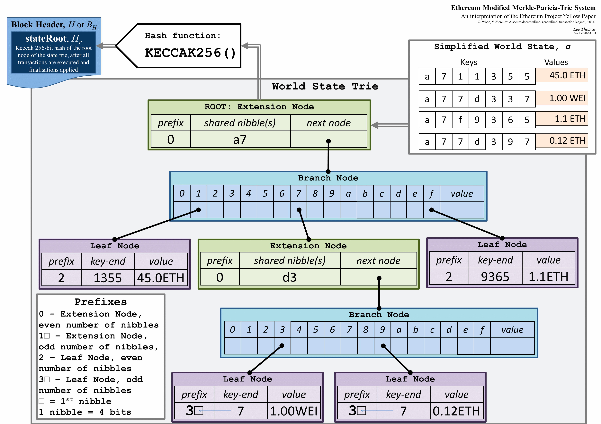

如上图所示: 总共有 2 个扩展节点，2 个分支节点，4 个叶子节点。

其中叶子节点的[k,v]分布情况为：

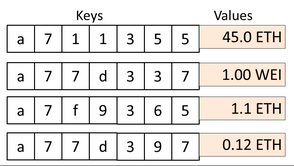

节点的前缀：

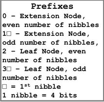

## Trie 中对 key 的编码

Trie 中对于 key 编码分为 3 种格式：

1. **keybytes encoding**

   包含真实的 key 信息，也是大多数 API 函数的入口参数格式；

2. **hex encoding**

   一个字节包含 keybytes 中的每个半字节，末尾可选跟随一个终止符（`0x10`）指示以 key 为路径的这一节点上是否包含一个 value，这一编码格式用于加载到内存中的节点操作；

3. **compact encoding**

   这一编码格式是 Yellow Paper 中定义的（被称为 hex prefix encoding），包含 keybytes 与一个标志位，其中标志位在于第一个字节的高半字节中，标志位的设置详见下面分析，这一格式用于节点在磁盘中存储时使用。

### RLP 编码

RLP（Recursive Length Prefix）编码，其定义可见 [wiki](https://github.com/ethereum/wiki/wiki/RLP)，其目的就是将一个任意嵌套的字节数组 (`[]byte`)，序列化成一个 “展平” 无嵌套的一维字节数组 `[]byte`，RLP 编码的唯一目的就是编码结构体，对于特殊的数据类型（比如说字符串，浮点数）则由上层协议决定。

由于 1 byte 字节的取值范围 `0x00 ~ 0xff`，可以表示任意字符，所以 `[]byte` 可以线性的表示任意的数据，比如一个字符串，如果每个字符用 ASCII 码的二进制表示，整个字符串就变成一个 `[]byte`。 RLP 编码其实提供了一种序列化的 encode 方法，无论输入是何种嵌套形式的元素或数组，encode 输出形式都是 `[]byte`；并且 RLP 是可逆的，它提供了互逆的编解码方法。

RLP 编码规则如下，原图来自[金钱难寐，大盗独行——以太坊 JSON-RPC 接口多种盗币手法大揭秘](https://paper.seebug.org/656/)：

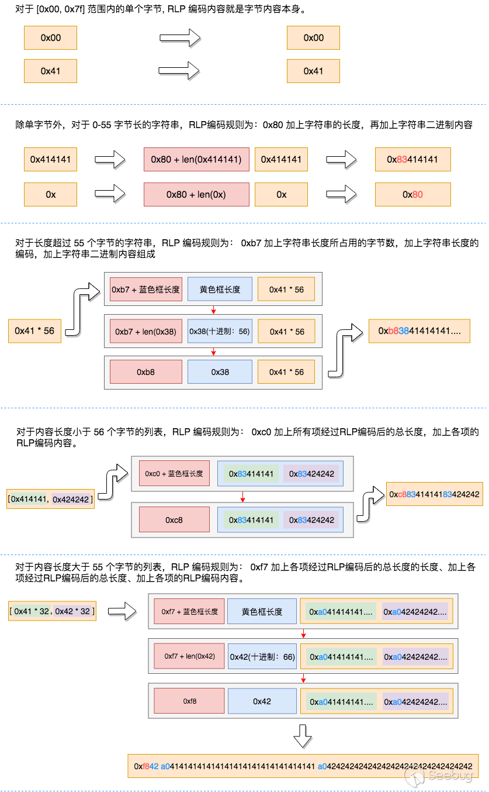

当 [k,v] 数据插入 MPT 时，它们的 k(key) 都必须经过编码。这时对 key 的编码，要保证原本是 `[]byte` 类型的 key 能够以 16 进制形式按位进入 `fullNode.Children[]`，因为 `Children[]` 数组最多只能容纳 16 个子节点。相应的，Ethereum 代码中在这里定义了一种编码方式叫 Hex 编码，也就是 16 进制编码，就是将 1byte 的字符大小限制在 4bit(16 进制) 以内。

**注意：**

对于 [k, v] 结构无法进行 RLP 编码，这不在 RLP 的 scope 中。

Ethereum 中具体使用的哈希算法，就是对某个类型对象的 RLP 编码值做了 SHA3 哈希运算，可称为 RLP Hash。
Ethereum 在底层存储中特意选择了专门存储和读取 [k, v] 键值对的第三方数据库 LevelDB，
[k, v] 中的 v 就是某个结构体对象的 RLP 编码值 (`[]byte`)，k 大多数情况就是 v 的 RLP 编码后的 SHA-3 哈希值（TODO：Ethereum 如何处理大 v 问题？）。

### keybytesToHex

由于一个字节的可取值范围为 `0x00 ~ 0xff` ，共有 256 个可取值，这个大小范围太大了，特别是将这一 key 扔到 Trie 中1的1时候，对应着同一层级的分枝数也有 256 个可能，这在一定程度上会影响到查询的效率。RLP 中引入了 Hex 编码，其好处是将原本 256 个可能的取值缩小到 16 个可能值，其中原始的 `[]byte` 形式称之为 **keybytes**，基本逻辑如下图：

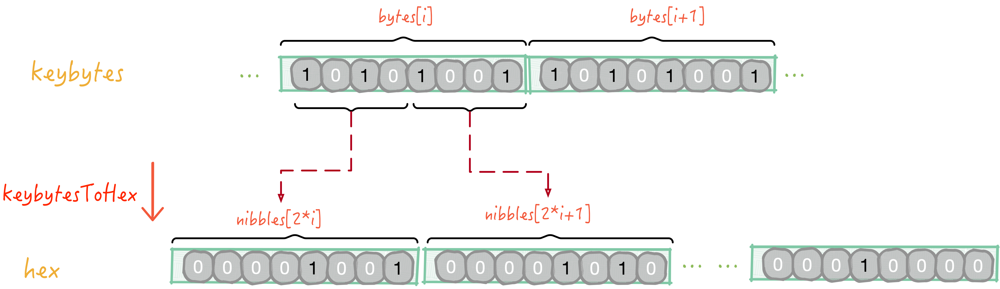

对应的代码实现为：

```go
//trie/encoding.go
func keybytesToHex(str []byte) []byte {
    l := len(str)*2 + 1
    var nibbles = make([]byte, l)
    for i, b := range str {
        nibbles[i*2] = b / 16
        nibbles[i*2+1] = b % 16
    }
    nibbles[l-1] = 16
    return nibbles
}
```

1.  将 **keybytes** 每个字节根据高 4bit 和低 4bit 拆开，分别放到两个字节中；
2. 最后在尾部加 1byte（固定值为 16） 标记当前属于 Hex 格式。

这样新产生的 key 虽然形式还是 `[]byte`，但是每个 byte 大小已经被限制在 4bit 以内，代码中把这种新数据的每一个字节称为 nibble，在经过这种编码之后，keybytes 中的每一个字节范围为 `0x00 ~ 0x0f`。

### hexToCompact

Hex 编码虽然解决了 key 是 **keybytes** 形式的数据插入 MPT 的问题，但代价也很大，就是数据冗余，长度会变成是原来 **keybytes** 格式下的两倍，这一点对于节点的磁盘存储成本多了一倍。

所以 Trie 中又定义了另一种编码格式叫 Compact 编码，用来对 Hex 格式进行优化。Compact 编码规则如下：

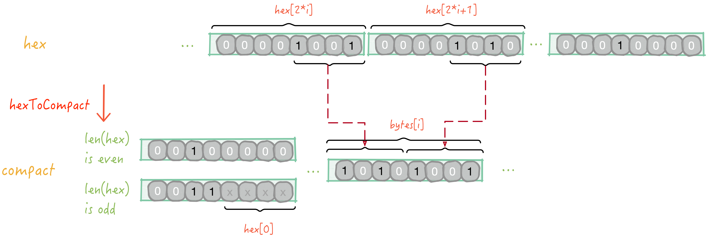

对应的代码实现：

```go
//trie/encoding.go
func hexToCompact(hex []byte) []byte {
    terminator := byte(0)
    if hasTerm(hex) {
        terminator = 1
        hex = hex[:len(hex)-1]
    }
    buf := make([]byte, len(hex)/2+1)
    buf[0] = terminator << 5 // the flag byte
    if len(hex)&1 == 1 {
        buf[0] |= 1 << 4 // odd flag
        buf[0] |= hex[0] // first nibble is contained in the first byte
        hex = hex[1:]
    }
    decodeNibbles(hex, buf[1:])
    return buf
}

func hasTerm(s []byte) bool {
    return len(s) > 0 && s[len(s)-1] == 16
}
func decodeNibbles(nibbles []byte, bytes []byte) {
    for bi, ni := 0, 0;
        ni < len(nibbles);
        bi, ni = bi+1, ni+2 {
        bytes[bi] = nibbles[ni]<<4 | nibbles[ni+1]
    }
}
```

如上所示 ：

1. 判断 Hex 长度是奇数还是偶数确定第一个字节的内容（即 Compact 标记位）：

   - 偶数：设置为 `0x20`;
   - 奇数：前半字节设置为 `0x3`，后半字节取 `hex[0]` 的值，并将 hex 指针指向下一个字节（即 `hex = hex[1:]`）；

2. 将剩余 Hex 中相邻 2 半字节的数据合并到 1 字节；

**TODO：何时会出现 hex[len(hex)-1] != 16 的情况**

> 可能是 trie delete 的逻辑中。

Key 编码的设计细节，也体现出 MPT 整个数据结构设计的思路很完整。

------

## Trie 中节点的插入

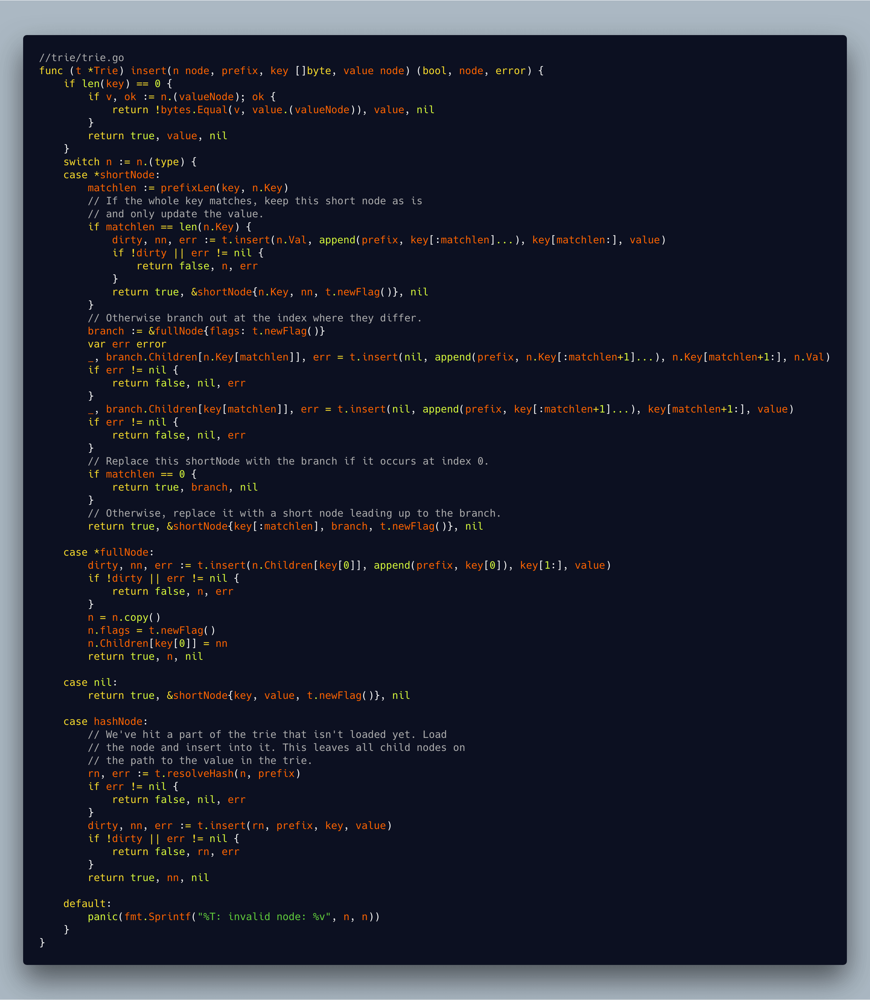

Trie 树插入的代码实现比较复杂，直接拷贝过来，可视性不高，所以这里拍照展示。

Trie 树的插入是一个递归调用的过程，从根节点开始，一直往下找，直到找到可以插入的点，进行插入操作。

`insert()` 参数和返回值说明：

* 参数 node 是当前插入的节点
* prefix 是当前已经处理完的部分 key
* key 是还没有处理完，剩下的部分 key, 完整的 key = prefix + key
* value 是需要插入的值。
* 返回值 bool 是操作是否改变了 Trie 树(dirty)
* node 是插入完成后的子树的根节点
* error 是错误信息

插入过程分析如下：

* 如果节点类型是 nil (一颗全新的 Trie 树的节点就是 nil 的)，这个时候整颗树是空的，直接返回 `shortNode{key, value, t.newFlag()}`， 这个时候整颗树的根就含有了一个 **shortNode** 节点。

* 如果当前的根节点类型是 **shortNode**(也就是叶子节点)，首先计算公共前缀：

  * 如果公共前缀就等于 key，那么说明这两个 key 是一样的，如果 value 也一样的(dirty == false)，那么返回叶子节点； 如果没有错误就更新 **shortNode** 然后返回。

  * 如果公共前缀不完全匹配，那么就需要把公共前缀提取出来形成一个独立的节点（extension 节点），extension 节点后面连接一个 branch 节点，branch 节点后面看情况连接两个 short 节点。

    首先构建一个 branch 节点(`branch := &fullNode{flags: t.newFlag()}`)，然后在 branch 节点的 Children 位置调用 t.insert 插入这两个 short 节点。这里有个小细节，key 的编码是 HEX encoding, 而且末尾带了一个终结符。现在考虑一个场景：

    我们的根节点的 key 是 abc0x16，我们插入的节点的 key 是 ab0x16, 下面的 `branch.Children[key[matchlen]]` 才可以正常运行，0x16 刚好指向了 branch 节点的第17个孩子。如果匹配的长度是0，那么直接返回这个 branch 节点，否则返回 shortNode 节点作为前缀节点。

* 如果当前的节点是 **fullNode**(也就是 branch 节点)，那么直接往对应的 Children 节点调用 insert 方法，然后把对应的 Children 节点指想新生成的节点。

* 如果当前节点是 **hashNode**, hashNode 也就是当前节点还没有加载到内存里面来，数据还存放在数据库里面，那么首先调用 `t.resolveHash(n, prefix)` 来加载到内存，然后对加载出来的节点调用 insert 方法来进行插入。


## 小结

Trie 结构组合了数个数据结构的优势，在实现上用到了递归算法，对于之前不熟悉数据结构和算法的同学来说，这一数据结构理解起来不免有点吃力，不过刚好可以通过这一机会提升下自己的硬实力。

----

## References

* <https://easythereentropy.wordpress.com/2014/06/04/understanding-the-ethereum-trie/>
* <https://medium.com/cybermiles/diving-into-ethereums-world-state-c893102030ed>
* https://paper.seebug.org/656/
