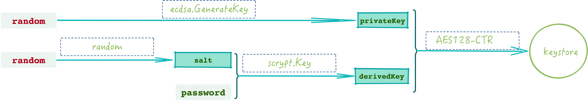

# Ethereum Wallet

---
<!-- START doctoc generated TOC please keep comment here to allow auto update -->
<!-- DON'T EDIT THIS SECTION, INSTEAD RE-RUN doctoc TO UPDATE -->


- [accounts.Manager 与 accounts.Wallet](#accountsmanager-%E4%B8%8E-accountswallet)
  - [Manager 的行为](#manager-%E7%9A%84%E8%A1%8C%E4%B8%BA)
    - [创建](#%E5%88%9B%E5%BB%BA)
- [keystore](#keystore)
    - [创建及保存账号](#%E5%88%9B%E5%BB%BA%E5%8F%8A%E4%BF%9D%E5%AD%98%E8%B4%A6%E5%8F%B7)
  - [对 Tx 进行签名](#%E5%AF%B9-tx-%E8%BF%9B%E8%A1%8C%E7%AD%BE%E5%90%8D)
- [usbwallet](#usbwallet)
- [HD Wallet](#hd-wallet)
- [References](#references)

<!-- END doctoc generated TOC please keep comment here to allow auto update -->


Ethereum Wallet（钱包）类似于 Ethereum 上去中心化应用的网关，负责管理账户的 Ether 或者其它加密货币资产，同时可用于转账，部署合约等交易数据。当前的钱包有知名的：

* Mobile 钱包 [imToken](https://token.im)
* 在线钱包 [MyEtherWallet](http://myetherwallet.com)
* Ethereum 官方 GUI 钱包 [Mist](https://github.com/ethereum/mist)
* Golang 命令行钱包 [geth-accounts](https://github.com/ethereum/go-ethereum/tree/master/accounts)
* ...

这些钱包的目的只有一个：通过你的**私钥**管理你的资产，因此在使用钱包的时候需要注意私钥的安全性，在使用的时候选择可信的钱包客户端。钱包的实现可分为两种：

* 钱包内部实现一个 Ethereum 轻节点，在这个节点上完成交易的签名发送；
* 钱包为一个轻客户端，通过 Web3 或者其它方式连接其它可信 Ethereum 节点，这种钱包的实现成本低，维护简单，当然安全风险也是需要考虑的；

虽然 go-ethereum 中也有一个 *mobile* 模块，提供了一些简化的移动端连接 Etherum 的 API，但这个模块实际使用的人并不多，因此，下文我们着重讲解 geth 提供的钱包功能。

## accounts.Manager 与 accounts.Wallet

注意，这里的 accounts 不要和 Ethereum 账户 `Account` 混淆了，虽然两者有相似之处，但是结构成员完全不同， 先来看一下这一模块中的主要成员关系：


对外由`accounts.Manager` 提供查询单个 Account，返回单个或多个 Wallet 对象，订阅 Wallet 更新事件等方法；对内有两级列表结构：

1. `Manager` 管理一组 `Backend` 接口，一个 `Backend` 对应一种类型的多个 Wallet，当前的 Wallet 实现有 keystore 和 usbwallet 两种方式；
2. 每一个 `Wallet` 内部维持一组 Account 对象，每个 Account 对象对应为一个 Ethereum Account；

除此之外，`Manager` 以及 `Wallet` 内部通过一个 `event.Feed` 成员变量来管理所有向它订阅 Wallet 更新事件的需求。

Wallet 接口定义如下：

```go
//accounts/accounts.go
type Wallet interface {
    URL() URL
    Status() (string, error)
    Open(passphrase string) error
    Close() error
    Accounts() []Account
    Contains(account Account) bool
    Derive(path DerivationPath, pin bool) (Account, error)
    SelfDerive(base DerivationPath, chain ethereum.ChainStateReader)
    SignHash(account Account, hash []byte) ([]byte, error)
    SignTx(account Account, tx *types.Transaction, chainID *big.Int) (*types.Transaction, error)
    SignHashWithPassphrase(account Account, passphrase string, hash []byte) ([]byte, error)
    SignTxWithPassphrase(account Account, passphrase string, tx *types.Transaction, chainID *big.Int) (*types.Transaction, error)
}
```

其中各方法成员解释如下：

* `URL() URL` 获取这个钱包可以访问的规范路径，用于钱包排序；

* `Status() (string, error)` 返回钱包当前的状态，keystore 钱包返回 `Locked`, `Unlocked`， usbwallet 返回自定义的状态信息；

* `Open(passphrase string) error` 打开钱包，虽然携带了一个 `passphrase` 参数，但并不意味着解密账户，这个接口主要是用于 usbwallet, 用于建立与硬件钱包的连接。

* `Close() error`关闭钱包，与 `Open` 一样，这个接口也是用于 usbwallet, 请注意，如果你 open 了一个硬件钱包，必须记得 close 它；

* `Accounts() []Account ` 获取钱包中已知的 Account 列表。对于分层确定性钱包（Hierarchical Deterministic Wallet）， 这个列表不会详尽的列出所有的账号， 而是只包含在帐户派生期间明确固定的帐户（关于 HD Wallet, 见下面的详细介绍）；

* `Contains(account Account) bool` 判断一个 Account 是否属于本钱包。

* ` Derive(path DerivationPath, pin bool) (Account, error)` 用于 HD Wallet, 尝试在指定的派生路径 `path` 上显式派生出分层确定性帐户。 如果 `pin` 为 `true`，派生出来的帐户将被添加到钱包的 Accounts 列表中。

* `SelfDerive(base DerivationPath, chain ethereum.ChainStateReader)` 同上，用于 HD Wallet, 设置一个基础帐户导出路径，从中尝试发现非零帐户，并自动将其添加到 Accounts 列表中。

  注意，`SelfDerive` 将递增指定路径的最后一个组件，而不是下降到子路径，以允许从非零组件开始发现帐户。 将第二个参数 `chain` 设为 `nil` 以禁用自动账户发现功能。

* ` SignHash(account Account, hash []byte) ([]byte, error)` 通过钱包中给定的 Account 给 `hash` 进行签名。这一方法的前提是给定的 Account 已经解锁，不然返回 `AuthNeededError` 的错误，里面包含了用户的信息，以及哪些字段或者操作需要提供。另外可以通过 `SignHashWithPassphrase` 方法来签名。

* `SignTx(account Account, tx *types.Transaction, chainID *big.Int) (*types.Transaction, error)` 与 `SignHash` 类似，通过钱包对指定的交易进行签名，返回经过签名的 Tx；

* `SignHashWithPassphrase(account Account, passphrase string, hash []byte) ([]byte, error)` 通过钱包使用给定的 Account 与 passphrase 来对 `hash` 进行签名；

* ` SignTxWithPassphrase(account Account, passphrase string, tx *types.Transaction, chainID *big.Int) (*types.Transaction, error)` 与上面类似。

### Manager 的行为

#### 创建

Manager 创建过程比较简单，直接看下面的代码：

```go
//accounts/manager.go
func NewManager(backends ...Backend) *Manager {
    // 1. Retrieve the initial list of wallets from the backends and sort by URL
    var wallets []Wallet
    for _, backend := range backends {
        wallets = merge(wallets, backend.Wallets()...)
    }
    // 2. Subscribe to wallet notifications from all backends
    updates := make(chan WalletEvent, 4*len(backends))
    subs := make([]event.Subscription, len(backends))
    for i, backend := range backends {
        subs[i] = backend.Subscribe(updates)
    }

    // 3. Assemble the account manager and return
    am := &Manager{ ... }
    ...

    // 4. listen for WalletEvent
    go am.update()

    return am
}
```

1. 合并参数 backends 中所有的 Wallet;
2. 针对每个 backend, 启动一个总长度为 $4*len(backends)$ 的 channel, 用于订阅由钱包后端发出的 `WalletEvent` 事件，例如 keystore 中钱包的创建和删除事件；
3. 根据 wallets, backends, 以及订阅 channel 等信息组装出一个 `Manager` 对象；
4. 然后开启一个 goroutine 执行 `am.update()` 以监听各个 WalletEvent 事件;

`am.update()` 会监听所有 backend 发出的事件，由 am 通过 Manager.feed 发布出来，对于消息的感兴趣的人就可以基于这个干活，以 keystore 为例，其基本流程如下：


**keystore 发布消息**

```go
//accounts/keystore/keystore.go

func (ks *KeyStore) refreshWallets() {
    ...
    events = append(events, accounts.WalletEvent{Kind: accounts.WalletArrived})
    events = append(events, accounts.WalletEvent{Kind: accounts.WalletDropped})
    ...
    for _, event := range events {
        ks.updateFeed.Send(event)
    }
}
```

**manager 转发消息**

```go
//accounts/manager.go
func (am *Manager) update() {
    ...
    for {
        select {
        case event := <-am.updates:
            // Wallet event arrived, update local cache
            am.lock.Lock()
            switch event.Kind {
            case WalletArrived:
                am.wallets = merge(am.wallets, event.Wallet)
            case WalletDropped:
                am.wallets = drop(am.wallets, event.Wallet)
            }
            am.lock.Unlock()

            // Notify any listeners of the event
            am.feed.Send(event)
        }
    }
}
```

**Node 接收 Wallet 事件**

```go
//cmd/geth/main.go
func startNode(ctx *cli.Context, stack *node.Node) {
    ...
    events := make(chan accounts.WalletEvent, 16)
    stack.AccountManager().Subscribe(events)
    go func() {
        ...
        // Listen for wallet event till termination
        for event := range events {
            switch event.Kind {
            case accounts.WalletArrived:
                if err := event.Wallet.Open(""); err != nil {
                    log.Warn("Failed to open wallet", "url",
                             wallet.URL(), "err", err)
                }
            case accounts.WalletOpened:
                status, _ := event.Wallet.Status()
                log.Info("New wallet appeared", "url", event.Wallet.URL(),
                         "status", status)

                derivationPath := accounts.DefaultBaseDerivationPath
                if event.Wallet.URL().Scheme == "ledger" {
                    derivationPath = accounts.DefaultLedgerBaseDerivationPath
                }
                event.Wallet.SelfDerive(derivationPath, stateReader)
            case accounts.WalletDropped:
                log.Info("Old wallet dropped", "url", event.Wallet.URL())
                event.Wallet.Close()
            }
        }
    }()
    ...
}
```

## keystore

keystore 用于创建、管理账号，以及对于 Tx 和一般字节数据进行签名操作。

#### 创建及保存账号

可以通过 `keystore.StoreKey(dir, auth string, scryptN, scryptP int)` 接口生成一个账号，并把生成的账号经过加密之后保存到 `dir` 目录下，其中这一个参数为密码文件保存目录，另外几个参数如下：

* `auth` 为用户指定的明文密码，需要记住，如果这一密码忘记了也就无法恢复出私钥，相当于这个账户也就丢了；
*  `scryptN` 和 `scryptP` 参数代表 [scrypt 算法](<https://www.tarsnap.com/scrypt/scrypt.pdf>) 的 N, P 参数（一般为 256MB 和 1，在 light 模式下为 4MB 和 6）, scrypt 是一个依赖内存的密钥导出函数（key derivation function），根据给定的 key, salt 和 内存消耗参数，经过一定的计算之后，返回密码学意义可用的加密后的 key。

完整的账号创建过程如下：




1. ECDSA 根据随机数生成一个随机的私钥 privateKey；
2. 由用户指定的密码和随机生成的 salt 走 scrypt 算法生成一个密钥；
3. 对 privateKey 根据密钥走 AES128-CTR 对称加密，附带生成一个数字摘要，用于校验密码；
4. 将加密之后的私钥以及 scrypt 参数，salt 等信息保存到本地文件中。

上面保存私钥的文件中保存的是加密过后的数据，所以这一文件是安全的，这一生成机制在 Ethereum 中被称为 [Web3 Secret Storage](https://github.com/ethereum/wiki/wiki/Web3-Secret-Storage-Definition)，最终生成的 keystore 文件长这个样子：

```json
{
  "address": "a5b2b16d8e5374ea7812fc4d57a87b8efd6ced34",
  "crypto": {
    "cipher": "aes-128-ctr",
    "ciphertext": "885c3d1d6f0901d0090cd91fcc6c494aa3728f830a59aad42ef82a152f2acf50",
    "cipherparams": {
      "iv": "f3a2d9ad54f857c8355ecb68c5d9afb4"
    },
    "kdf": "scrypt",
    "kdfparams": {
      "dklen": 32,
      "n": 262144,
      "p": 1,
      "r": 8,
      "salt": "058793f6dbddbf774927a186476c5b1fb16942431b5cdb2ce63224eae3a64d0a"
    },
    "mac": "8fea65d1342ea103df7f508d9baaa675b446f1566769220e047fb21f70dd7d34"
  },
  "id": "37e3de94-7392-4f68-89a8-aa60f57400b8",
  "version": 3
}
```

### 对 Tx 进行签名

前面在讲解交易的时候，提到过用户可以直接将 Tx 信息提交给节点，由节点完成交易签名过程，细节部分当时略过了，这儿讲解下使用钱包完成交易签名的过程。

以下还是以接收到 `eth_sendTransaction` Web3 API 为例讲解，从接收到 Tx 到完成签名的代码如下：

```go
//internal/ethapi/api.go
func (s *PublicTransactionPoolAPI) SendTransaction(ctx context.Context, args SendTxArgs) (common.Hash, error) {
    // Look up the wallet containing the requested signer
    account := accounts.Account{Address: args.From}

    wallet, err := s.b.AccountManager().Find(account)
    if err != nil {
        return common.Hash{}, err
    }

    if args.Nonce == nil {
        // Hold the addresse's mutex around signing to prevent concurrent assignment of
        // the same nonce to multiple accounts.
        s.nonceLock.LockAddr(args.From)
        defer s.nonceLock.UnlockAddr(args.From)
    }

    // Set some sanity defaults and terminate on failure
    if err := args.setDefaults(ctx, s.b); err != nil {
        return common.Hash{}, err
    }
    // Assemble the transaction and sign with the wallet
    tx := args.toTransaction()

    var chainID *big.Int
    if config := s.b.ChainConfig(); config.IsEIP155(s.b.CurrentBlock().Number()) {
        chainID = config.ChainID
    }
    signed, err := wallet.SignTx(account, tx, chainID)
    if err != nil {
        return common.Hash{}, err
    }
    return submitTransaction(ctx, s.b, signed)
}
```

1. 根据 Tx 发起方地址从 `accounts.Manager` 中找到对应的钱包；

2. 调用钱包的 `SignTx()`  完成签名。

   前面说过，这个接口签名成功的前提是这一钱包处理 `UNLOCKED` 状态，这一状态的钱包会把私钥直接导入到内存中，因此 `SignTx()` 可以直接取到这个私钥，然后通过 secp256 完成签名，此时如果有恶意攻击者获取到了私钥，那么后果不不堪设想。

   如果钱包处于 `LOCKED` 状态，可以先调用 `personal_unlockAccount` API 解锁账号，在 Tx 处理之后马上调用 `personal_lockAccount` ，但是对于线上钱包来说，这一操作实在是太危险了， 强烈不建议！

   `personal_unlockAccount` 接口有一个 duration 参数，用于指定处于 `UNLOCKED` 状态的时间长短，当处于 `UNLOCKED` 状态的钱包在 duration 给定的时限到达后，keystore 立即将其 Account 对应的 PrivateKey 销毁（逐个 bit 清 0)，并将该 unlocked 对象从 KeyStore 成员中删除。

## usbwallet

 go-ethereum 中还提供了硬件钱包的软件接口，Linux 中将一切的对象都看作文件，因此，只要将一个个的硬件钱包当作一个文件设备，只要驱动安装之后即可使用，当前的硬件钱包有两个 [Ledger](https://www.ledgerwallet.com/), [Trezor ](https://trezor.io/) 这两个的使用和差异这儿不介绍了，我们关心的是硬件钱包创建地址的过程。

需要注意的是，硬件钱包只能用于交易签名，对于其它一般性质的签名，即 Wallet 接口中定义的 `SignHash()` 不可用。

## HD Wallet

HD Wallet 最初是由 Bitcoin 社区最初在 [BIP 32](https://github.com/bitcoin/bips/blob/master/bip-0032.mediawiki) 中提出来的，定义了 Hierarchical Deterministic wallet （HD Wallet）的核心提案，提出钱包可以通过种子来生成主私钥，然后派生海量的子私钥和地址，按照树状结构存储。其结构如下所示（原图见 [bips/derivation.png at master · bitcoin/bips](https://github.com/bitcoin/bips/blob/master/bip-0032/derivation.png)）：


由于种子是一串很长的随机数，不利于记录，所以在 [BIP 39](https://github.com/bitcoin/bips/blob/master/bip-0039.mediawiki) 中提出将种子转化为一组单词表示，一般由 12 个单词构成，称之为助记词（mnemonic code，phrase）。

**5 层结构**

[BIP 44](https://github.com/bitcoin/bips/blob/master/bip-0044.mediawiki) 在 BIP32 的基础上提出了 5 层的路径建议，赋予树状结构中的各层不同的意义，以支持多币种，多账户。提出的路径结构为：

```bash
m / purpose' / coin_type' / account' / change / address_index
```

其中的

* `purporse` 固定值 44，代表使用 BIP44；
* `coin_type` 币种索引值，例如 Bitcoin 就是 0，Ethereum 是 60；
* `account` 代表账户信息，一个账户可以有多个地址，等同于 Ethereum 中的 wallet;
* `change` 常量 0 或者1，常量 0 用于外部链，常量 1 用于内部链（也称为更改地址）
    * 外部链用于在钱包外部可见的地址，例如用于接收付款；
    * 内部链用于在钱包外部不可见的地址，例如用于 UTXO 找零地址；
* `address_index` 表示生生的地址序号，从 0 开始递增。

一些事例如下（来自[bips/bip-0044.mediawiki at master · bitcoin/bips](https://github.com/bitcoin/bips/blob/master/bip-0044.mediawiki)）：

| coin            | account | chain    | address | path                     |
| --------------- | ------- | -------- | ------- | ------------------------ |
| Bitcoin         | first   | external | first   | m / 44'/ 0' / 0' / 0 / 0 |
| Bitcoin         | first   | external | second  | m / 44'/ 0' / 0' / 0 / 1 |
| Bitcoin         | first   | change   | first   | m / 44'/ 0' / 0' / 1 / 0 |
| Bitcoin         | second  | external | first   | m / 44'/ 0' / 1' / 0 / 0 |
| Bitcoin Testnet | first   | external | first   | m / 44'/ 1' / 0' / 0 / 0 |

*注：完整支持的 coin 见 [slips/slip-0044.md at master · satoshilabs/slips](https://github.com/satoshilabs/slips/blob/master/slip-0044.md).*

当初为何 Bitcoin 社区需要这么一个实现，这里摘自 [分层确定性钱包 HD Wallet 介绍 - 知乎](https://zhuanlan.zhihu.com/p/30297080)

> 私钥不同的生成方法，也对应着不同的钱包结构，通常可以分为非确定性钱包和确定性钱包。比特币最早的客户端（Satoshi client）就是非确定性钱包，钱包是一堆随机生成的私钥的集合。客户端会预先生成 100 个随机私钥，并且每个私钥只使用一次，**每个交易使用一个地址的概念是中本聪提出的**。如果交易比较频繁，私钥可能会用光，然后再产生一批私钥，所以每次完成 100 个交易后，你必须备份新的 wallet.dat 文件，否则可能会丢失资产。这种钱包难以管理和备份。如果你生成很多私钥，你必须保存它们所有的副本。这就意味着这个钱包必须被经常性地备份。每个私钥都必须备份，否则一旦钱包不可访问时，无法找回钱包。
>
> 确定性钱包则不需要每次转账都要备份，确定性钱包的私钥是对种子进行单向哈希运算生成的，种子是一串由随机数生成器生成的随机数。在确定性钱包中，只要有这个种子，就可以找回所有私钥，只需备份种子就相当于备份您的所有钱包，所以这个种子也相当重要，一定要备份到安全的地方。

因此，分层确定性钱包的优势非常明显，可以由一个种子管理所有的私钥，用户只需一个种子，就能控制所有币种，所有账户的钱包，你的所有钱包也是**确定的**。

分层确定的过程参见 Bitcoin 中的实现，原图来自 [分层确定性钱包 HD Wallet 介绍 - 知乎](https://zhuanlan.zhihu.com/p/30297080)


1. 根据随机数查询 [bips/bip-0039.mediawiki at master · bitcoin/bips](https://github.com/bitcoin/bips/blob/master/bip-0039.mediawiki) 中定义的 2048 个单词，得到 11 个单词，再对这 11 个单词做 checksum 生成第 12 个助记词；
2. 由助记词转换生成种子；
3. 根据种子推导生成一级根私钥；
4. 从该根私钥，导出子私钥（参见 BIP32），其中节点布局由 BIP44 设置。


---
## References

* https://blog.csdn.net/teaspring/article/details/78350888
* https://blog.csdn.net/xq723310/article/details/82940594
* https://medium.com/bitcraft/hd-wallets-explained-from-high-level-to-nuts-and-bolts-9a41545f5b0
* https://zhuanlan.zhihu.com/p/30297080
