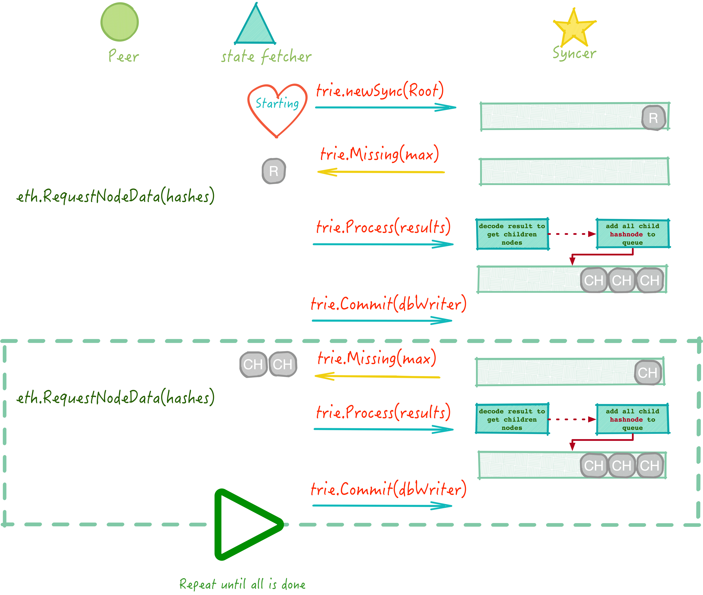

# State Sync

---

<!-- START doctoc generated TOC please keep comment here to allow auto update -->
<!-- DON'T EDIT THIS SECTION, INSTEAD RE-RUN doctoc TO UPDATE -->

- [downloader 安排同步事宜](#downloader-%E5%AE%89%E6%8E%92%E5%90%8C%E6%AD%A5%E4%BA%8B%E5%AE%9C)
  - [主框架处理 channel 响应](#%E4%B8%BB%E6%A1%86%E6%9E%B6%E5%A4%84%E7%90%86-channel-%E5%93%8D%E5%BA%94)
  - [分发与处理任务](#%E5%88%86%E5%8F%91%E4%B8%8E%E5%A4%84%E7%90%86%E4%BB%BB%E5%8A%A1)
- [trie.Sync 生成节点 Hash](#triesync-%E7%94%9F%E6%88%90%E8%8A%82%E7%82%B9-hash)
- [小结](#%E5%B0%8F%E7%BB%93)
- [References](#references)

<!-- END doctoc generated TOC please keep comment here to allow auto update -->

StateSync 用来获取由 State Root 所指定的 State Merkle Trie，也就是在某一个 Block 所在位置时刻 的 Ethereum World State. StateSync 会在 _downloader_ 中由 `processFastSyncContent` 的时候启动。在了解这种 Trie 结构的下载之前，先了解一下一般的数据批量下载方案，以 K-V 存储系统（比如 Aliyun OSS）为例，一般的下载文件的方式：

1. 获取文件列表；
2. 对于文件列表中的每一个文件分别下载；

那么 Trie 的同步也是类似的，不过相对于 K-V 来说，文件列表不是一次生成的，边下载边生成文件列表，最终目的就是把整棵 MPT 树 duplicate 一份到本地，不置可否，在这一同步过程中需要 Peer 和本地共同维护一些中间状态，包括当前已经同步的 node，正在同步中的 node，以及已经完成的 node 等信息。

粗鲁地看一下整个 StateSync 的过程：



整个流程其实是内嵌在 _downloader_ 之中的，通过消息类型来区分是 Block 同步还是 State 同步，其同步流程为：

1. _downloader_ 启动一个 stateFetcher 线程；
2. _downloader_ 根据需要同步的 Root 节点，组装一个 `state.Sync`结构（实际调用的是 `state.NewStateSync()` 实现）；
3. stateFetcher 线程不断往 syncer 线程调用 `Missing()` 取到待同步的 **hashNode**；
4. stateFetcher 从 Peer 获取对应 **hashNode** 的 value（Peer 通过 `trie.Node()` 接口将 Trie DB 中的数据返回给 stateFetcher;
5. _hanldeMsg_ 线程将 `NodeDataMsg` 上报给 _downloader_ 对应的 `stateCh` channel，stateFetcher 线程监听 `stateCh`，将上面接收到的数据经过处理调度之后，将 results 交由 syncer 线程；
6. syncer 线程对于接收到的 results 数据与本地比对后，解析 results 中每个 node 的数据，解析得到 node 的 children 数据，对于 child 中节点类型是 **hashNode** 的说明这一节点的数据不在 Trie 之上（回顾 Trie 这一章节的讲解），需要去 Peer 处重新获取，这里产生的 **hashNode** 也正是下一次待同步的节点。

在了解了这些内容之后，我接下来我们再来细看下 _downnloader_ 以及 _trie_ 中的处理流程。

**约定:**

与 Block 同步的过程类似，这里约定下面几个代号：

- $P$ 表示 Peer 节点；
- $S$ 表示正在执行 StateSyncer 的线程；
- $F$ 表示当前 StateSyncer 的调用者，在这里是由 _downloader_ 线程启动的另一个线程；

## downloader 安排同步事宜

> 在比较旧版本的 go-ethereum 中，StateSync 的逻辑放在 _eth/downloader/downloader.go_ 中，后来大概是在 v1.6.5 的时候拆分到 _eth/downloader/statesync.go_ 中。

虽然说 StateSync 只在 fast sync 的模式下会用到，但 _downloader_ 中在 `downloader.New` 的时候不管同步模式是什么，都会单独开启一个 stateFetcher 线程用于 StateSync 的事宜，这个线程比较奇特，其运行模式和之前介绍的这些线程稍微有所不同，听我细细道来。

先看下 stateFetcher 内部的运行机制：

```go
//eth/downloader/statesync.go
func (d *Downloader) stateFetcher() {
    for {
        select {
        case s := <-d.stateSyncStart:
            for next := s; next != nil; {
                next = d.runStateSync(next)
            }
        case <-d.stateCh:
            // Ignore state responses while no sync is running.
        case <-d.quitCh:
            return
        }
    }
}
```

从这儿还看不出什么，其运行模式和其它线程基本一致，只是在收到 `d.stateSyncStart` channel 中的消息之后，内部会以 for loop 的形式运行 StateSync.

runStateSync 内部的逻辑：

```go
//eth/downloader/syatesync.go
func (d *Downloader) runStateSync(s *stateSync) *stateSync {
    ...
    go s.run()
    defer s.Cancel()
    ...
    for {
        select {
        case next := <-d.stateSyncStart:
            return next
        case <- s.done:
            return nil
        case ...
        }
    }
    ...
}
```

可见，这个函数才是 stateFetcher 的主要部分，注意到：

1. 在 StateSync 开始之前启动一个线程用于从 Trie 处获取同步任务；
2. 在同步已经开始之后，若再收到 `d.stateSyncStart` 任务，那么直接退出当前的同步计划。这一点是比较好玩的一点，也正是上文提到的『不一致』的地方：这个真正执行 StateSync 的线程是可重入的！这也是可以理解的，原来你是基于 Block $N$ 做同步，你同步到一半的时候本地区块已经到了 Block $N+M$ 了，当然是马上切到这个切块点上同步更有意义。

### 主框架处理 channel 响应

_首先定义一下任务的含义：任务是指对于 $P$ 的一系列 hashNode 的请求。_

StateSync 接收上游的 `NodeDataMsg` 的响应，将响应报追加到自身的 `finished` 数组中，同时把这一消息对应的跟踪任务从本地中移除（见下面分解），然后这就算完事了。除此之外，再来看看其它一些消息是干嘛用的：

- `s.deliver <- finished[0]`:
  把从上游接收的响应按时间顺序从前往后发到自身的 `s.deliver` channel 上，有其它线程会负责将数据取出之后用于 Trie 处理；

- `<- peerDrop`
  这个很好理解，前面注册了 `PeerSrop` 的事件，如果自己的 Peers 中有 Peer 掉线了，如果在这个 Peer 身上有当前的任务，需要把这个任务重新调度到其它 Peer 上，同时将跟踪任务移除（与接收到正常响应的情况一样）；

- `<- d.trackStateReq`
  在每一次发送 `GetNodeDataMsg` 给 $P$ 的时候，同时通知本地需要监控这一任务的执行情况，这里用的是非缓冲 channel, 也就是说这里给 $P$ 发送 `GetNodeDataMsg` 消息的时候只能串行进行，理论上每当发送一个消息之后，stateFetcher 线程将启动一个定时器监控这一个请求到时的处理结果，然后必须等到接收到 $P$ 的回应之后才能再发送下一次的 `GetNodeDataMsg`。
  但是，这里要考虑一种极端情况，虽然理论上来说我们的 Trie 调度器是不会把两个任务同时分发给同一个 $P$（TODO：不清楚为何不能从同一个 $P$ 取任务，害怕 $P$ 做恶篡改数据的风险？）。不过，这里有一个例外，假如这个 $P$ 掉线然后马上重连了（中间间隔小于本地与 $P$ 数据传输耗时 $2*RTT$），本地还无法感知到这种错误之前又有任务调度到了这个 $P$ 上面，新的任务是没有关系的，但是之前的那个请求是永远收不到回应了，中间有一段空白了，怎么办？想开点，重新调度吧。

  ```go
  case req := <-d.trackStateReq:
  if old := active[req.peer.id]; old != nil {
      old.timer.Stop()
      old.dropped = true

      finished = append(finished, old)
  }
  // Start a timer to notify the sync loop if the peer stalled.
  req.timer = time.AfterFunc(req.timeout, func() {
      select {
      case timeout <- req:
      case <-s.done:
          // Prevent leaking of timer goroutines in the unlikely case where a
          // timer is fired just before exiting runStateSync.
      }
  })
  active[req.peer.id] = req
  ```

- `<- timeout`

  正是前面 `d.trackStateReq` 内部设定的定时器，定时器超时即说明这一任务失败了，需要重新调度。

### 分发与处理任务

stateFetcher 的 `loop()` 函数主要用于处理后端业务，有两个主要的逻辑：

1. Get：将当前待处理任务（从后端 Trie 获取到）round robin 方式分发给**空闲的** Peers 列表；
2. Set：接收 stateFetcher 另一线程传递过来的 `NodeDataMsg`， 将之传送给 Trie 处理。

## trie.Sync 生成节点 Hash

Trie 结构对外展现的是 K-V 结构，因此只要将所有的 K 找到，也就不难将 Trie 克隆（同步）一份，用于同步 Trie 结构的源码位于 _trie/sync.go_ 文件中，`Sync` 结构提供同步调度器的功能，对外提供当前已知的 Key 的 Hash，同步器可用于从源端 Trie 获取包含其它未知 Hash 数据的 node 数据，之后从中分析出新的 Hash 值，直到所有的未知都变成已知为止。

`Sync` 结构定义如下：

```go
//trie/sync.go
type Sync struct {
    database DatabaseReader
    membatch *syncMemBatch
    requests map[common.Hash]*request
    queue    *prque.Prque
}
```

这其中的：

- `queue` 以当前请求的节点在 Trie 树中的高度为优先级的队列，也就是叶子节点的优先级比分枝节点要优先处理；
- `requests` 保存当前正在调度执行的任务，配合 `queue` 避免重复调度；

这一文件对外提供的接口主要是：

- `NewSync` 用于生成一个从 root 指定的 `trie.Sync` 结构；
- `Missing` 找到当前**最需要待处理**的节点 Hash 值；
- `Process` 这是同步能成功的关键，把从其它地方获得的 node 信息中解析出 _hash node_，这些 _hash node_ 又用于下一批 node 的同步过程
- `Commit` 写入底层 DB；

完整的 `trie.Sync` 使用参见 [trie-sync.go](https://api.cacher.io/raw/6033a86dad2f9e73bb9f/f5338848f4787caa1ad2/trie-sync.go) 来自于 _trie/sync_test.go_。

## 小结

## References
