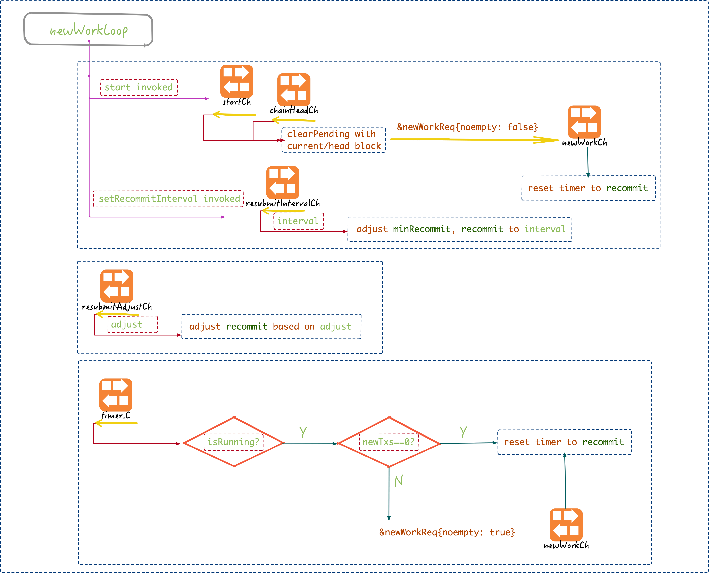
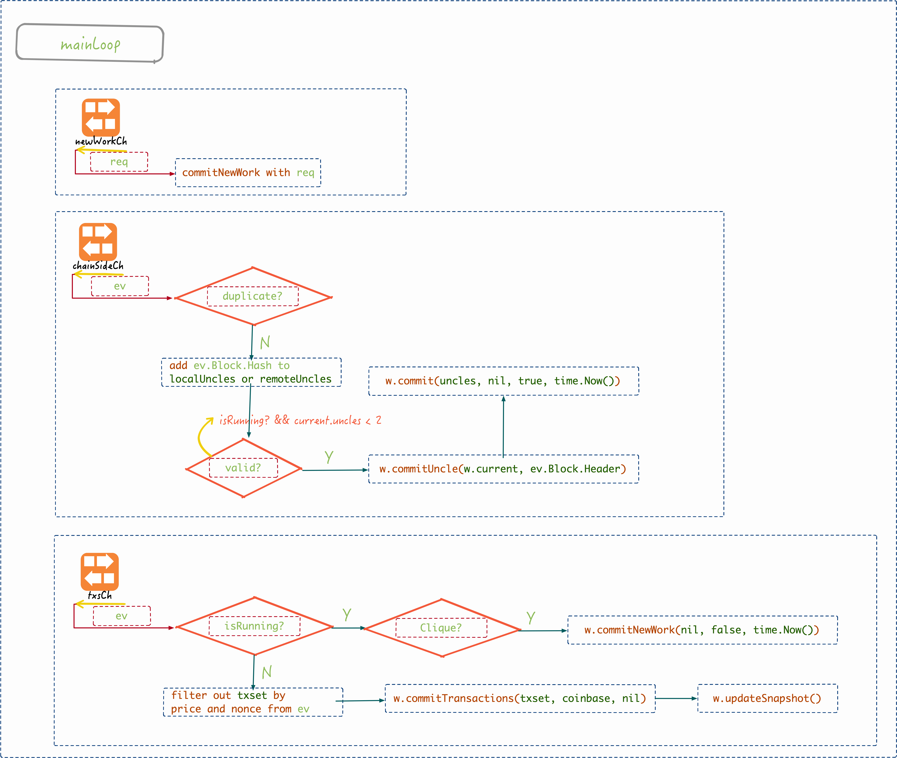
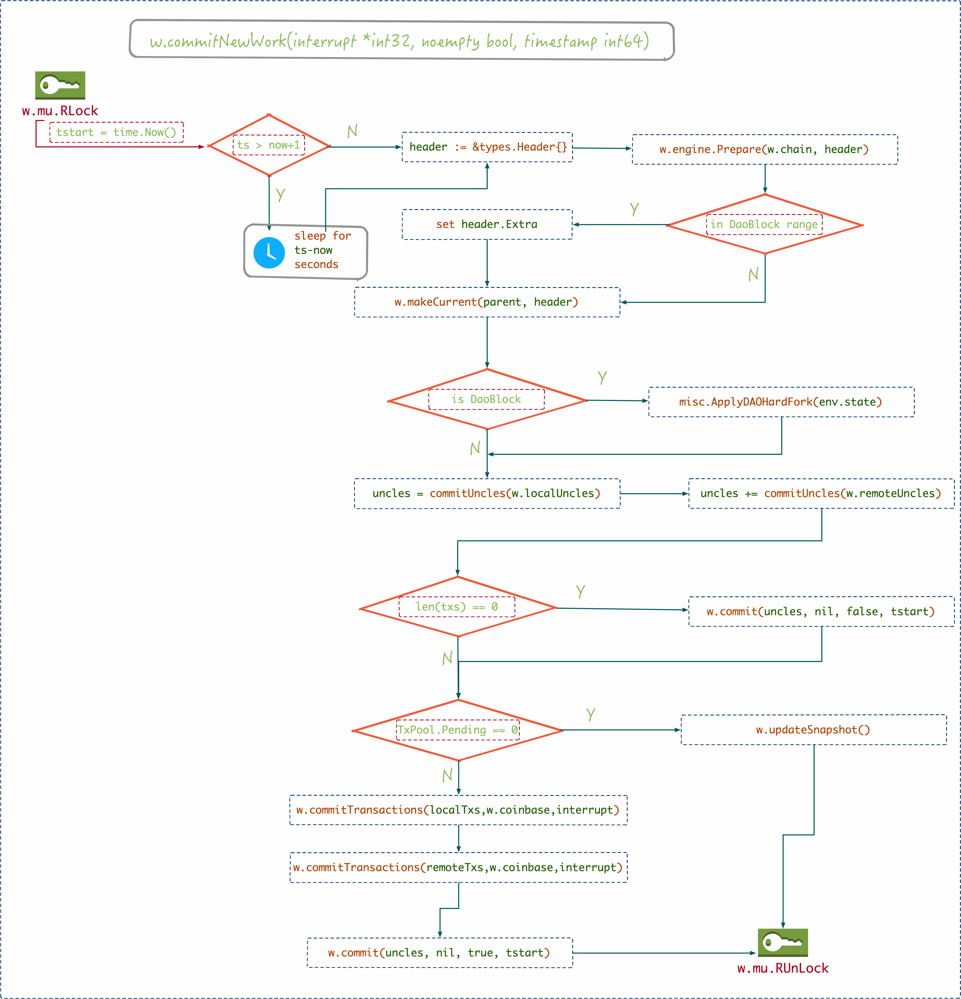
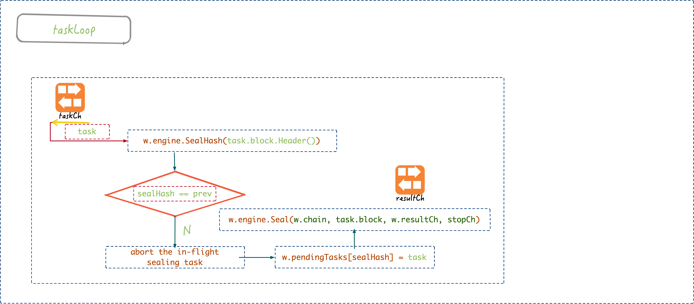
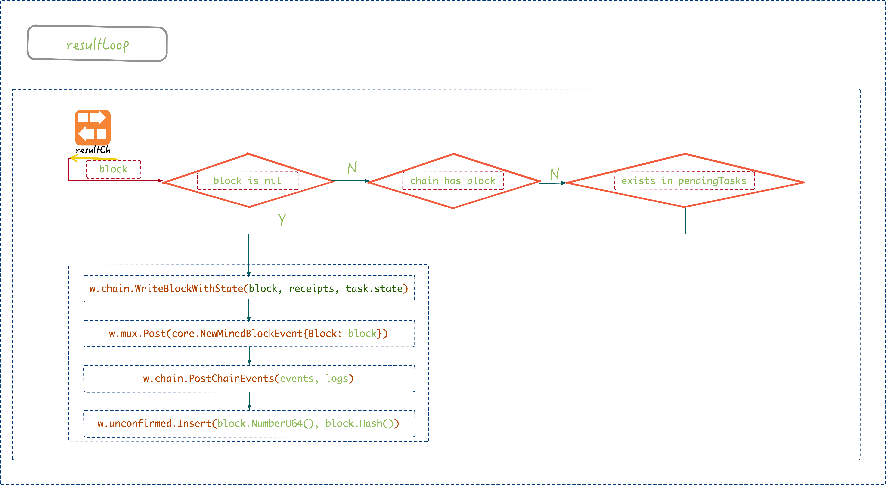

# Miner

---
<!-- START doctoc generated TOC please keep comment here to allow auto update -->
<!-- DON'T EDIT THIS SECTION, INSTEAD RE-RUN doctoc TO UPDATE -->


- [等待挖矿线程开启](#%E7%AD%89%E5%BE%85%E6%8C%96%E7%9F%BF%E7%BA%BF%E7%A8%8B%E5%BC%80%E5%90%AF)
  - [Miner 的启动](#miner-%E7%9A%84%E5%90%AF%E5%8A%A8)
    - [订阅 `downloader .XXXEvent` 事件](#%E8%AE%A2%E9%98%85-downloader-xxxevent-%E4%BA%8B%E4%BB%B6)
- [worker 开始你的表演](#worker-%E5%BC%80%E5%A7%8B%E4%BD%A0%E7%9A%84%E8%A1%A8%E6%BC%94)
  - [挖矿管理线程 -- newWorkLoop](#%E6%8C%96%E7%9F%BF%E7%AE%A1%E7%90%86%E7%BA%BF%E7%A8%8B----newworkloop)
  - [mainLoop](#mainloop)
    - [commitNewWork scaffold](#commitnewwork-scaffold)
    - [Dao Hard fork](#dao-hard-fork)
    - [commitTransactions](#committransactions)
    - [updateSnapshot](#updatesnapshot)
    - [commit](#commit)
    - [commitNewWork summarize](#commitnewwork-summarize)
  - [taskLoop](#taskloop)
  - [resultLoop](#resultloop)
- [小结](#%E5%B0%8F%E7%BB%93)
- [References](#references)

<!-- END doctoc generated TOC please keep comment here to allow auto update -->


前面的章节中，我们讲解了 Tx 加入到 TxPool 之后，对于客户端来说，只要慢慢等待 Tx 被矿工打包进 Block 就结束了，这一个章节讲解矿工是打包的细节。

从通俗意义的计算机科学上来说，交易是生产数据，挖矿则是消费数据的过程，通过不断将交易池子中的数据消费掉，组装出新的区块，进而能够让新的交易发布出来，从而保证整个 BlockChain 能够源源不断地往前发展。

## 等待挖矿线程开启

> *miner* 模块在 2018.8 前后调整非常大，将原来由 miner-worker-agent 三层结构简化成了 miner-worker 二层结构，将其中关于 remote agent 移动到了共识算法中，抛开共识算法，*miner* 模块还是比较好理解的。

```go
//miner/miner.go
type Miner struct {
    mux      *event.TypeMux
    worker   *worker
    coinbase common.Address
    eth      Backend
    engine   consensus.Engine
    exitCh   chan struct{}

    canStart    int32
    shouldStart int32
}
```

一个节点能否开始挖矿由几个因素决定，但是最关键的还是节点自身的关系，特别是节点和 Ethereum 主网的差异性，只有在本地节点和主网相差无几的时候开始挖矿才是有意义的。因此，`miner.Miner` 作为公共类型，内部时刻盯着 *downloader* 模块，一旦后面完成了同步，立刻（用户已经打开了挖矿开关的前提下）开始挖矿工作。

`miner.Miner` 对外暴露 mine 功能，这个结构体及基对外的接口比较简单，没什么需要特别介绍的，关键的挖矿过程在 `worker` 成员中，等到下面仔细讲解，先来看看这个结构的作用。


### Miner 的启动

`miner.New()` 接口中组装出一个 `miner.Miner` 结构体，同时开启一个线程用于订阅 `downloader.XXXEvent` 事件，节点同步完成之后，由 *eth.downloader* 模块对外广播 `downloader.DoneEvent` 或者 `downloader.FailedEvent` 事件，而 miner 在接收到这些事件之后将决定是否完成才能真正开始挖矿！

#### 订阅 `downloader .XXXEvent` 事件

*miner* 中使用 `event.TypeMux` 订阅 `downloader.XXXEvent` 事件：

```go
//miner/miner.go
func (self *Miner) update() {
    events := self.mux.Subscribe(downloader.StartEvent{},
                                 downloader.DoneEvent{},
                                 downloader.FailedEvent{})
    defer events.Unsubscribe()

    for {
        select {
        case ev := <-events.Chan():
            if ev == nil { return }
            switch ev.Data.(type) {
            case downloader.StartEvent:
                atomic.StoreInt32(&self.canStart, 0)
                if self.Mining() {
                    self.Stop()
                    atomic.StoreInt32(&self.shouldStart, 1)
                    log.Info("Mining aborted due to sync")
                }
            case downloader.DoneEvent, downloader.FailedEvent:
                shouldStart := atomic.LoadInt32(&self.shouldStart) == 1

                atomic.StoreInt32(&self.canStart, 1)
                atomic.StoreInt32(&self.shouldStart, 0)
                if shouldStart { self.Start(self.coinbase) }
                return
            }
        case <-self.exitCh:
            return
        }
    }
}
```

`update()` 订阅监听 downloader 事件，请注意，与前面介绍的事件处理不同的是，这里是一种**单次**事件的，一旦收到期待的事件之后就即刻退出：

* `downloader.StartEvent` 时，意味着此时本节点正在从其他节点同步新区块，**这时 miner 应当立即停止手头的挖掘工作，并继续监听等待同步完成**；

* 而一旦接收了 `downloader.DoneEvent` 或者 `downloader.FailedEvent`，即刻退出消息订阅，说明miner 主线程此时可以**真正**开始挖掘工作了。

从安全角度考虑，这种机制可以防止大量的 DOS 安全漏洞；不然的话外部攻击者可以公告说自己『挖掘了』新的 Block，需要你开始同步，你就要停下手上的挖矿工作，不断去和对端同步，也就是意味着你损失了本地的挖矿算力。

另一方面，对于任何一个 Ethereum 网络中的节点（不考虑轻节点）来说，挖掘区块和从其他节点下载同步区块的过程，其本质是**相互冲突**的，网络中的节点要不在挖掘新区块，要不就在下载其它节点已经挖掘出来的区块。这样的『限制』，保证了在某个节点上，一个新区块只可能有一种来源，**这可以大大降低可能出现的区块冲突**，并避免全网中计算资源的浪费。


## worker 开始你的表演

对于一个新区块被挖掘出的过程，代码实现上基本分为两个环节：

1. 挖掘：**worker** 组装新区块基本的数据成员，包括成员 Header 的部分属性，以及交易列表 Txs，和叔区块组 uncles，并且所有交易已经执行完毕，所有收据（Receipt）也已收集完毕；
2. 封印：**Engine** 调用共识算法授权确认区块，填补该区块剩余的成员，比如 Header.Difficulty。


*miner/worker* 结构体成员非常多，其中：

* `engine` 为 `consensus.Engine` 接口类型对象，由此完成最终的区块打包工作，这个内部有大量的内容留在下一节讲解；

* `current` 为 `environment` 结构体对象，为挖掘一个区块时所需的上下文环境。

另外有 3 个带缓冲的 channel 分别用于订阅 TxPool 与链上事件：

* `worker.txsCh`: 订阅 TxPool  中的数据，缓冲区大小 4096；
* `worker.chainHeadCh`：关注当前的区块头，缓冲区大小 10，这一消息的处理快慢关系到自己能否获得收益；
* `worker.chainSideCh`: 关注侧链的事件，缓冲区大小也为 10，后方细讲。

与 *eth* 模块中的 `Ethereum` 协议（即 `eth.ProtocolManager` 类似），worker 中分别启动了四个线程：

* `worker.newWorkLoop()`：根据接收到的 event 提交新的挖掘工作；
* `worker.mainLoop()`：根据接收到的 event 重新生成封印任务；
* `worker.taskLoop()`：提取封印任务，将之推送到共识引擎处理；
* `worker.resultLoop()`：提取共识处理过后的任务（Block 数据），提交到底层数据库中；

四大金刚分工协作，效率杆杆的！

另外，`unconfirmedBlocks` 是一个 `ring.Ring` 数据结构，它会以 `unconfirmedBlock` 为单一元素存储最近一些本地挖掘出的但还没有足够保证被主网确认的区块，用来给矿工提供信息，以便他们了解自己之前挖到的区块是否被包含进入了规范的主链。因此，在矿工挖掘出一个新区块通过 eth 协议广播出来的同时将这个新区块加入到 `unconfirmedBlocks`，在一段时间（5 个后续区块确认）之后，根据区块的 Number 和 Hash 再确定这些区块是否已经被接收进主干链（canonical chain）里，目前以日志打印的方式来告知用户。

下面，详细介绍每个线程的具体工作。

---

### 挖矿管理线程 -- newWorkLoop



这一线程是 *miner/worker* 的入口线程，负责 *worker* 的启停工作:

* 通过 `worker.start()` 将 `w.running` 置为 1，而后给 `w.startCh` 发送一个启动的信号，*worker* 就这么起来了;
* 而停止的话，和一般的线程不同的是，`w.stop()` 只是将 `w.running` 置为 0，而给没有通过 channel 给相关线程发送信号的方式『叫停』他们，这是 *miner* 模块中的不同点，因此真正的 mining 线程需要时刻检测自己是否**被中止**了。

当这一线程收到启动信号，或者是收到 `core.ChainHeadEvent` 事件的时候，先清空本地比当前区块小的 `w.pendingTasks`（想想也是，旧的区块挖掘已经没有意义了），再往 `w.newWorkCh` 中扔一个 `newWorkReq` 消息，唤起真正的 *worker* 线程起来干活。在唤起 *worker* 线程起来干活之后，重置定时器时间为 `recommit` 的值。

这一线程除了往 *worker* 发送任务之外，其余的工作都用于重新计算 `recommit` 的值，这一值初始值为 3s，至于这个值的用处等到后面再说，先看下这里是如何重新计算的。

这一线程通过 `w.resubmitIntervalCh` 和 `w.resubmitAdjustCh` 这两个 channel 接收调整重新计算的请求，其中

* `w.resubmitIntervalCh`: 由用户调用，将 `recommit` 以及 `minRecommit` 调整为新的值（且不得小于 1s）；
* `w.resubmitAdjustCh`: 由 *worker* 自我调整，类似于一种 [反馈机制](https://en.wikipedia.org/wiki/Feedback)，调整的细节不重要，略过；

> TODO： `recommit` 这个值对于 Ethereum 出块时间是否有影响呢？


### mainLoop



这一线程监听以下三个 channel, 完成不同的工作：

* `w.newWorkCh`: 执行 `w.commitNewWork` 即提交任务给共识引擎完成封印工作，这是一个同步调用的过程，并且用了同步锁做串行化顺序保证；
* `w.chainSideCh`: 如果当前的叔块不多于 2 个的话，将接收到的 side block 保存到当前上下文中；
* `w.txsCh`: 如果当前没有在挖矿的话，将接收到的 Tx 追加到 pending 列表中，不然下次在打包封印的时候可能对于这一个 Tx 可能就会漏了；

针对这几个 channel 的处理过程，详细分析一下：

#### commitNewWork scaffold



这个函数的基本逻辑如下：

1. 准备新区块的时间属性 `timestamp`：
    新区块的出块时间一般均等于系统的当前时间，不过要确保这个值晚于父区块的出块时间。如果 `timestamp > time.Now() + 1` 那就 sleep `timestamp - now` 的时间，从而确保新区块的出块时间严格与当前时间一致。

    由此可见，区块的出块时间是在出块之前就定下来的，并且两个区块之间的间隔最小为 1s：

    ```go
    if parent.Time().Cmp(new(big.Int).SetInt64(timestamp)) >= 0 {
        timestamp = parent.Time().Int64() + 1
    }
    ```

2. 创建新区块的 Header 对象，目前可以确定的属性有：

   ```go
   //miner/worker.go
   header := &types.Header{
        ParentHash: parent.Hash(),
        Number:     num.Add(parent.Number(), common.Big1),
        GasLimit:   core.CalcGasLimit(parent),
        Extra:      w.extra,
        Time:       big.NewInt(timestamp),
        Coinbase:   w.coinbase,
    }
   ```
   其中关于 `GasLimit` 的确定比较有意思，使用 `core.CalcGasLimit(parent, w.gasFloor, w.gasCeil)` 计算得到，这一方法旨在保持 Gas 稳定在一个基线，稳定在 `w.gasFloor` 与 `w.gasCeil` 之间，Yellow Paper 中对其限制为：
   $$
   \begin{align}
   H_1 &< P(H)_{H_{1}} + \lfloor \frac{P(H)_{H_{1}}}{1024} \rfloor \qquad \bigwedge\\
   H_1 &> P(H)_{H_{1}} - \lfloor \frac{P(H)_{H_{1}}}{1024} \rfloor \qquad \bigwedge\\
   H_1 &\ge 5000 \\
   H_1 & stands \ for \ gasLimit \\
   P(H) & stand \ for \ ParentHeader \\
   \end{align}
   $$
   在 go-ethereum 中其代码实现为：

   ```go
   //core/block_validator.go
   func CalcGasLimit(parent *types.Block, gasFloor, gasCeil uint64) uint64 {
       pUsed, pLimit := parent.GasUsed(), parent.GasLimit()

       // contrib = (parentGasUsed * 3 / 2) / 1024
       // decay = parentGasLimit / 1024 -1
       contrib, decay := (pUsed + pUsed/2)/1024, pLimit/1024 - 1

       /*
           strategy: gasLimit of block-to-mine is set based on parent's gasUsed value.
           if parentGasUsed > parentGasLimit * (2/3) then we increase it,
           otherwise lower it (or leave it unchanged if it's right
           at that usage) the amount increased/decreased depends on how far away
           from parentGasLimit * (2/3) parentGasUsed is.
       */
       limit := pLimit - decay + contrib
       if limit < 5000 { limit = 5000 }

       // If we're outside our allowed gas range, we try to hone towards them
       if limit < gasFloor {
           limit = pLimit + decay
           if limit > gasFloor { limit = gasFloor }
       } else if limit > gasCeil {
           limit = pLimit - decay
           if limit < gasCeil { limit = gasCeil }
       }
       return limit
   }
   ```

   *其中 gasFloor 与 gasCeil 默认值为 `8,000,000`.*

   其他诸如 `Difficulty` 等属性，均留待之后的共识算法中确定。

3. 调用 `w.engine.Prepare()` 完成 Header 对象额外的准备工作，留待共识算法中讲解细则。

4. _如果新区块处于 DAO 硬分叉的影响范围内（根据区块 Number 范围来定），则对 `header.Extra` 打一个特殊的标记（回忆在 *eth/handler.go* 中对于 DAO 的判断逻辑）。_

5. 根据已有的 Header 对象，创建 `w.current` 成员变量（创建逻辑在下面单独介绍）。

6. _如果配置信息中支持 DAO 硬分叉，并且当前 Block 刚好就是 DAO 硬分叉所在的区块，那么执行硬分叉（直接更改 StateDB 中的数据，将受 DAO 影响账号中剩余的 balance 移到 DAORefund 合约中）。_

7. 准备新区块的叔区块 `uncle[]`，来源是 `w.localUncles` 和 `w.remoteUncles`，即从 `ChainSideEvent` 事件中搜集得到，**注意叔区块最多只能有两个**。

8. 准备新区块的 Txs 列表，数据来源是 TxPool（TxPool 中存储还未执行的**所有**交易，而已经执行的交易保存在 当前环境下的 Block 的交易列表 txs 中了）中那些最近加入的 tx，根据 GasPrice 从大到小以及 Nonce 从小到大排序取适量的 Tx 执行，因此，当 TxPool 中的数据量远大于一个 Block 所能承受的大小时，一些 GasPrice 较小或者 Nonce 较大的 Tx 将排除在外。

   在这一过程中，将调用 `core.ApplyTransaction()` 执行 Tx，并将 Tx 以及生成的 Receipt 保存到 `w.current.txs` 和 `w.current.receipts` 列表中。

9. 调用 `w.commit()` 函数，对新区块完成填充，包括 Header.Root, TxHash, ReceiptHash, UncleHash 等成员。

以上步骤中，4 和 6 都是仅仅在该区块配置中支持 DAO 硬分叉，并且该区块的位置正好处于 DAO 硬分叉影响范围内（$BlockNum \in [1920000, 1920010]$）时才会发生；其他步骤是普遍性的。

#### Dao Hard fork

**可能有人比较好奇，DAO 硬分叉是如何实施的，为什么会在 1920000 这个区块上执行？**

先粗略介绍一下 DAO 的问题，参考 [The dao the hack the soft fork and the hard fork][1]：

> 为了允许投资者离开该组织，比如投资者认为一个具有破坏性或质量差的提案被接受了，DAO 创建了一个称为 split function 的“退出门”，此功能允许投资者恢复过程（revert process）并取回他们发送给 DAO 的 Ether。如果有人决定从 DAO 中分离出来，他们会创建自己的 child-DAOs ，Dao 会批准他们的建议并在 28 天后将 Ether 发送到一个地址上。您还可以与多个 DAO token 持有者分开，并开始接受新的 child-DAO 提案。
>
> 而黑客真是利用了 split function 的缺陷，源源不断地将 DAO 众筹过来的 Ether 发送给他们自己的地址，详细的漏洞细节可以参考。

关于 DAO 硬分叉的缘由可以参考 https://ethfans.org/henry/articles/175 这篇文章中提到的前因后果，这里需要知道的是，DAO 事件的受害者是 DAO 团队，也就是他们通过 ICO 众筹的 Ether 被黑客盗取了，因此这里实施起来是“比较简单的”。首先，硬分叉是需要更改共识协议的，而更改共识的话是需要矿工同意的，那么只能由矿工来发起硬分叉，接着，只有 51% 以上的矿工同意硬分叉，整个规范链才能往硬分叉之后的方向发展，否则还是会被忽略掉。因此，当时几个大的矿池达成共识，在 1920000 这个区块高度上统一执行硬分叉，至于硬分叉的实施细节相对来说是比较简单的，就是把 DAO 事件中创建的 child DAO 合约中的余额全部退回给一个名叫 [DAORefundContract](https://etherscan.io/address/0xbf4ed7b27f1d666546e30d74d50d173d20bca754) 的账户：

```go
//consensus/misc/dao.go
func ApplyDAOHardFork(statedb *state.StateDB) {
    // Retrieve the contract to refund balances into
    if !statedb.Exist(params.DAORefundContract) {
        statedb.CreateAccount(params.DAORefundContract)
    }

    for _, addr := range params.DAODrainList() {
        statedb.AddBalance(params.DAORefundContract,
                           statedb.GetBalance(addr))
        statedb.SetBalance(addr, new(big.Int))
    }
}
```

这里的余额更改就是直接更改 StateDB 中的数据，一般来说 StateDB 是由 Gensis Block 或者 Transaction 来更改，但是这边是直接更改余额，而这样子的更改是不会反映到 BlockChain 上的，因此你在 [etherscan.io](https://etherscan.io) 上是查询不到这个调整的！现在 DAO 创建的 child-DAO 的余额已经全部转回到统一的受控地址了，那么对于 DAO ICO 用户只要从受控地址中拿回自己的 Ether，DAO 事件也就『完美』解决了。

#### commitTransactions

**TODO**

#### updateSnapshot

**TODO**

#### commit

这一函数中执行任何的 post-transaction 状态变更，最终组装成一个完好的 Block 结构，并将之提交给 `w.taskCh` channel 中。

1. 收集所有的 Receipts；
2. deep copy 一份当前的 StateDB（TODO：深拷贝的 StateDB 的具体的作用）；
3. 将收集的 Receipts、深拷贝的 StateDB、完整的 Block、当前时间（不同于 Block 中的时间）提交给 `w.taskCh`；
4. 将 `w.unconfirmed` 中低于 `block.NumberU64() -1` 的区块全部移除；
5. 更新 `w.snapshot`；


#### commitNewWork summarize

`commitNewWork() ` 初步完成了待挖掘区块的组装，我们来看下，到目前为止，Block 中哪些成员变量已经确定下来了：

**Header**

- [x] `ParentHash`
- [x] `UncleHash`: `engine.Finalize` 中调用 `types.NewBlock` 得到
- [x] `Coinbase`
- [x] `Root`: `engine.Finalize` 中通过 `state.IntermediateRoot` 计算得到
- [x] `TxHash`: `engine.Finalize` 中调用 `types.NewBlock` 得到
- [x] `ReceiptHash`: `engine.Finalize` 中调用 `types.NewBlock` 得到
- [x] `Bloom`: `engine.Finalize` 中调用 `types.NewBlock` 得到
- [x] `Difficulty`: `engine.Prepare` 中根据当前区块和父区块计算得到
- [x] `Number`
- [x] `GasLimit`: 根据 `core.CalcGasLimit()` 计算得到
- [x] `GasUsed`: `core.ApplyTransaction()` 之后就已更新
- [x] `Time`
- [x] `Extra`
- [ ] `MixDigest`
- [ ] `Nonce`


**Body**

- [x] `Transactions`
- [x] `Uncles`

这里现在唯一没有确定的就是 `MixDigest` 和 `Nonce` 这两个成员，这两个成员是共识算法中需要确定下来的值，也是最耗费『财力』的任务。

### taskLoop



**TODO**

### resultLoop



**TODO**


当这一切都完成，worker 就会发送一条 `NewMinedBlockEvent` 事件，等于通告天下：**我挖出了一个新区块！**这样监听到该事件的其他节点，就会根据自身的状况，来决定是否接受这个新区块成为全网中公认的 BlockChain 新的链头 head。**至于这个公认过程如何实现，就属于共识算法的范畴了，后面会分析。**


## 小结

本文介绍了一个新区块挖掘的完整过程，从 *miner/miner* 到 *miner/worker* 中完成具体的事宜，一般所说的 “挖掘一个新区块” 其实包括两部分：

  * 第一阶段数据组装，包括区块 Header 中各个成员，以及 Body 中的交易列表 Txs、叔区块 uncles 等，这一阶段完成 Txs 列表中所有交易的执行过程，执行的细节参考 [00. from-transaction-to-ethereum](00.+20from-transaction-to-ethereum) 章节；
  * 第二阶段对该区块进行封印 (Seal)，没有成功 Seal 的区块不能被广播给其他节点。第二阶段所消耗的运算资源，远超第一阶段。

---
## References

* [1]: https://www.cryptocompare.com/coins/guides/the-dao-the-hack-the-soft-fork-and-the-hard-fork/
* https://blog.csdn.net/teaspring/article/details/78050274
* https://blog.ethereum.org/2016/06/17/critical-update-re-dao-vulnerability/
* https://blog.ethereum.org/2016/07/20/hard-fork-completed/
* https://medium.com/@slacknation/dao-hack-timeline-823e5a18e894
