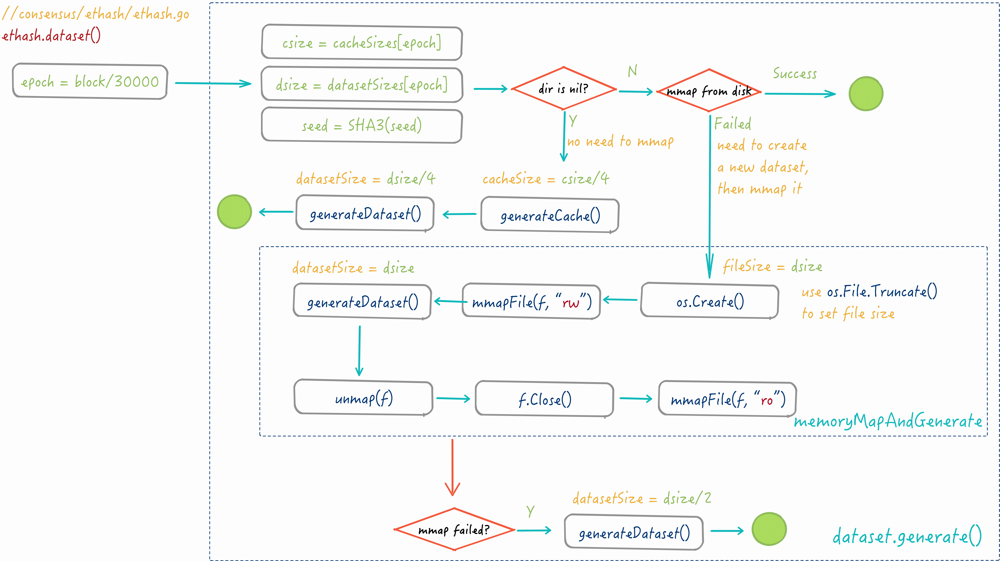

# 共识算法『生成』区块 Hash

---
<!-- START doctoc generated TOC please keep comment here to allow auto update -->
<!-- DON'T EDIT THIS SECTION, INSTEAD RE-RUN doctoc TO UPDATE -->


- [Ethash 共识算法](#ethash-%E5%85%B1%E8%AF%86%E7%AE%97%E6%B3%95)
  - [PoW 数学原理](#pow-%E6%95%B0%E5%AD%A6%E5%8E%9F%E7%90%86)
- [Ethash 的 Seal 过程](#ethash-%E7%9A%84-seal-%E8%BF%87%E7%A8%8B)
  - [数据集](#%E6%95%B0%E6%8D%AE%E9%9B%86)
    - [数据集生成](#%E6%95%B0%E6%8D%AE%E9%9B%86%E7%94%9F%E6%88%90)
      - [数据集大小](#%E6%95%B0%E6%8D%AE%E9%9B%86%E5%A4%A7%E5%B0%8F)
      - [随机数 seed 的生成](#%E9%9A%8F%E6%9C%BA%E6%95%B0-seed-%E7%9A%84%E7%94%9F%E6%88%90)
      - [生成 cache](#%E7%94%9F%E6%88%90-cache)
      - [生成 dataset](#%E7%94%9F%E6%88%90-dataset)
  - [哈希查找算法](#%E5%93%88%E5%B8%8C%E6%9F%A5%E6%89%BE%E7%AE%97%E6%B3%95)
  - [hashimoto 算法解释](#hashimoto-%E7%AE%97%E6%B3%95%E8%A7%A3%E9%87%8A)
- [Ethash 算法总结](#ethash-%E7%AE%97%E6%B3%95%E6%80%BB%E7%BB%93)
- [References](#references)

<!-- END doctoc generated TOC please keep comment here to allow auto update -->


共识算法族对外暴露的是 `consensus.Engine` 接口，当前有两种实现体，分别是基于 PoW 的 Ethash 算法和基于 PoA 的 Clique 算法。

在 `Engine` 接口的声明函数中，可以分为两类接口，一类是用于验证及准备区块信息的：

- `VerifyXXX()` 用来验证区块相应数据成员是否合理合规，可否放入区块；
  -  `VerifyHeader()`：验证 Header 是否合乎共识算法规则，规则由 Yellow Paper 定义，
  - `VerifyHeaders()`： 与 `VerifyHeader()` 类似，不过用于验证多个 Header,
  - `VerifyUncles()`: 验证 Uncles.
- `Prepare()` 接口往往在 Header 创建时调用，用来对 `Header.Difficulty` 赋值；
- `Finalize()` 接口在区块的数据成员（包括 Txs，Uncles，Receipts）都已具备时被调用，用来生成各个 Merkle Root。

而另一类是用于封印的，这一类接口有：

- `Seal()` 接口可对一个调用过 `Finalize()` 的区块进行封印，封印即生成`Header.Nonce`, `Header.MixDigest` 成员的过程。`Seal()` 成功时返回的区块全部成员齐整，可视为一个规范的区块，随后立即被广播到整个网络上，同时可以被添加到本地的 BlockChain 中。这个过程也正是 Ethereum 矿工做的事情。
- `VerifySeal()` 接口跟 `Seal()` 使用完全一样的算法原理，对于  PoW 来说，验证是否满足 PoW 难度要求，来确定该区块是否已经经过 `Seal()` 操作。

在两种共识算法的实现中，Ethash 是生产环境下以太坊真正使用的共识算法，Clique 主要针对以太坊的测试网络运作，两种共识算法的差异，主要体现在 `Seal()` 的实现上，因此下文着重介绍 Seal 的过程，其它几个接口先不介绍了（TODO：记得）。

_Clique 只要测试网络中使用到，优先级不高，这儿先不介绍了。_

## Ethash 共识算法

Ethash 是 Ethereum 1.0 中引入的 PoW 算法，属于 [Dagger Hashimoto · ethereum/wiki Wiki](https://github.com/ethereum/wiki/wiki/Dagger-Hashimoto) 的一种，详细内容可以阅读 [Ethash · ethereum/wiki Wiki](https://github.com/ethereum/wiki/wiki/Ethash) 。

这一算法设计的出发点有：

1. **IO 饱和**: 这一算法应当消耗几乎所有可用的内存访问带宽，目的是为了尽可能阻止 ASIC 矿机的出现；
2. **GPU 友好**: 使用 CPU 挖矿是不太可能的了，这种方式容易受到僵尸网络的攻击，因此我们将GPU作为一种妥协目标；
3. **Light client 可验证**: light client 在秒级别可验证正确性，消耗内存在 MB 级别；
4. **Light client 无法快速运行**：light client 上运行 Ethash 算法的速度比在 full client 上要慢
4. **Light client 快速启动**: light client 在 40 秒内可验证区块的正确性（Javascript 语言实现的基础上）。

### PoW 数学原理

Ethash 算法又被称为 Proof-of-Work(PoW)，是基于运算能力的封印过程。Ethash 实现的 Seal()
函数，其基本原理可简单表示成以下公式:
$$
RAND(ds, h, n) <= \frac{M} {d}
$$

这里:

- 等号右边的 $M$ 表示一个极大的数，比如 $2^{256}-1$；

- $d$ 表示 Header 成员的 Difficulty 属性，$d$ 的大小将直接影响挖掘的难易程度，$d$ 越大表示挖掘的难度也就越高;

- 左边的 RAND() 是一个概率函数，它代表了一系列复杂的运算，并最终产生一个伪随机数值。

  这个函数包括三个入参：

  * $ds​$ 是数据集；
  * $h$ 是 Header 不包含 Nonce 成员的 RLP 哈希值；
  * $n$ 表示 Header 成员 Nonce。

  整个关系式可以理解为：以某个方式从一个数据集中找到一个最大不超过 \frac{M} {d} 的数，那么就认为算法运行结束，否则继续找这个数，由于 M 是固定不变的，因此 d 的大小直接决定了 Seal 的难易程度。

## Ethash 的 Seal 过程

Ethash 通过 `New()` 创建一个完整大小的 ethash PoW 模式，同时在后台启动一个线程用于处理远程挖矿的事宜（即矿工提交工作给矿池的模式，在后文『矿池架构与原理』一篇详细讲解）。

Seal 的过程就是一个工作派发的过程，内部启动多线程并行挖矿，这些线程与主线程通过 channel 通信，一旦有矿工挖掘到了，主线程即刻将结果上传给 *miner*，由后者完成新区块通告事宜。

`mine()` 函数的实现如下：

```go
//consensus/ethash/sealer.go
func (ethash *Ethash) mine(block *Block, id int, seed uint64,
                           abort chan struct{}, found chan *Block) {
    var (
        header  = block.Header()
        hash    = ethsh.SealHash(header).Bytes()
        target  = new(big.Int).Div(maxUint256, header.Difficulty)
        number  = header.Number.Uint64()
        dataset = ethash.dataset(number)
        nonce   = seed
    )
    ...
search:
    for {
        select {
        case <-abort:
            ...
            break search
        default:
            ...
            // compute the PoW value of this nonce
            digest, result := hashimotoFull(dataset, hash, nonce)
            if new(big.Int).SetBytes(result).Cmp(target) <= 0 {
                header = types.CopyHeader(header)
                header.Nonce = types.EncodeNonce(nonce)
                header.MixDigest = common.BytesToHash(digest)
                found <- block.WithSeal(header)
                break search
            }
        }
        nonce++
    }
    runtime.KeepAlive(dataset)
}
```

这个逻辑很清晰，不断调用 `hashimotoFull()` 运算得到 `digest` 与 `result`，一旦 `result` 小于目标值 `target`，深度拷贝 Header 对象，并赋值给拷贝的 Header 成员以 `Nonce`、`digest`，再将这一 header 通过发送回 Sealer。在每次循环运算时，nonce 还会 $++$，使得每次循环中的计算的内容都各不相同。

**需要注意的是：**

> 初始的 nonce 是一个随机数，并非从 0 开始，这样子的好处很明显，各个机器上的矿工从一个不同的起点开始计算，完全是随机的靠运气，不然的话相当于所有人都是在做同一件事，各个矿工之间完全是在浪费能量。
>
> 另外，在这一过程结束的时候，调用 `runtime.KeepAlive(dataset)` 保活 `dataset`，这里的 `dataset` 是通过内存映射的方式从本地文件加载到内存的（后方细讲），`dataset` 在其 finalizer 中被释放（同理，通过 `runtime.SetFinalizer()` 设置），KeepAlive 确保这一 `dataset` 没有被释放（其 finalizer 不会被调用），因而其它线程依然可以使用。

这里 `hashimotoFull()` 函数通过调用 `hashimoto()` 函数完成运算，而同时还有另外一个类似的函数 `hashimoLight()` 函数：

```go
//consensus/ethash/algorithm.go
func hashimotoFull(dataset []uint32, hash []byte, nonce uint64) ([]byte, []byte) {
    lookup := func(index uint32) []uint32 {
        offset := index * hashWords
        return dataset[offset : offset+hashWords]
    }
    return hashimoto(hash, nonce, uint64(len(dataset))*4, lookup)
}
func hashimotoLight(size uint64, cache []uint32, hash []byte, nonce uint64) ([]byte, []byte) {
    keccak512 := makeHasher(sha3.NewKeccak512())
    lookup := func(index uint32) []uint32 {
        rawData := generateDatasetItem(cache, index, keccak512)
        data := make([]uint32, len(rawData)/4)
        for i := 0; i <len(data); i++ {
            data[i] = binary.LittleEndian.Uint32(rawData[i*4:])
        }
        return data
    }
    return hashimoto(hash, nonce, size, lookup)
}
```

以上两个函数，最终都调用了 `hashimoto()`，它们的差别仅在于各自调用 `hashimoto()` 函数的入参不同。相比于 `Light()`，`Full()` 函数调用的 size 更大，以及一个从更大数组中获取数据的查询函数 `lookup()`。有个疑问，有更小的 size，为什么还要更大的呢？

> `hashimotoFull()` 函数是被 `Seal()` 调用的；而 `hashimotoLight()` 是为 `VerifySeal()` 准备的。

在讲解具体的哈希运算之前，先了解一下哈希运算的数据集。

### 数据集

Ethash 依赖于一个[伪随机](https://en.wikipedia.org/wiki/Pseudorandomness)的数据集，这个数据集的学术名称为 [DAG](https://en.wikipedia.org/wiki/Directed_acyclic_graph)。数据集的内容是预先定义好了的，在不同客户端之间保持相同（说好的『共识』）；大小是由区块 Number 确定，每 $epochLength$ 个区块增大一次，$epochLength$ 被定义成常量 30000，每 30000 个区块共享一个数据集，这一 DAG 文件当前（2018.8.8，大概是在第 200 个 epoch）大小在 2.4GB [[1]][1]。

由于这个文件在哈希运算的过程中都需要使用到，并且每次都是随机读取（由于 `lookup()` 非线性查找的原因），因此放磁盘上是不现实的，只能够加载到内存，但是这么大的文件在进程启动的时候每次都生成一遍的话太耗费时间了，下图是在一台 CPU 为 Intel(R) Core(TM) i7-4870HQ CPU @ 2.50GHz 的 VM 上生成一个 1G 大小的 DAG 文件耗费的时间情况：


测试代码如下：

```go
package main

import (
    "path/filepath"

    "github.com/ethereum/go-ethereum/consensus/ethash"
    "github.com/pkg/profile"
)

func main() {
    defer profile.Start().Stop()
    ethash.MakeDataset(1, filepath.Join(".", ".ethash"))
}
```

可以看出来，其中大部分时间都花费在了 Hash 运算上面，权衡之下，通过 [mmap](https://en.wikipedia.org/wiki/Mmap) 内存映射是个不错的选择，在数据集生成过程中，将生成的数据集同时保存到磁盘上，下次使用的时候直接从磁盘加载。

#### 数据集生成

Ethash 中有两种数据集，分别为 dataset 和 cache，这两者结构基本一致，最大的差别在于大小，前者大（GB 级别），后者小（MB 级别），以 dataset 为例的生成过程如下:



*ethash/sealer.go* 的 mine 中调用 `ethash.cache(number，async)` 会确保该区块所用到的 cache 对象已经创建，它的入参是区块的 Number，用 $Number \div epochLength$ 可以得到该区块所对应的 epoch 号，再由 epoch 可以获取到这一数据集的大小。

内存映射的过程比较简单，上面的流程图已经非常清晰说明了问题，值得注意的是，在 `memoryMapAndGenerate()`  创建新的 DAG 文件时使用了两次内存映射函数：

1. 第一次以 `rw` 方式生成一个磁盘文件并映射到内存空间中；
2. 调用 `generator()` 进行数据的灌装，于是这个内存数组以及所映射的磁盘文件就同时变得十分巨大（GB 级别）；
3. 灌装结束之后，关闭内存映射和刚刚打开的文件描述符；
4. 第二次以 `ro` 方式重新打开这个磁盘文件并 mmap 映射到内存之中，可以保证这一个文件不会被使用方更改。

另外 `ethash.Ethash` 中用 LRU 分别缓存不同 epoch 对应已经创建好的 cache 和 dataset 对象，在不同 block 之间可以减少 mmap 的次数。

接下来，重点关注其中一些有意思的细节内容。

##### 数据集大小

数据集大小由参数 size 决定，是生成内存映射 buffer 的容量，dataset 结构中有两个 size：

* `csize`：cache 的大小，由 `cacheSize()` 函数计算出来；
* `dsize`：dataset 的大小，由 `datasetSize()` 函数计算出来；

这两个的大小跟区块 epoch 有关联，Ethash 在代码里预先定义了一个数组 `cacheSizes[]` 和 `datastSizes[]`，存放了前 2048 个 epoch 所用到的 `csize` 和 `dsize`。如果当前区块的 epoch 处于这个范围内，直接取用之，大小分布在 $csize \in [16MB, 270MB]$ 与  $dsize \in [1GB, 17GB]$；

如若没有，则以下列公式计算大小：
$$
\begin{align}
csize &= cacheInitBytes + cacheGrowthBytes * epoch - hashBytes \\
dsize &= datasetInitBytes + datasetGrowthBytes * epoch - mixBytes \\
\end{align}
$$
以其中较小的 $cacheSize$ 来说明：

- $cacheInitBytes$ = $2^{24}$，
- $cacheGrowthBytes$ = $2^{17}$，
- $hashBytes$ = 64，

可见 $size$ 的取值有多么巨大了，注意到 `xxxSize()`  中在对 size 赋值后还要不断调整，保证最终 size 是个质数，这就比较奇怪了，前面 2048 个 epoch 没有这个特殊要求，为何这里需要质数保证？（TODO）

粗略计算一下 size 的取值范围:

$$
\begin{align}
csize &= 2^{24} + 2^{17} * epoch \\
\\
where: & \\
&epoch > 2048 \equiv 2^{11} \\
=> csize &> 2^{28} \equiv 256MB \\
\end{align}
$$

因此生成的 cache 大小 至少有 256MB，而这还仅仅是 `VerifySeal()` 使用的 cache，`Seal()` 使用的 dataset 还要大的多（不过 dsize 的大小稳定在 16GB 上下，增长没有那么快），可见这些数据集有多么庞大了，这也就是 Ethereum 挖矿与 Bitcoin 挖矿的差异性，前者对于显卡容量有一定的要求，Ethereum 利用这个特性来抗拒 ASIC 矿机。

##### 随机数 seed 的生成

参数 seed 是 `generateCache()` 中对 buffer 进行哈希运算的种子数据，大小为 32bytes, 生成逻辑比较简单，直接看代码：

```go
//consensus/ethash/algorithm.go
func seedHash(block uint64) []byte {
    seed := make([]byte, 32)
    if block < epochLength { return seed }
    keccak256 := makeHasher(sha3.NewKeccak256())
    for i := 0; i <int(block/epochLength); i++ {
        keccak256(seed, seed)
    }
    return seed
}
```

 `seedHash()` 中利用 `keccak256()` 哈希函数对 seed 做 epoch 次**原地哈希**，原地哈希的好处是每次执行的结果取决于上一次的结果，同时每一次执行的结果都是确定的，所以每个不同的 cache 所用到的 seed 也是完全不同的，执行 20 次的结果如下：

```
@00 hash: 0x0000000000000000000000000000000000000000000000000000000000000000
@01 hash: 0x290decd9548b62a8d60345a988386fc84ba6bc95484008f6362f93160ef3e563
@02 hash: 0x510e4e770828ddbf7f7b00ab00a9f6adaf81c0dc9cc85f1f8249c256942d61d9
@03 hash: 0x356e5a2cc1eba076e650ac7473fccc37952b46bc2e419a200cec0c451dce2336
@04 hash: 0xb903bd7696740696b2b18bd1096a2873bb8ad0c2e7f25b00a0431014edb3f539
@05 hash: 0xf2e59013a0a379837166b59f871b20a8a0d101d1c355ea85d35329360e69c000
@06 hash: 0x582b06447f087674bcc0a32a19961e77dafb9e17955792f79ec8936e3d9742fc
@07 hash: 0x6d29f6dd1270e49744bd5377ec86395b2de2abbe54bae16281b8e39b35538dcd
@08 hash: 0xc307e5620454e771052a14bea2468aa36e4d01104c1bb0589fb96c692da7cebc
@09 hash: 0xec9d541d1c32bec7debceb8103337e6ad3b1140e80ae7773a1013fd6f3014c46
@10 hash: 0x9b2baad7528ecec612c5751a6bd525905892d7892e155c3b05e61363154a940b
@11 hash: 0xd705bfceb18862841d146b65702167152de74c08a4c1821a1698fcc414d8978e
@12 hash: 0x4db8c3d89b7de6ddb733a736d664ebda3b6c5c5131f406df463e8f83d7805283
@13 hash: 0x9b1ca7a86d339a3f175e48937848ac1cc012678e046b8c433a226d06f0f9bf9b
@14 hash: 0x526ee6e688a9b3d466fe4a7355197a89898593509d75c570942cc73a5ca8299d
@15 hash: 0x3db89d407a5318223df61aeabb86646833530dcccfb8fecb21b4e19d6494d7a0
@16 hash: 0xf1af2c862779f5efe4ec2ba0c3982e07c705fd93f1ce622b03681128c04f6aa2
@17 hash: 0x1c43434ae099df696d682e68d0611cc9b9eda636466134d6e857c86c4bd6ed28
@18 hash: 0xaec7cfe5efe3d3e0665826a4817adef725e254509263560cf98f8a906172999d
@19 hash: 0xc6320e3c1c3456002aa6ccc5b60cf5bf054d7e9392712f8b7764869abe630035
```


##### 生成 cache

`generateCache()` 函数在给定种子 `seed` 的情况下，对固定容量的一块 buffer（32MB）进行一系列操作，使得 buffer 的数值分布随机无章，最终 buffer 作为 cache 中的数组（非线性表）返回：

```go
func generateCache(dest []uint32, epoch uint64, seed []byte) {
    ...
    // Convert our destination slice to a byte buffer
    header := *(*reflect.SliceHeader)(unsafe.Pointer(&dest))
    header.Len *= 4
    header.Cap *= 4
    cache := *(*[]byte)(unsafe.Pointer(&header))

    // Calculate the number of theoretical rows (we'll store in one buffer nonetheless)
    size := uint64(len(cache))
    rows := int(size) / hashBytes
    ...

    keccak512 := makeHasher(sha3.NewKeccak512())
    keccak512(cache, seed)

    for offset := uint64(hashBytes); offset < size; offset += hashBytes {
        keccak512(cache[offset:], cache[offset-hashBytes:offset])
    }

    // Use a low-round version of randmemohash
    temp := make([]byte, hashBytes)
    for i := 0; i < 3; i++ {
        for j := 0; j < rows; j++ {
            var (
                srcOff = ((j - 1 + rows) % rows) * hashBytes
                dstOff = j * hashBytes
                xorOff = (binary.LittleEndian.Uint32(cache[dstOff:]) % uint32(rows)) *
                         hashBytes
            )
            bitutil.XORBytes(temp, cache[srcOff:srcOff+hashBytes],
                             cache[xorOff:xorOff+hashBytes])
            keccak512(cache[dstOff:], temp)
        }
    }
    if !isLittleEndian() { swap(cache) }
}
```

由于入参内存映射是 `*uint32` 的指针类型，而这里是当作 `byte` 数组来使用的，因此需要先对指针类型转换，并将数组大小 `*4`.

与生成 `seed` 使用的 `keccak256` 不同的是，`generateCache()` 中使用 `keccak512` 哈希函数，相比于前者，最大的不同在于后者生成的字节大小为 64bytes，这一函数的作用是：

1. 对给定的 buffer 数组以 hashBytes 大小（64bytes）分段进行 `keccak512` 哈希计算；

2. 同理，再对 buffer 数组以 hashBytes 大小（64bytes）分段进行 `randmemohash` 哈希计算；

   **RandMemoHash** 来自于 2014 年密码学方向的一篇学术论文：[Strict Memory Hard Hashing](http://www.hashcash.org/papers/memohash.pdf) 中

##### 生成 dataset

与 `generateCache()` 类似，通过种子数据生成一个大型数据集，不过这里使用的种子数据为 `generateCache()` 生成的数据，确保生成的数据尽可能随机无章，由于这一数据集过于膨大，为加快生成过程，这里使用多线程分块处理：

```go
func generateDataset(dest []uint32, epoch uint64, cache []uint32) {
    ...
    threads, size := runtime.NumCPU(), uint64(len(dataset))
    var pend sync.WaitGroup
    pend.Add(threads)

    for i := 0; i < threads; i++ {
        go func(id int) {
            defer pend.Done()

            keccak512 := makeHasher(sha3.NewKeccak512())
            batch := uint32((size + hashBytes*uint64(threads) - 1) / (hashBytes * uint64(threads)))
            first := uint32(id) * batch
            limit := first + batch
            if limit > uint32(size/hashBytes) { limit = uint32(size / hashBytes) }

            // Calculate the dataset segment
            percent := uint32(size / hashBytes / 100)
            for index := first; index < limit; index++ {
                item := generateDatasetItem(cache, index, keccak512)
                if swapped { swap(item) }
                copy(dataset[index*hashBytes:], item)
            }
        }(i)
    }
    pend.Wait()
}
```

其中每一个线程处理 $batch$ 个连续字节，计算公式如下：

$$
\begin{align}
batch &= \frac {size + hashBytes * T - 1} {hashBytes * T} \\
\\
where: & \\
& hashBytes \equiv 64\\
& T \equiv len(threads) \\
\end{align}
$$

分子中多了 $hashBytes * T - 1$ 的考虑到，在 `size` 不能被 $hashBytes * T$ 整除的时候，每一个 $batch$ 稍微大一点，因此每个线程上的数据尽量均分。

每一个线程内部使用 [FNV Hash 算法](https://en.wikipedia.org/wiki/Fowler–Noll–Vo_hash_function) 计算：

```go
const hashWords = 16
func generateDatasetItem(cache []uint32, index uint32, keccak512 hasher) []byte {
    rows, mix := uint32(len(cache) / hashWords), make([]byte, hashBytes)

    binary.LittleEndian.PutUint32(mix, cache[(index%rows)*hashWords]^index)
    for i := 1; i < hashWords; i++ {
        binary.LittleEndian.PutUint32(mix[i*4:], cache[(index%rows)*hashWords+uint32(i)])
    }
    keccak512(mix, mix)

    // Convert the mix to uint32s to avoid constant bit shifting
    intMix := make([]uint32, hashWords)
    for i := 0; i < len(intMix); i++ {
        intMix[i] = binary.LittleEndian.Uint32(mix[i*4:])
    }
    // fnv it with a lot of random cache nodes based on index
    for i := uint32(0); i < datasetParents; i++ {
        parent := fnv(index^i, intMix[i%16]) % rows
        fnvHash(intMix, cache[parent*hashWords:])
    }
    // Flatten the uint32 mix into a binary one and return
    for i, val := range intMix {
        binary.LittleEndian.PutUint32(mix[i*4:], val)
    }
    keccak512(mix, mix)
    return mix
}
```


### 哈希查找算法

数据集准备好了之后，接下来就可以从通过查找算法从数据集中取数据了，上述 `hashimoto()` 函数中使用的是非线性表查找哈希算法，即 [hashing by nonlinear table lookup](https://en.wikipedia.org/wiki/Hash_function#Hashing_by_nonlinear_table_lookup)），属于众多哈希函数中的一种实现，这一哈希算法以快速和高品质（哈希冲突小）著称，原理如下：

1. 准备一个随机数表，即非线性表，例如 256 个随机 32 位整数；
2. hash key 以 byte 切分成小块，每一块用做非线性表的索引；
3. 根据索引到随机数表中检索到内容；
4. 将每小块的内容做算术运算（例如 XOR 算法）得到最终结果

在代码中的实现为：

```go
//consensus/ethash/algorithm.go
func fnv(a, b uint32) uint32 { return a*0x01000193 ^ b }
func fnvHash(mix []uint32, data []uint32) {
    for i := 0; i < len(mix); i++ { mix[i] = mix[i]*0x01000193 ^ data[i] }
}
func hashimoto(hash []byte, nonce uint64, size uint64, lookup func(index uint32) []uint32) ([]byte, []byte) {
    ...
    temp := make([]uint32, len(mix))

    for i := 0; i < loopAccesses; i++ {
        parent := fnv(uint32(i)^seedHead, mix[i%len(mix)]) % rows
        for j := uint32(0); j < mixBytes/hashBytes; j++ {
            copy(temp[j*hashWords:], lookup(2*parent+j))
        }
        fnvHash(mix, temp)
    }
        ...
}
```


### hashimoto 算法解释

hashimoto 的 Hashing 算法解释图例（原图来自于 [Ethash Hashing Algorithm - Google Drawings](https://docs.google.com/drawings/d/12yaGlsb5cz7IlWXcwgT6xXympFDVf84C6UrYkqHRipQ/edit)，稍有更改）：


解释如下：

1. 根据 Header Hash 和 Nonce 通过一个类 SHA3 函数计算出一个大小为 128 字节的初始値，记作 **Mix 0**；
    1. Header Hash 字节大小为 32，Nonce 字节大小为 8，两个加在一起记作 **Seed**，大小是 40；
    2. 对 **Seed** 作 SHA3，并将结果重新赋值给 **Seed**, 此时 **Seed** 大小是 64;
    3. 组装 32 个 `uint32` 的整数数组，即 **Mix 0**，取值规则为：$Mix0_{i} = Seed[i%16*4:]$，注意一个 `uint32` 字节大小等于 4 bytes，一个 **Seed** 只能平分 16 份（$\frac{64}{4} = 16$），而 **Mix 0** 数组长度 32，所以此时 **Mix 0** 数组前后各一半是相等的（也就是这里使用了 $%16$ 的原因）；
2. 根据得到的 **Mix 0** 以及 `lookup()` 方法计算出需要从 DAG 中取出对应的一个 page（128 字节）的数据，即图中的 FetchDAGPage 方法；
    _代码实现中，是分两次提取，每次提取 64 字节_
3. 根据 **Mix 0** 的输出以及 FetchDAGPage 的数据块一起做 mixing，得到一层中间数据，作为下一次 mixing 的中间输入，记作 **Mix 1**；
    这里 mixing 采用了 [FNV Hash 算法](https://en.wikipedia.org/wiki/Fowler–Noll–Vo_hash_function)
4. 持续运行继续步骤 2, 3，一共持续 64 次，最终得到 **Mix 64**，大小同样为 128 字节;
5. 简化 **Mix 64** 的结果，得到 32 字节的 **Mix Digest**;
6. 将 **Mix Digest** 与之前的 **Seed** 作 SHA256 生成 **Result**；
7.  比较 **Result** 和给定的 **Target Threshold** 大小，判断成功还是失败（与原图不同点）。

从上面得知，对于一个 Nonce 来说，内部经过了 1 次 SHA3 计算和 64 次 mixing 计算，在 mixing 计算过程中需要从 DAG 文件中提取 128 字节内容，最终生成两个长度均为 32byte 的字节数组，`ethash.mine()` 函数中，对于这两个返回值，直接塞到 `big.Int` 中，以整型数形式直接比较 `result` 和 `target`；如果符合要求，则将 `digest` 以 `common.Hash` 类型存放于 `Header.MixDigest` 中，待以后 `ethash.VerifySeal()` 中使用。再一次，这里这么多次的内存访问，其性能取决于内存带宽的限制，而同时一个 DAG 文件的大小在 GB 级别，也证明了 Ethereum 挖矿是内存消耗型的，足以抵抗 ASIC 矿机。

> 试问，每一个 Nonce 内部需要运行 64 次哈希运算，既然生成的都是随机数，能否少计算几次，这样子遍历 nonce 的速度就快了，这样子找到合适的 digest 的值的时间是否有可能缩短？

## Ethash 算法总结

回顾一下 Ethash 共识算法最基本的形态，如果把整个 `result` 的生成过程视作那个概率上的函数 $RAND()$，则如何能更加随机，分布更加均匀的生成数组，关系到整个 Ethash 算法的安全性。毕竟如果 result 生成过程如果存在被短路破译的话，那么必然有方法可以更快地找到符合条件的结果，可以看到 Ethash 算法中应用了非常多的复杂计算，包含了多次、多种哈希算法：

1. SHA3 哈希，包括 256bit 和 512bit，用它们来对数据集作哈希运算，其结果充当其他更大更复杂哈希计算的种子数据；

2. lookup() 函数提供了非线性表格查找方式的哈希函数，相关联的 dataset 和 cache 规模巨大，其中数据集的生成 / 填充过程中也大量使用哈希函数。

3. 整数位运算与字节运算是差若天渊的 CPU 运算，在一些计算过程中，有意将 `[]byte` 数组转化为 `uint32` 整数进行操作（比如 XOR，以及类 XOR 的 `fnv()` 算法）。


## References

* [1]: https://github.com/ethereum/go-ethereum/blob/v1.8.13/consensus/ethash/algorithm.go#L440

* https://www.vijaypradeep.com/blog/2017-04-28-ethereums-memory-hardness-explained/
* https://github.com/ethereum/wiki/wiki/Ethash
* https://github.com/ethereum/wiki/wiki/Ethash-Design-Rationale
