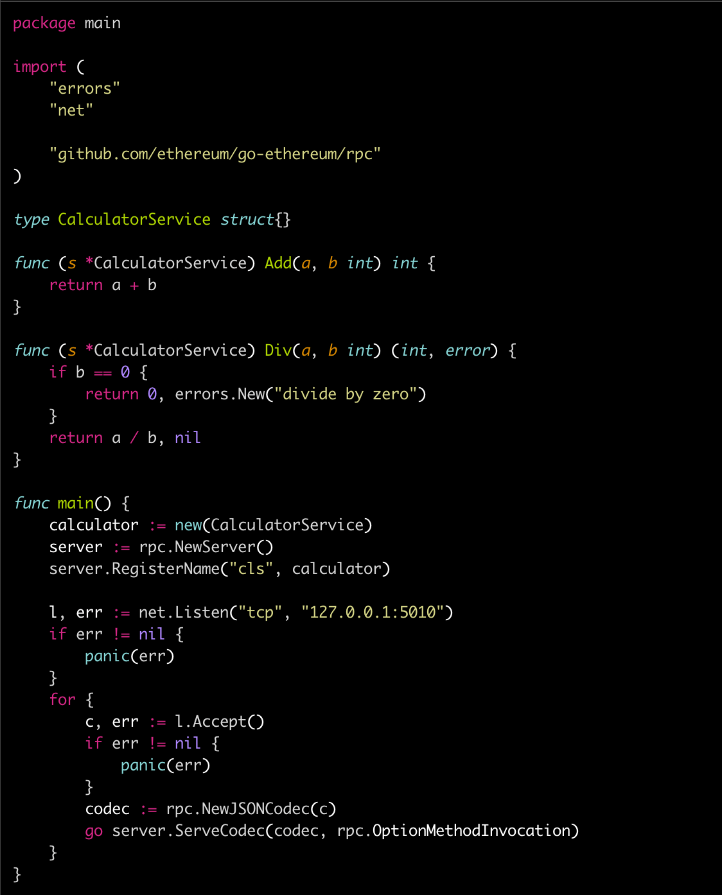

# Ethereum RPC and implemention

---
<!-- START doctoc generated TOC please keep comment here to allow auto update -->
<!-- DON'T EDIT THIS SECTION, INSTEAD RE-RUN doctoc TO UPDATE -->


- [RPC 标准](#rpc-%E6%A0%87%E5%87%86)
  - [Ethereum RPC specification](#ethereum-rpc-specification)
  - [完整的 demo](#%E5%AE%8C%E6%95%B4%E7%9A%84-demo)
  - [Ethereum PUB/SUB specification](#ethereum-pubsub-specification)
  - [PUB/SUB 完整的 demo](#pubsub-%E5%AE%8C%E6%95%B4%E7%9A%84-demo)
- [RPC Server 的实现](#rpc-server-%E7%9A%84%E5%AE%9E%E7%8E%B0)
  - [RPC Public API](#rpc-public-api)
  - [Server framework](#server-framework)
    - [register new service](#register-new-service)
    - [handle request](#handle-request)
    - [inner implement](#inner-implement)
    - [subscribe framework](#subscribe-framework)
- [Ethereum JSON RPC Protocol](#ethereum-json-rpc-protocol)
  - [eth/filters](#ethfilters)
    - [bloom filter 应用之过滤进行时](#bloom-filter-%E5%BA%94%E7%94%A8%E4%B9%8B%E8%BF%87%E6%BB%A4%E8%BF%9B%E8%A1%8C%E6%97%B6)
- [小结](#%E5%B0%8F%E7%BB%93)
- [References](#references)

<!-- END doctoc generated TOC please keep comment here to allow auto update -->


> RPC 非常好用，特别是在开发调试阶段，对于暴露 geth 内部状态，与内部线程互动等都非常有用，**但是在线上环境，RPC 请慎用，即使打开也需要做网络隔离，不然很容易引发 [以太坊情人节](https://4294967296.io/eth214/) 这种事故。**

## RPC 标准

### Ethereum RPC specification

RPC(Remote Procedure Call) 即远程过程调用，是一种通过网络从远程计算机程序上请求服务的方式。RPC 框架非常之多，特别是 Java 领域之中，比如 Alibaba 的 [dubbo](https://github.com/apache/incubator-dubbo),  跨语言而通用的 [RESTful API](https://en.wikipedia.org/wiki/Representational_state_transfer), [GRPC](https://grpc.io) 等，go-ethereum *rpc* 模块中采用的是基于 HTTP 的 JSON RPC 实现，RPC 调用者使用 HTTP 的方式就可以接入 Ethereum 网络，客户端接入还是相当方便的。

特别地，*rpc* 模块中要求 RPC 实现者需要符合以下标准，才可被用于远程访问，结合 Golang 语言特性，分析一下：

| RPC 标准                                        | Golang 语言特性                |
| ----------------------------------------------- | ------------------------------ |
| 对象必须已导出                                  | 首字母大写的结构体             |
| 方法必须已导出                                  | 首字母大写的方法名             |
| 方法返回 0、1(响应或错误）、2（响应和错误）个値 | 函数多返回值                   |
| 方法参数必须是已导出的或者内置类型              | 首字母大写的类型名或者内置类型 |
| 方法返回値必须是已导出或者内置类型              | 同上                           |

> 『导出』是指 Golang 的 exported 属性，[The Go Programming Language Specification - The Go Programming Language](https://golang.org/ref/spec#Exported_identifiers) 对此的定义是：
>
> 1. 对象的首字母是 unicode 大写；
> 2. 对象必须是在 package 作用域中定义的，或者这一对象是一个成员的属性（field）或者是一个方法名称
>
> 以上两点均满足才是导出的完整定义。

一个示例 RPC 的实现者如下：

```go
type CalcService struct {}
func (s *CalcService) Add(a, b int) (int, error)
```

在上述示例中，当返回的 `error` 不为 nil 的时候，返回的 `int` 値被忽略；否则 int 値被发送回 rpc 调用者。

通过提供指针类型的变量，使得方法支持可选参数（注意：**指针变量必须放在最后**）。例如，如果我们支持在可选有限域内整数相加的方法：

```go
func (s *CalcService) Add(a, b int, mod *int) (int, error)
```

### 完整的 demo

下面先来看一个完整的 JSON RPC Server 的实现，参见 [rpc-example.go](https://api.cacher.io/raw/6033a86dad2f9e73bb9f/44dba39c9e0215d13290/rpc-example.go)：



客户端的调用方法如下：

```python
import socket
c = socket.socket(socket.AF_INET, socket.SOCK_STREAM)
c.connect(('127.0.0.1', 5010))
c.send(b'{"jsonrpc":"2.0","method":"cls_add","params":[1,2],"id":1}')
print(c.recv(1024))
# b'{"jsonrpc":"2.0","id":1,"result":3}\n'

c.send(b'{"jsonrpc":"2.0","method":"cls_div","params":[2,1],"id":1}')
print(c.recv(1024))
# b'{"jsonrpc":"2.0","id":1,"result":0}\n'
```

**方法不存在的调用**

```python
c.send(b'{"jsonrpc":"2.0","method":"cls_sub","params":[2,2],"id":1}')
print(c.recv(1024))
# b'{"jsonrpc":"2.0","id":1,"error":{"code":-32601,"message":"The method cls_sub does not exist/is not available"}}\n'
```

**调用出错的情况**

```python
c.send(b'{"jsonrpc":"2.0","method":"cls_div","params":[2,0],"id":1}')
print(c.recv(1024))
# b'{"jsonrpc":"2.0","id":1,"error":{"code":-32000,"message":"divide by zero"}}\n'
```

从上面的示例也可以看出来：

1. Ethereum RPC 的实现与底层协议无关，不论是 TCP、HTTP 或者是 [IPC](https://en.wikipedia.org/wiki/Inter-process_communication);
2. *rpc* 服务在投入使用之前需要先注册，用于界定 namespace；
3. *rpc* 对于客户端的请求在 `rpc.ServeCodec` 回调中实现，包括请求的读取、处理、响应阶段；


### Ethereum PUB/SUB specification

前面这种 request/response 调用方式对于 RPC Server 来说是被动的，只有接受到客户端的 request 才能够回应 response，而对于有些场景，RPC Server 还需要主动或者多次往 Client 发送响应这种场景，这种场景多半是通过 publish/subscribe 这种方式实现，*rpc* 中也有针对这种场景的实现。对于这种方式的 RPC 来说，这种模式下的方法需要符合下列标准：

- 对象必须已导出；
- 方法必须已导出；
- 方法的第一个参数必须是 `context.Context`;
- 方法参数必须是已导出或内置类型；
- 方法必须返回 `(Subscription, error)` 类型。

### PUB/SUB 完整的 demo

PUB/SUB 完整示例见 [rpc-pubsub.go](https://api.cacher.io/raw/6033a86dad2f9e73bb9f/44dba39c9e0215d13290/rpc-example.go), 客户端与 request/response 的访问类似：

```python
import socket
c = socket.socket(socket.AF_INET, socket.SOCK_STREAM)
c.connect(('127.0.0.1', 5010))
c.send(b'{"jsonrpc":"2.0","method":"abc_subscribe","params":["peckSubscription",15,1234],"id":1}')
c.recv(128)
#b'{"jsonrpc":"2.0","id":1,"result":"0xc6039fa89031296e0f69f0313d8be598"}\n{"jsonrpc":"2.0","method":"abc_subscription","params":{"s'

c.recv(128)
# b'tion","params":{"subscription":"0xc6039fa89031296e0f69f0313d8be598","result":1238}}\n'...
```

与 request/response 不同的时，第一个消息必须是 `<RegisterName>_subscribe` 方法，而方法名称放置在参数中第一个位置。

Subscription 在下面几种情况下会被删除：

- 用户发送了一个 unsubscribe 的请求;
- 创建 subscirbe 的连接被关闭了，这种情况可能由客户端或者服务器触发，服务端在写入出错或者是通知队列长度太大的时候会选择关闭连接。

## RPC Server 的实现

### RPC Public API

通过上面两个 demo 我们了解到 Ethereum 中 RPC  的使用方法，接下来对于 RPC 背后的 framework 做个详细了解。

RPC 接口定义如下：

```go
//rpc/types.go
type API struct {
    Namespace string
    Version   string
    Service   interface{}
    Public    bool
}
```

* `Namespace`: 定义这个接口在哪个命名空间下有效，用于隔离不同的模块；
* `Version`: API 版本（TODO：是否有对 API 版本号做检查？）；
* `Service`:  `interface` 类型，那么对于 API 的实现体是没有特别的要求（TODO：如何调用 API 又是怎么定义的呢？）
* `Public`: 标识是否 Public（TODO：与对象 public 是否有关系？）

*rpc* 包中各个文件的功能如下：

* *server.go*: 整个 RPC framework 框架逻辑均在这一文件中，包括 RPC 注册，RPC Server 请求解析等业务；
* *subscription.go*: 实现 publish/subscrib 的逻辑；
* 其它一些辅助性功能文件

### Server framework

*server.go* 实现了 RPC 服务端的核心逻辑，对应为一个服务的生命周期，包括：

* 注册服务
* 读取请求
* 处理请求
* 发送回应

server 的核心数据结构是 Server 结构体：

```go
//rpc/types.go
type serviceRegistry map[string]*service
type callbacks map[string]*callback
type subscriptions map[string]*callback

type service struct {
    name          string
    typ           reflect.Type
    callbacks     callbacks
    subscriptions subscriptions
}

type callback struct {
    rcvr        reflect.Value
    method      reflect.Method
    argTypes    []reflect.Type
    hasCtx      bool
    errPos      int
    isSubscribe bool
}

type Server struct {
    services serviceRegistry
    run      int32
    codecsMu sync.Mutex
    codecs   *set.Set
}
```

这一结构体的解读如下：

* 一个 `Server`结构代表一个 RPC Server 的实现体，可以在这一 Server 结构中注册不同的 RPC 服务；

* 通过 `server.RegisterName(name string, rcvr interface{})` 注册新的 `name` namespace 下的 `rcvr` 服务，可以在一个 `Server` 内部实现多个 namespace 下的不同服务；

* 注册的服务即为 `service`, `Server` 中有多个不同 namespace 下面注册的 service, 用 `services` 字段表示（为 map 结构，其中 key 是 namespace，而 value 是 `service` 类型）。 `service` 结构中包含下列属性：

  * `name` 代表了这一个 service 的 namespace，

  * `typ` 代表了实例的数据结构类型（通过 `reflect.TypeOf(rcvr)` 返回），

  * `callbacks` 是这一实例的回调方法列表，注意这里并没有将回调方法通过参数的形式传入，那么这一字段如何生成的呢？（下面会有介绍）

  * `subscriptions` 是实例的订阅方法列表，与 `callbacks` 相似，考虑这一字段如何生成；

    注意，这个字段和 `callbacks` 一样，也是 `callback` 类型，两者通过 `isSubscribe` 字段来区分。

* `run` 字段是用来控制 Server 的运行和停止的，为原子性保障，通过 `atomic.LoadInt32()` 方法判断；

* `codecs` 是一个 set 结构，用来存储当前所有的客户端连接（即 `ServerCodec` 结构）

#### register new service

service 通过 `server.RegisterName(name string, rcvr interface{})` 把自身服务注册到 Server 结构体中，service 的实现通过 `callbacks` 与 `subscriptions` 提供，前面讲了，这两个字段并不是由注册者传递进来的，那么这两者是如何生成的呢？先来看下 `server.RegisterName()` 内部实现：

```go
//rpc/server.go
func (s *Server) RegisterName(name string, rcvr interface{}) error {
    if s.services == nil { s.services = make(serviceRegistry) }

    svc := new(service)
    svc.typ, rcvrVal = reflect.TypeOf(rcvr), reflect.ValueOf(rcvr)

    if name == "" {
        return fmt.Errorf("no service name for type %s", svc.typ.String())
    }
    if rcvrName := reflect.Indirect(rcvrVal).Type().Name();
        !isExported(rcvrName) {
        return fmt.Errorf("%s is not exported", rcvrName)
    }

    methods, subscriptions := suitableCallbacks(rcvrVal, svc.typ)
    if len(methods) == 0 && len(subscriptions) == 0 {
        return ...
    }

    // already a previous service register under given sname,
    // merge methods/subscriptions
    if regsvc, present := s.services[name]; present {
        for _, m := range methods {
            regsvc.callbacks[formatName(m.method.Name)] = m
        }
        for _, s := range subscriptions {
            regsvc.subscriptions[formatName(s.method.Name)] = s
        }
        return nil
    }

    svc.name = name
    svc.callbacks, svc.subscriptions = methods, subscriptions

    s.services[svc.name] = svc
    return nil
}
```

流程如下：

1. 避免 namespace 为空；
2. 判断这一 service 对象的实现体是可导出的（对象的首字母为大写）；
3. 找到这个对象所有的回调与订阅接口列表；
4. 如果这一个 service 已经存在了，更新这一 service 的回调与订阅接口；
5. 注册 service 到 server 的 `services` 属性中。

可以发现，service 的回调与订阅接口列表通过 `suitableCallbacks()` 函数获取，这个方法会先遍历 rcvr 这一反射类型的所有方法，找到适合 RPC callback 或者 subscription 类型标准的方法并返回：

```go
//rpc/utils.go
func suitableCallbacks(rcvr reflect.Value,
                       typ reflect.Type) (callbacks, subscriptions) {
    callbacks, subscriptions:= make(callbacks), make(subscriptions)

METHODS:
    for m := 0; m < typ.NumMethod(); m++ {
        method := typ.Method(m)
        mtype, mname := method.Type, formatName(method.Name)
        // method must be exported
        if method.PkgPath != "" { continue }

        var h callback
        h.isSubscribe = isPubSub(mtype)
        h.rcvr, h.method, h.errPos = rcvr, method, -1

        firstArg := 1
        numIn := mtype.NumIn()
        if numIn >= 2 && mtype.In(1) == contextType {
            h.hasCtx, firstArg = true, 2
        }

        if h.isSubscribe {
            // skip rcvr type
            h.argTypes = make([]reflect.Type, numIn-firstArg)
            for i := firstArg; i < numIn; i++ {
                argType := mtype.In(i)
                if isExportedOrBuiltinType(argType) {
                    h.argTypes[i-firstArg] = argType
                } else {
                    continue METHODS
                }
            }
            subscriptions[mname] = &h
            continue METHODS
        }

        // determine method arguments, ignore first arg
        // since it's the receiver type
        // Arguments must be exported or builtin types
        h.argTypes = make([]reflect.Type, numIn-firstArg)
        for i := firstArg; i < numIn; i++ {
            argType := mtype.In(i)
            if !isExportedOrBuiltinType(argType) {
                continue METHODS
            }
            h.argTypes[i-firstArg] = argType
        }

        // check that all returned values are exported or builtin types
        for i := 0; i < mtype.NumOut(); i++ {
            if !isExportedOrBuiltinType(mtype.Out(i)) { continue METHODS }
        }

        // when a method returns an error it must be the last returned value
        h.errPos = -1
        for i := 0; i < mtype.NumOut(); i++ {
            if isErrorType(mtype.Out(i)) {
                h.errPos = i
                break
            }
        }

        if h.errPos >= 0 && h.errPos != mtype.NumOut()-1 { continue METHODS }
        switch mtype.NumOut() {
        case 0, 1, 2:
            // method must one return value and 1 error
            if mtype.NumOut() == 2 && h.errPos == -1 {
                continue METHODS
            }
            callbacks[mname] = &h
        }
    }

    return callbacks, subscriptions
}
```

查找的流程如下：

1. 将方法首字母小写；

2. 通过方法的 `PkgPath` 属性（空字符串表示这一方法是『可导出的』）判断这一方法是否是可导出的；

3. 判断函数的入参都是可导出或者内置类型；

4. 同理，判断函数的出参都是可导出或者内置类型；

5. 如果函数返回 2 个参数，第 2 个参数必须是 `error`。


> Golang 的 *relflect* 语言特性提供了 runtime 的反射特性，允许在运行时通过特定的方法操作对象的能力，典型使用场景是从 `interface` 接口类型中通过静态类型取值，或者使用 `reflect.TypeOf()` 获取对象的 runtime 类型。

#### handle request

`server.ServeCodec(ServerCodec, CodecOption)` 接收两个参数：

1. `ServerCodec`：`interface`类型，实现了 Server 端对于一个 RPC 请求的读取、解析、写入方法，

   并且这些实现必须是线程安全的（goroutine 级别，会被多个 goroutine 同时并发调用到），需要满足的接口有：

   ```go
   //rpc/types.go
   type ServerCodec interface {
       // Read next request
       ReadRequestHeaders() ([]rpcRequest, bool, Error)
       // Parse request argument to the given types
       ParseRequestArguments(argTypes []reflect.Type,
                             params interface{}) ([]reflect.Value, Error)
       // Assemble success response, expects response id and payload
       CreateResponse(id interface{}, reply interface{}) interface{}
       // Assemble error response, expects response id and error
       CreateErrorResponse(id interface{}, err Error) interface{}
       // Assemble error response with extra information
       // about the error through info
       CreateErrorResponseWithInfo(id interface{}, err Error,
                                   info interface{}) interface{}
       // Create notification response
       CreateNotification(id, namespace string,
                          event interface{}) interface{}
       // Write msg to client.
       Write(msg interface{}) error
       // Close underlying data stream
       Close()
       // Closed when underlying connection is closed
       Closed() <-chan interface{}
   }
   ```

2. `CodecOptions` ：用于表明当前的实现是否支持 RPC 调用和 pub/sub 模式，
   *  `OptionMethodInvocation`: 表明 codec 支持 RPC 方法调用；
   *  `OptionSubscriptions`： 表明 codec 支持 pub/sub 订阅模式

这一方法用于处理请求的过程：

1. 从 `ServerCodec` 中**读取**出 request；
2. 调用合适的 callback;
3. 往 codec 中**写入** response.

这也是比较经典的事件处理流程，`server.ServeCodec()` 会一直堵塞，直到 codec 被关闭或者 server 停止了，无论哪种情况，codec 都会被关闭。

值得注意的是：

> 由于 server 模块并没有提供一个通用的 Start 接口，因此启动的逻辑由各个 server 实现体自行启动。

回看上面的示例，无论是 rpc 调用还是 pub/sub，都是通过下列的方式处理请求：

**启动**

```go
l, err := net.Listen("tcp", "127.0.0.1:5010")
```

listen 在一个 port 上

**处理**

```go
for {
    c, _ := l.Accept()
    go server.ServeCodec(rpc.NewJSONCodec(c), rpc.OptionMethodInvocation)
}
```

[TCP accept](http://man7.org/linux/man-pages/man2/accept.2.html) 一个连接出来之后，启动一个 goroutine 调用 `server.ServeCodec()` 来进行服务。

#### inner implement

Server 通过从 codec 中读取请求之后，处理请求，然后发送回应给客户端，这里的主要逻辑在 serveRequest 方法中体现，不论是 callback 还是 subscription 处理的流程都是大致相似的：

```go
func (s *Server) serveRequest(ctx context.Context, codec ServerCodec,
                              singleShot bool, options CodecOption) error {
    var pend sync.WaitGroup

    defer func() {
        if err := recover(); err != nil {
            const size = 64 << 10
            buf := make([]byte, size)
            buf = buf[:runtime.Stack(buf, false)]
            log.Error(string(buf))
        }
        s.codecsMu.Lock()
        s.codecs.Remove(codec)
        s.codecsMu.Unlock()
    }()

    ctx, cancel := context.WithCancel(ctx)
    defer cancel()

    // if the codec supports notification include a notifier
    // that callbacks can use to send notification to clients.
    // It is tied to the codec/connection.
    // If the connection is closed the notifier will stop
    // and cancels all active subscriptions.
    if options&OptionSubscriptions == OptionSubscriptions {
        ctx = context.WithValue(ctx, notifierKey{}, newNotifier(codec))
    }
    s.codecsMu.Lock()
    if atomic.LoadInt32(&s.run) != 1 { // server stopped
        s.codecsMu.Unlock()
        return &shutdownError{}
    }
    s.codecs.Add(codec)
    s.codecsMu.Unlock()

    // test if the server is ordered to stop
    for atomic.LoadInt32(&s.run) == 1 {
        reqs, batch, err := s.readRequest(codec)
        if err != nil {
            ...
            pend.Wait()
            return nil
        }

        // check if server is ordered to shutdown and return an error
        // telling the client that his request failed.
        if atomic.LoadInt32(&s.run) != 1 {
            // ... write codec &shutdownError{}
            return nil
        }
        // If a single shot request is executing, run and return immediately
        if singleShot {
            if batch {
                s.execBatch(ctx, codec, reqs)
            } else {
                s.exec(ctx, codec, reqs[0])
            }
            return nil
        }
        // For multi-shot connections, start a goroutine to serve and loop back
        pend.Add(1)

        go func(reqs []*serverRequest, batch bool) {
            defer pend.Done()
            if batch {
                s.execBatch(ctx, codec, reqs)
            } else {
                s.exec(ctx, codec, reqs[0])
            }
        }(reqs, batch)
    }
    return nil
}
```

请求处理的逻辑也是比较清晰的：

1. 将这一请求添加到 `server.codec` 这一 [set](https://en.wikipedia.org/wiki/Set_(mathematics)) 字段中;

2. 调用 readRequest 解析出 `*serverRequest` 类型数组：

   1. 通过 `codec.ReadRequestHeaders()` 从 codec 中读取出一个或者多个 `rpcRequest` 类型原始数据。这一实现内部也分成两个步骤实现（以 `rpc.JSONCodec` 为例）：

      1. 通过 codec 的 `decode()` 方法从协议栈上读取出原始流数据（调用 `json.NewDecoder(io.Reader).Decode()` 方法解析生成 `json.RawMessage` 结构；

      2. 将 `json.RawMessage` 解析生成 `rpcReques` 类型数据，值得注意的是，对于 pub/sub 的 `<Module>_subscribe` 方法，第一个参数（`params[0]`）为 subscribe 的方法名，回忆上面调用 `abc_subscribe` 方法的 body：

         >```json
         >{
         >  "jsonrpc": "2.0",
         >  "method": "abc_subscribe",
         >  "params": [
         >    "peckSubscription",
         >    15,
         >    1234
         >  ],
         >  "id": 1
         >}
         >```

   2. 将 `rprcRequest` 原始数据通过 `codec.ParseRequestArguments()` 解析生成 `serverRequest` 类型的数组，主要是将调用的回调函数的参数读取出来。至此，RPC 或者 pub/sub 的方法名及其参数都已经确定了，接下来就可以执行这些回调函数了；

   注意：readRequest 的处理过程中，会与本地注册的 service 比对，确定是否存在请求需要的 service 和对应的 callback/subscribe 回调方法，但如果是 `unsubscribe` 方法的话，不需要确定 service 存在与否。

3. 执行回调，如果是单次请求（短连接），直接调用 `exec()` 或者 `execBatch()` 处理之后然后 response，然后退出；如果是多次请求（长连接），新建一个 goroutine 用于处理请求，而主线程再调用 readRequest 处理接下来的请求；

   `execXXX()` 内部调用 `server.handle()` 处理请求并生成响应，然后将响应通过 `codec.Write()` 方法写回给调用者，到此为止，请求的处理流程就结束了。

注意：这个方法开头的 `defer` 中使用了 Golang `recover()` 用于在 goroutine panic 的时候，捕获 panic 信息，并中断 panic，不至于整个进程退出；另外，不论这个调用成功与否，在处理结束的时候都将这一连接从 `server.codec` 中删除。

上面是一个通用的事件处理框架，对于 pub/sub 的处理流程稍微有些许差异性。

#### subscribe framework

回到前面 serveRequest 开头的流程，如果这一 codec 支持 subscribe 请求，那么在当前的 context 中保存一个当前的 codec 对应的 `rpc.Notifier` ，如果当前连接被关闭，那么 notifier 也会被关闭，并取消掉所有激活的订阅（通过 context 实现）：

```go
//rpc/server.go
func (s *Server) serveRequest(ctx context.Context, codec ServerCodec, singleShot bool, options CodecOption) error {
    ...
    if options&OptionSubscriptions == OptionSubscriptions {
        ctx = context.WithValue(ctx, notifierKey{}, newNotifier(codec))
    }
    ...
}
```

接下来在处理请求的时候，也就是 handle 中：

```go
//rpc/server.go
func (s *Server) handle(ctx context.Context, codec ServerCodec, req *serverRequest) (interface{}, func()) {
    ...
     if req.callb.isSubscribe {
        subid, err := s.createSubscription(ctx, codec, req)
        if err != nil {
            return ...
        }

        activateSub := func() {
            notifier, _ := NotifierFromContext(ctx)
            notifier.activate(subid, req.svcname)
        }

        return codec.CreateResponse(req.id, subid), activateSub
    }
    ...
}
```

上述

1. 调用 `server.createSubscription()` 方法创建 subscription ID，同时保存这一 ID 到 Notifier  的 inactive 队列中;

2. 从 context 中恢复出 notifier，通过恢复出来的 Notifier 生成激活函数 activateSub;

3. 通过 `codec.CreateResponse()` 返回 subscribe ID 和 activeSub；

   注意：代码里面有一个技巧，activateSub 这个方法作为参数返回给 `execXXX()`，在 `execXXX()` 将 response 发送给客户端之后再调用这一函数，避免客户端还没有收到 subscription ID 的时候就已经收到了 subscription 信息：

   ```go
   //rpc/server.go
   func (s *Server) exec(ctx context.Context, codec ServerCodec,
                         req *serverRequest) {
        ...
       response, callback = s.handle(ctx, codec, req)

       if err := codec.Write(response); err != nil {
           log.Error(fmt.Sprintf("%v\n", err))
           codec.Close()
       }

       if callback != nil {
           callback()
       }
   }
   ```

   激活的逻辑将 subscription ID 从 inactive 队列移动到 active 队列中：

   ```go
   //rpc/subscription.go
   func (n *Notifier) activate(id ID, namespace string) {
       n.subMu.Lock()
       defer n.subMu.Unlock()

       if sub, found := n.inactive[id]; found {
           sub.namespace = namespace
           n.active[id] = sub
           delete(n.inactive, id)
           // Send buffered notifications.
           for _, data := range n.buffer[id] {
               n.send(sub, data)
           }
           delete(n.buffer, id)
       }
   }
   ```

   同时，将一些缓存的消息（比如在发送 subscription ID 到当前调用之前，由服务端生成的消息）发送给 client。

   相对应的取消订阅的逻辑也就是从 active 队列中直接删除:

   ```go
   //rpc/subscription.go
   func (n *Notifier) unsubscribe(id ID) error {
       n.subMu.Lock()
       defer n.subMu.Unlock()
       if s, found := n.active[id]; found {
           close(s.err)
           delete(n.active, id)
           return nil
       }
       return ErrSubscriptionNotFound
   }
   ```

subscribe 成功之后，server 端通过主动调用 Notify 的方式直接往 client 端发送数据，client 端通过 subscription ID 关联起来：

```go
//rpc/subscription.go
func (n *Notifier) Notify(id ID, data interface{}) error {
    n.subMu.RLock()
    defer n.subMu.RUnlock()

    sub, active := n.active[id]
    if active {
        notification := n.codec.CreateNotification(string(id),
                                                   sub.namespace,
                                                   data)
        if err := n.codec.Write(notification); err != nil {
            n.codec.Close()
            return err
        }
    }
    return nil
}
```

因此，对于 server 端 pub/sub 的模式而言，服务端只需要维护 subscription ID 以及对应的 Notifier，相比于 request/response 的模式，这种方式下发送给 client 的数据不需要缓存在 server 端，这样子对于服务端的压力会小很多，事物都是两面的，这种模式下面对于 client 的数据有效性（是否丢数据的情况）只能由 client 自己来保证了。

## Ethereum JSON RPC Protocol

Ethereum 完整的 RPC 定义在 [JSON RPC · ethereum/wiki Wiki](https://github.com/ethereum/wiki/wiki/JSON-RPC)，此外，除了 Ethereum 官方提供的 RPC 列表之外，还有一些第三方组织提供的扩展 RPC， 比如 Parity 提供的 trace 接口 [Parity Ethereum · Parity Tech Documentation](https://wiki.parity.io/Parity-Ethereum)。

Ethereum 提供的 RPC 之中，多半是用于查询的目的，除此之外，有一类接口特别有意思，这类接口用于监控节点上最新的动态，这就是 *eth/filters* 模块提供的能力。

### eth/filters

*eth/filters* 主要实现了两个功能：

- 提供了基于 pub/sub 模式的 filter RPC，用来给 rpc 客户端提供实时的交易，区块，日志等的过滤功能；

  *filters* 模块在处理 pub/sub 的时候，重分考虑了客户端的情形，对于无法使用长连接的情形提供了基于 request/response 的『类 pub/sub』调用方式，这种情形下由客户端定时轮循主动得到回应；

- 提供了基于 bloomIndexer 的日志过滤模式，可以快速的对大量区块执行布隆过滤操作。

过滤器数据结构：

```go
//eth/filters/api.go
type filter struct {
    typ      Type
    deadline *time.Timer
    hashes   []common.Hash
    crit     FilterCriteria
    logs     []*types.Log
    s        *Subscription
}
```

其中：

* `typ`: 过滤的类型，当前支持的过滤类型有
  * `LogsSubscription`
  * `PendingLogsSubscription`
  * `MinedAndPendingLogsSubscription`
  * `PendingTransactionsSubscription`
  * `BlocksSubscription`
* `deadline`: filter 调用间隔的最长时间，初始时间为 5 分钟，在每次调用 filter 接口之后重置为 5 分钟；
* `hashes`: 过滤得到的 Hash 値；
* `crit`: 过滤条件；
* `logs`: 过滤得到的 Log 信息，根据 `typ` 不同，过滤的结果可能放在 `logs` 字段，也可能放在 `hashes` 字段之中；
* `s`: `filter.EventSystem` 事件系统中的 `filter.Subscription` 类型。

 `PublicFilterAPI` 结构用于创建和管理过滤器：

```go
//eth/filters/api.go
func NewPublicFilterAPI(backend Backend, lightMode bool) *PublicFilterAPI {
    api := &PublicFilterAPI{
        backend: backend,
        mux:     backend.EventMux(),
        chainDb: backend.ChainDb(),
        events:  NewEventSystem(backend.EventMux(), backend, lightMode),
        filters: make(map[rpc.ID]*filter),
    }
    go api.timeoutLoop()

    return api
}
```

注意到，在启动 API 的同时，启动了一个 goroutine 每 5分钟（与上面的 `deadline` 不是同一个值）检查所有的 filters, 将那些没有处理结束的 filter 删除：

```go
//eth/filters/api.go
func (api *PublicFilterAPI) timeoutLoop() {
    ticker := time.NewTicker(5 * time.Minute)
    for {
        <-ticker.C
        api.filtersMu.Lock()
        for id, f := range api.filters {
            select {
            case <-f.deadline.C:
                f.s.Unsubscribe()
                delete(api.filters, id)
            default:
                continue
            }
        }
        api.filtersMu.Unlock()
    }
}
```

每 5 分钟之后，检查所有 filter 的 deadline 是否已经超时，没有超时则什么也不处理，不然就将这一 filter 删除。


#### bloom filter 应用之过滤进行时

客户端通过 PublicFilterAPI 可以得到自己感兴趣的内容，那么服务端在接收到这些请求的时候是如何处理的呢？对于区块内容的过滤比较简单，根据区块号直接查找就可以了；对于 Log 的情况比较特殊， go-ethereum 中将 log 的过滤查找单独放在 *eth/filters/filter.go* 中，*filter.go* 提供了基于 bloomIndexer 的日志过滤模式，可以快速的对大量区块执行布隆过滤操作，首先 *filter.go* 中定义了一个 Filter 对象:

```go
//eth/filters/filter.go
type Filter struct {
    backend Backend

    db         ethdb.Database
    begin, end int64
    addresses  []common.Address
    topics     [][]common.Hash

    matcher *bloombits.Matcher
}
```

其中：

* begin, end: 开始、结束区块 Number；
* addresses: 过滤包含的地址信息；
* topics: 区块哈希？（TODO：why 二维数组）；
* matcher: bloom 过滤器的匹配器，在 *core* 模块中定义；

过滤查找的过程：

```go
//eth/filters/filter.go
func (f *Filter) Logs(ctx context.Context) ([]*types.Log, error) {
    // 1. 查找到当前区块链的区块头
    header, _ := f.backend.HeaderByNumber(ctx,
                                          rpc.LatestBlockNumber)
    if header == nil {
        return nil, nil
    }
    head := header.Number.Uint64()
    // 2. 待查找区块的起始位置做修整：起始値未指定的情况下设定为当前的区块头
    if f.begin == -1 {
        f.begin = int64(head)
    }
    // 3. 待查找区块的结束位置设定为：请求中指定的値或者当前的区块头
    end := uint64(f.end)
    if f.end == -1 {
        end = head
    }
    // Gather all indexed logs, and finish with non indexed ones
    var (
        logs []*types.Log
        err  error
    )
    size, sections := f.backend.BloomStatus()
    // 4. 待查找区块的起始位置位于布隆过滤器之中的话，执行索引查找
    if indexed := sections * size; indexed > uint64(f.begin) {
        if indexed > end {
            logs, err = f.indexedLogs(ctx, end)
        } else {
            logs, err = f.indexedLogs(ctx, indexed-1)
        }
        if err != nil {
            return logs, err
        }
    }
    // 5. 对于待查找区块中还剩下部分未分布于布隆过滤器之中的部分，执行非索引查找
    rest, err := f.unindexedLogs(ctx, end)
    logs = append(logs, rest...)
    return logs, err
}
```

查询的逻辑和一般的链表查询比较相似：

1. 定位查询的始末位置；

2. 布隆过滤器之中的部分执行索引查询；

   查找到所有的 receipt -> 并从 receipt 中取到所有的日志 -> 执行 filterLogs 过滤得到需要的 Log

   至于过滤的规则就是 Filter 结构体初始化的时候，传入的 addresses, topics 两个参数有关联

3. 过滤器之外的部分执行遍历查询

   循环遍历从 begin 到 end 指定的所有 Block，再在每个 Block 中检索所有匹配的 Log.

TODO：补充更多细节

## 小结

Ethereum RPC 与一般意义的 RPC 并无差别，Ethereum 针对具体业务类型提供了两套 RPC：

1. 实时性要求高的 pub/sub: 发布订阅模式，保证数据的实时性，但是数据的有效性由 client 自行担保；
2. 一般模式的 request/response: 无状态模式，client 和 server 的接入难度低，在此基础之上又实现了『类 pub/sub』的接入方式，客户端对于伪实时的数据需求也就实现了。

## References
