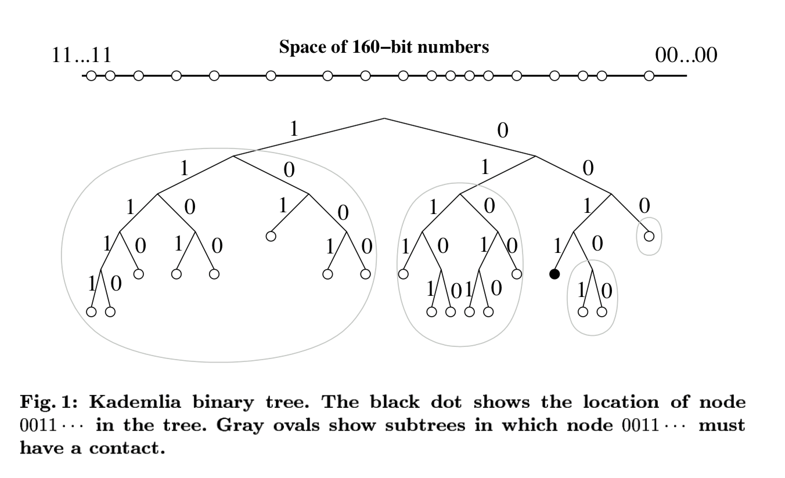
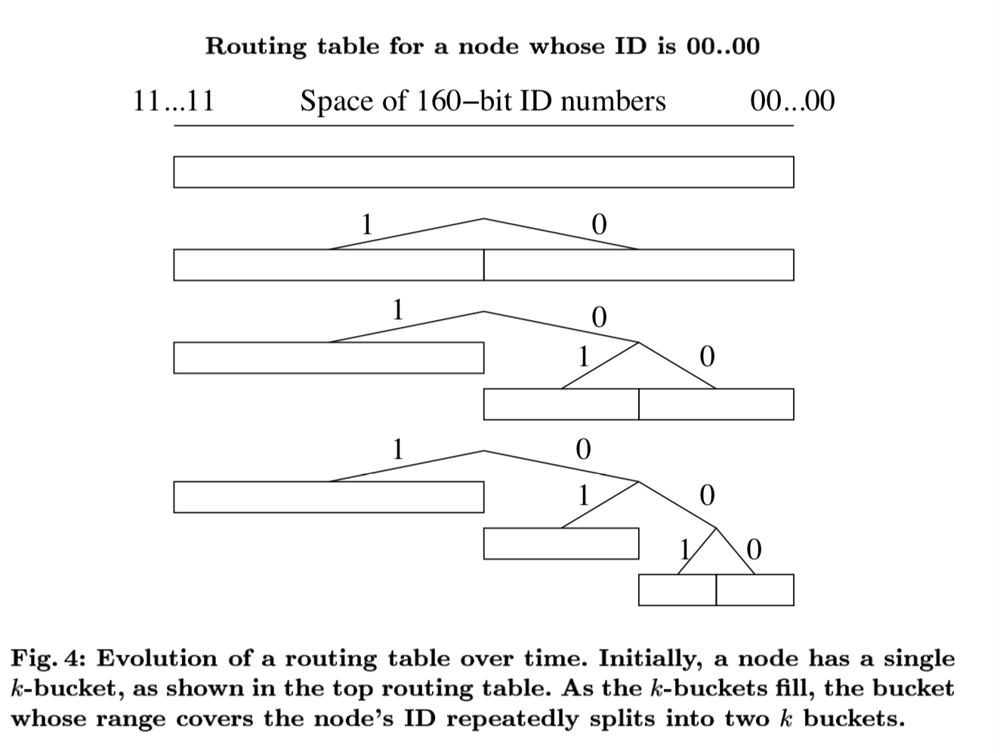
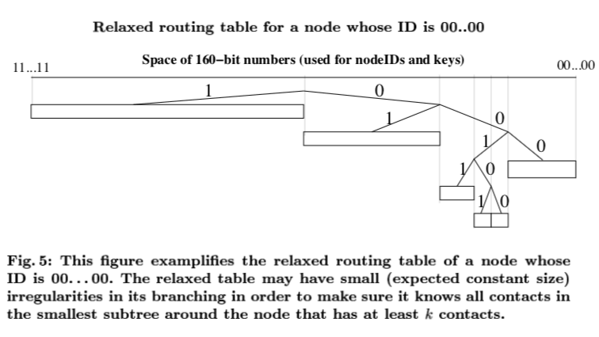

# P2P 协议中的翘首 -- Kademlia 协议

---

<!-- START doctoc generated TOC please keep comment here to allow auto update -->
<!-- DON'T EDIT THIS SECTION, INSTEAD RE-RUN doctoc TO UPDATE -->

- [Kademlia 协议简介](#kademlia-%E5%8D%8F%E8%AE%AE%E7%AE%80%E4%BB%8B)
- [Kademlia 技术细节 — 路由表](#kademlia-%E6%8A%80%E6%9C%AF%E7%BB%86%E8%8A%82--%E8%B7%AF%E7%94%B1%E8%A1%A8)
- [_K_-bucket](#k-bucket)
  - [_K_-bucket 更新策略](#k-bucket-%E6%9B%B4%E6%96%B0%E7%AD%96%E7%95%A5)
    - [被动更新](#%E8%A2%AB%E5%8A%A8%E6%9B%B4%E6%96%B0)
    - [主动更新](#%E4%B8%BB%E5%8A%A8%E6%9B%B4%E6%96%B0)
- [Kad 协议](#kad-%E5%8D%8F%E8%AE%AE)
  - [路由表](#%E8%B7%AF%E7%94%B1%E8%A1%A8)
- [Key 定时重放](#key-%E5%AE%9A%E6%97%B6%E9%87%8D%E6%94%BE)

<!-- END doctoc generated TOC please keep comment here to allow auto update -->

这篇文章主要讲解一下 Kademlia 协议，偏技术层面，需要对分布式数据存储技术有一定的了解。

看到下列的名词不会陌生的同学可以继续往下看，其它同学可以先补充一些基础知识再来看 :)

- 哈希，散列表；
- 分布式哈希；
- K-V 存储；
- 智能选路算法；

## Kademlia 协议简介

关于 Kademlia 协议的详细说明可以查看 [**维基百科的解释**](https://en.wikipedia.org/wiki/Kademlia) 和两位作者 [Peter Maymounkov 与 David Mazières 的论文](https://pdos.csail.mit.edu/~petar/papers/maymounkov-kademlia-lncs.pdf)，简单概述如下：

> **Kademlia** 是一种分布式哈希表技术，用于 P2P 网络，在 2002 年被两位作者发明；
>
> **Kademlia** 通过独特的异或算法（ XOR）为距离度量基础，建立了一种全新的 DHT 拓扑结构，相比于其他算法，大大提高了路由查询速度。

该协议规定了网络结构，文件也规定了节点之间查询进行的数据交换方式，节点之间通过 UDP 协议进行数据通信；节点之间通过唯一的节点 ID 进行身份标识，节点 ID 和文件 Key 息息相关，其具体关系由下文慢慢道来。

## Kademlia 技术细节 — 路由表

**Kademlia** 设置的哈希环大小为 $2^{160}$， 也就是说 Key space 被划分到 160 位大小以内，那么 Key 的取值范围就是 `[0, 2^16)` 。集群中的每个节点的 NodeID 取值和 Key 一致，也是在 `[0, 2^16)` 之间，不的是 Key 的哈希值是根据文件内容生成的，而 NodeID 更多的是一个随机值。代表文件的 Key-Value 对存储在 ID 最近的节点上，最后，基于节点 ID 的路由算法使得任何人都可以快速查找到给定的 key。

Kademlia 中的 XOR 查找使得网络中的参与者可以快速学习下网络拓扑结构，而其它的缺失了这个特性的 DHT 算法无法从查询请求中学习到路由信息。 Chord 节点路由表中必须存储前面一段距离的精确的节点信息，然而在实际上，任何一个前向的节点可能和前向的节点距离非常远，Kademlia 可以通过给相同间隔内的节点发送查询请求，允许选择在时延上最小的节点。

为了定位到离给定 ID 最近的节点， Kad 使用了单向路由算法，而其它系统一般是查找到最近的几跳，而最近的几跳可能并不是真实的最近。

Kad 将节点当作是二叉树上的节点，每个节点的位置由最短唯一前缀给定。将一个节点放置到二叉树上，子树划分规则是：与节点为同一级的子树，子树前缀是相同的，而后缀是不同的。对于 0011 的节点来说，他的子树有：

- 1xxx

- 01xx

- 000x

- 0010

Kad 协议保证了每个节点至少知道子树上一个节点，以构成对整个网络的认知。两个节点之间的距离的量级为，两个节点之间共同子树的树高；当有空子树的时候，也就是说会有多个共享最长前缀的叶子节点。路由单向性的特质保证了，不管从哪个方向查找，都能定位到真实的叶子节点。因此，在查找 <key,Value> 的时候，从沿途 cache 找到的 key 是非常有意义的，可以加快查找的时间、减少路由查询次数。

## _K_-bucket

对于任意的 $ 0 \leqslant i \leqslant 160 $，每个节点都会维护一份离自己距离为 $2^{i}$ 到 $2^{i+1}$ 之间的 〈IP Address, UDP Port, Node ID〉列表信息，这个列表信息也就称为 **_k_-bucket**。 _k_-bucket 中的每一行是根据节点存活时间排序的，存活最久的节点排在最前面，对于比较小的 i 值来说，_k_-bucket 可能是空的（网络上节点比较少，自己的邻居比较远），对于比较大的 i 值，bucket 中节点的数量最多可以增长到 `k`（系统设定的变量， k 的意义是说在一个小时的间隔内，任意的 k 个节点之间不会失联）。

| i   | distence              | peers                                                                                 |
| --- | --------------------- | ------------------------------------------------------------------------------------- |
| 0   | [$2^{0}$,$2^{1}$)     | (IP address, UDP port, Node ID) $0_{1}$...(IP address, UDP port, Node ID) $0_{k}$     |
| ... |                       | ...                                                                                   |
| i   | [$2^{i}$,$2^{i+1}$)   | (IP address, UDP port, Node ID) $i_{1}$...(IP address, UDP port, Node ID) $i_{k}$     |
| ... |                       | ...                                                                                   |
| 160 | [$2^{160}$,$2^{161}$) | (IP address, UDP port, Node ID) $160_{1}$...(IP address, UDP port, Node ID) $160_{k}$ |

### _K_-bucket 更新策略

_k_-bucket 的维护从大体上来说，分为被动更新和主动更新。

#### 被动更新

当一个 Kad 节点 A 接收到另外一个节点 B 的消息（request or reply），Kad 节点会更新 B 到对应的 _k_-bucket 中：

- B 已经在 _k_-bucket 中了 => 那就将 B 移动到 _k_-bucket 尾部（_k_-bucket 中的位置越后面，表示这个节点越近看到过，也可以认为 _k_-bucket 中越前面的节点存活时间越久）；
- B 没有在 _k_-bucket 中：
  - _k_-bucket 未满 => 那就将 B 插入到 _k_-bucket 尾部；
  - _k_-bucket 已满 => 节点 A ping 这个 _k_-bucket 中**存活时间最久**的节点，来决定如何处理：
    - ping 失败了，将失败的节点淘汰掉，把 B 插入到 _k_-bucket 尾部;
    - ping 成功了，将这个节点（非节点 B）插入到 _k_-bucket 尾部，同时丢弃节点 B。

_k_-bucket 采用的是 `least-recently seen` 淘汰策略，也就是假设存活时间最长的节点

越不容易掉线。另一个 _k_-bucket 的优势在于一定程度上抵抗了 DoS 攻击，无法通过大量节点同时加入节点的方式，从而刷新节点的路由表的方式来泛洪集群，因为 Kad 网络只会在旧节点离开系统的时候才加入新的节点。

#### 主动更新

主动更新是由 Kad 自我发起的，当检测到 1 小时内 _k_-bucket 内一个 ID range 之间没有节点查询的请求，那么 Kad 会主动发起一起 ID range 之间节点的查询请求，以刷新自己维护的列表，保证路由准确性。

## Kad 协议

Kademlia 包含了四种 RPC 消息类型：

- **PING**: 探测节点是否存活；
- **STORE**: 保存 Key-Value 数据到节点上，注意这里没有 DELTE 协议（因为数据是自动老化的）
- **FIND_NODE**: 查找离给定 ID 最近的 _k_ 个节点（可能位于一个 _k_-bucket，或者在几个 _k_-bucket 上）
- **FIND_VALUE**: 与 **FIND_NODE** 类似，返回 〈IP address, UDP port, Node ID〉，不过如果 RPC 的接收节点上有给定的 ID 值的 Key-Value 数据，则返回保存的数据内容。

Kad 协议中最重要的就是节点查找的流程，就是如何找到离给定节点 ID 最近的 _k_ 个节点的过程：

1. 先从离自己最近的非空 _k_-bucket 中选出 $\alpha$ 个初始节点；
2. 向这 $\alpha$ 个节点并行发送异步的 **FIND_NODE** RPC 请求；
3. 节点上接收到 **FIND_NODE** RPC 的回复之后，从响应量中学习到较近的节点列表，再向这些节点发送 **FIND_NODE** RPC ；
4. 如果节点没有响应，那就可以认为这个节点失败了，更新自己的 _k_-bucket；
5. 如果 **FIND_NODE** 响应的节点比已经找到的节点更远的话，那就需要重新发送 **FIND_NODE** 给 _k_ 个没有查找过的最近的节点。
6. 整个查找过程直到最近的 _k_ 个节点全部响应了为止。

所有的操作都和上面的节点查找过程是相似的，**STORE** 协议会先查找到离 Key ID 最近的 _k_ 个节点，然后给这个 _k_ 个节点发送 **STORE** RPC。

由于路由是双向的，那么对于一个 Key 的查询一定会收敛到一个节点上，但是 Key-Vaule 可以被缓存到在查询路径上的节点上，因此对于 Key 的查询并不一定是在离 Key ID 最近的节点上取到的，而可能是在这一路径的缓存节点上。为了避免过于缓存的问题，缓存的老化时间设置为当前节点和 Key ID 最近的 node ID 之间的节点数量的指数相反数；缓存的淘汰机制使用使用的 LRU 算法即可，同时由于无法知道整个系统缓存的 Key 数量，那么也就不能设置 cache size.

一个节点 $\upsilon$ 要想加入一个已有 Kad 网络，那么 $\upsilon$ 至少知道节点中的一个节点 $\omega$， $\upsilon$ 将 $\omega$ 插入自己的 _k_-bucket 中，然后 $\upsilon$ 执行 $\upsilon$ 自己的节点 ID 的 **FIND_NODE** 操作，从而建立起整个网络的 _k_-bucket，同时 Kad 网络上的其它节点也就将 $\upsilon$ 加入到了自己的 _k_-bucket 中，整个 Kad 网络的路由信息也就更新了。在这里 $\omega$ 也就称为这个集群的种子节点，比如在 Ethereum 中会由官方维护一系列种子节点。

### 路由表

Kad 的路由表是一棵二叉树，叶子节点的内容就是 _k_-bucket，每一个 _k_-bucket 包含了整个 ID 空间中的一段 ID range，所有的 _k_-bucket 组成了包含了整个 ID 空间，而彼此不重合。路由表中的节点是根据需要动态创建的，查看以下示例：

1. 刚开始节点 $\upsilon$ 的路由表上只包含一个节点（一个 _k_-bucket 包含了整个 ID 空间）；

2. 当 $\upsilon$ 学习到一个新节点，将新节点插入到**合适的 _k_-bucket 中**（也就是包含自己节点 ID 的那一个）：

   - 如果这个 _k_-bucket 未满，直接插入；
   - 否则，也就是说 _k_-bucket 已满：
     - 如果待插入的 _k_-bucket 中包含了节点 $\upsilon$ 自己的节点 ID：那么将 _k_-bucket 以节点 $\upsilon$ ID 为界一分为二，重复上面的插入过程；
     - 如果说待插入的 _k_-bucket 中没有包含节点 $\upsilon$ 的节点 ID，说明这个 _k_-bucket 不用分裂，节点 $\upsilon$ 对于这个区间内的节点信息已经够了，新节点也就不需要再插入进来了。

   **如何处理高度不平衡树的情况？**（TODO: 还是没太看明白，后续看 p2p 代码的时候了解下）

   节点 $\upsilon$ 加入 Kad 网络的时候是唯一一个以 000 为前缀的节点，后续 Kad 网络上已经有 _k_ 个以 001 为前缀的节点了，每一个以 001 为前缀的节点有一个空的 _k_-bucket，这个也就是 $\upsilon$ 将入插入的那个 bucket, 但是 $\upsilon$ 的桶更新策略只会通知到 _k_ 个节点，为了避免这个问题，Kad 节点会保留一棵子树，子树上保存至少 _k_ 个可用节点。

   

## Key 定时重放

由于 Key 的老化时间为 24 小时，为了确保 Key-Value 对的持久存储，节点必须不断发布本节点上的有效 Key-Vaule，不然的话，下面两种场景会导致 Key 的丢失：

- 最初拥有 Key 的 _k_ 个节点可能下线或者失败了；
- 新加入的节点距离 Key ID 的距离可能更近，而如果没有重放的话，这些节点上将不会缓存 Key-Value, 去查询的时候也就失败了。

为了补偿节点离开网络的影响，Kad 每小时重放一次 Key-Value 对，但是这就引入了另一个问题，对于一个保存在 _k_ 个节点上的 Key 来说，一共会有 $k * (k-1)$ 个 **STORE** 消息。Kad 中的优化方案就是，一个节点收到了一个 Key-Vaule **STORE** 消息，那么他认为其它节点也收到了这个消息，在接下来的一个小时他就不再往外发布同一个 Key 了，因此，可以认为每个小时只有一个节点往后发布消息，也就是 $k-1$ 个消息。

每一个 Node 存储和自己 NodeID 相关的部分 Key, 当接收到和自己 NodeID 不匹配的 Key 时，主动往自己的邻居转发请求。

**Kademlia** 路由表由多个列表组成，每个列表也就是一个 K 桶，其中每个列表对应 Node ID 的一位（哈希环 160 位，则节点的路由表包含 128 个列表）包含多个条目，条目中包含定位其他节点所必要的一些数据。列表条目中的这些数据通常是由其他节点的 IP 地址，端口和节点 ID 组成。每个列表对应于与节点相距特定范围距离的一些节点，节点的第 n 个列表中所找到的节点的第 n 位与该节点的第 n 位肯定不同，而前 n-1 位相同，这就意味着很容易使用网络中远离该节点的一半节点来填充第一个列表（第一位不同的节点最多有一半），而用网络中四分之一的节点来填充第二个列表（比第一个列表中的那些节点离该节点更近一位），依次类推。如果 ID 有 128 个二进制位，则网络中的每个节点按照不同的异或距离把其他所有的节点分成了 128 类，ID 的每一位对应于其中的一类。随着网络中的节点被某节点发现，它们被逐步加入到该节点的相应的列表中，这个过程中包括向节点列表中存信息和从节点列表中取信息的操作，甚至还包括当时协助其他节点寻找相应键对应值的操作。这个过程中发现的所有节点都将被加入到节点的列表之中，因此节点对整个网络的感知是动态的，这使得网络一直保持着频繁地更新，增强了抵御错误和攻击的能力。

在 **Kademlia** 相关的论文中，列表也称为 K 桶，其中 K 是一个系统变量，如 20，每一个 K 桶是一个最多包含 K 个条目的列表，也就是说，网络中所有节点的一个列表（对应于某一位，与该节点相距一个特定的距离）最多包含 20 个节点。随着对应的 bit 位变低（即对应的异或距离越来越短），K 桶包含的可能节点数迅速下降（这是由于 K 桶对应的异或距离越近，节点数越少），因此，对应于更低 bit 位的 K 桶显然包含网络中所有相关部分的节点。由于网络中节点的实际数量远远小于可能 ID 号的数量，所以对应那些短距离的某些 K 桶可能一直是空的（如果异或距离只有 1，可能的数量就最大只能为 1，这个异或距离为 1 的节点如果没有发现，则对应于异或距离为 1 的 K 桶则是空的）。
