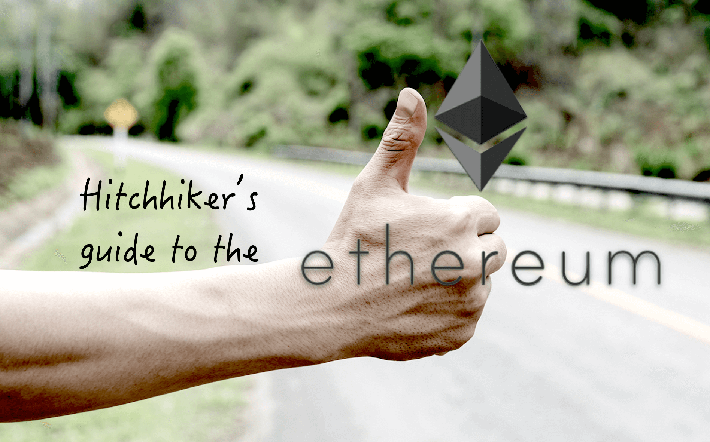

# Hitchhiker's guide to the Ethereum

<!-- START doctoc generated TOC please keep comment here to allow auto update -->
<!-- DON'T EDIT THIS SECTION, INSTEAD RE-RUN doctoc TO UPDATE -->

- [概述](#%E6%A6%82%E8%BF%B0)
- [约定](#%E7%BA%A6%E5%AE%9A)

<!-- END doctoc generated TOC please keep comment here to allow auto update -->

## 概述

本系列笔记以 [ethereum/go-ethereum at v1.8.17](https://github.com/ethereum/go-ethereum/tree/v1.8.17)为基线，记录 Etherum Golang 客户端学习过程中的学习记录。本文记录过程中使用 [Typora — a markdown editor, markdown reader.](https://typora.io/) 作为 markdown 编辑器，如果你的编辑器不支持 Latex 格式的 mathmatic 公式，那么在阅读此文的时候会发现有一些格式不正常，推荐使用 Typora.io；另外所有的流程图均使用 [OmniGraffle - diagramming and graphic design for Mac, iPhone, and iPad - The Omni Group](https://www.omnigroup.com/omnigraffle/)绘制。笔记内容为个人所思，且参考网上已有内容（均已标注来源，如有遗漏，请提示）。

本系列笔记分为以下几个系列：

- [从交易的角度等待 Etherum 的功能和特性](00.from-transaction-to-ethereum.md)
- [EVM 和合约浅知](01.evm-and-contract.md)
- [Ethereum 内部数据结构合集](02.data-struct-in-ethereum.md)
- [RLP 和 MPT 结构在 Ethereum 中的应用](03.rlp-and-mpt.md)
- [Ethereum 钱包知识以及内置 keystore 钱包实现](04.wallet-and-keystore.md)
- [BlockChian 区块同步事宜](05.block-syncing.md)
- [Ethereum 账户同步事宜](06.state-syncing.md)
- [Etherum 网络中的矿工与区块打包事宜](07.miner-and-seal.md)
- [什么是区块链共识](10.what-is-consensus.md)
- [Ethereum 中的 RPC 及实现](11.rpc-in-ethereum.md)
- [Ethereum 中的 P2P 协议] WIP
- [Etherum Geth 主进程的启动过程分析] WIP
- [P2P Kademlia 协议分析](60.p2p-kademlia.md)
- [Ethereum 通用矿池架构] WIP
- [Ethereum 区块同步 Fast Sync 分析](71.fast-sync-101.md)
- [Ethereum 中其它小细节] WIP

## 约定

* 「Tx」 表明是名词的交易，常用的场景是一笔 Tx；「交易」代表动词的交易，常用的场景是执行交易；
* 「转账」特指 Ether 转账，不包括合约创建和调用；
* 「Transaction」Yellowpaper 中明显定义：*A transaction is a single cryptographically-signed instruction constructed by an actor externally to the scope of Ethereum.* Etherueum 中的交易指是一个由外部单一数字签名生成的指令，由于合约账号没有私钥，故无法生成数字签名，因此合约账号所发起的交易不是 Tx，只能算是 message call, 本文中也称为 internal call。
